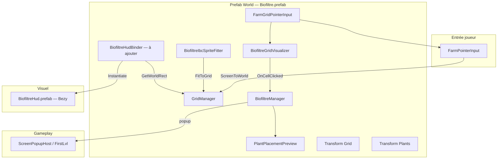

# Câblage biofiltre — grille, cuve IBC, HUD Bezy

**Branche :** `feature/biofiltre-isometric`  
**Dernière mise à jour :** 2026-09-05  
**Statut playtest grille :** `[P0-FARM-GRID-PLAY-001]` clos (ortho) — clics, pose, récolte, pause/recall OK  
**Statut IBC visuel :** `[P0-FARM-IBC-GRID-001]` **clos** 2026-09-02 — grille **carrée** sur `main`  
**Statut iso :** `[P0-FARM-ISO-GRID-001]` — géométrie losange 2:1 + `IbcIso` câblé ; playtest alignement en attente

Ce document centralise **qui fait quoi**, **où brancher quoi dans l’Inspector**, et **l’ordre Bezy** pour ne pas reposer la question à chaque session.

Références complémentaires :
- Prompts Bezy détaillés : `Notes/Ui/PROMPTS_Bezi_biofiltre_hud_slots.md`
- Brief agent VM (C#) : `Notes/Farm/PROMPT_agent_vm_biofiltre_hud_slots.md`
- Skill prod : `Notes/Bezi/WORKFLOW_skill_prefab_ui.md`
- Suivi tâches : `Notes/Todo_project.md` (IDs `[P0-FARM-IBC-GRID-001]`, `[BZ-FARM-BIOHUD-*]`)

---

## 1. Vue d’ensemble



| Couche | Qui | Prefab YAML |
|--------|-----|-------------|
| Grille + clics + gameplay | **Cursor** (scripts) | `Biofiltre.prefab` — champs sérialisés auteur |
| Cuve IBC (scale sur grille) | **Cursor** script + **auteur** assignation | Composant sur `Biofiltre.prefab` |
| HUD slots world (★ + primaire + secondaire) | **Bezy** prefabs + **Cursor** binder | `BiofiltreHud.prefab` + nested slots |
| Métier prestige / shields | **Plus tard** (GDD `[BL-GDD-007]`) | Hors scope V0 |

---

## 2. Prefab `Biofiltre.prefab` — état actuel

**Chemin :** `Assets/Prefabs/World/Biofiltre.prefab`

### Hiérarchie

```
Biofiltre                          ← racine
├── Grid                           ← gridContainer (cellules générées runtime)
└── Plants                         ← plantsContainer (instances plantes)
```

### Composants sur la racine (déjà présents)

| Composant | Script | Rôle |
|-----------|--------|------|
| `GridManager` | `Assets/Scripts/Farm/GridManager.cs` | Layout grille, `WorldToCell` / `CellToWorld`, `GetWorldRect()` |
| `BiofiltreGridVisualizer` | `BiofiltreGridVisualizer.cs` | Génère les cellules (sans collider), event clic |
| `BiofiltreManager` | `BiofiltreManager.cs` | Pont grille ↔ UI graines / récolte / save |
| `PlantPlacementPreview` | `PlantPlacementPreview.cs` | Fantôme de pose sur la grille |
| `FarmGridPointerInput` | `FarmGridPointerInput.cs` | Clic/touch → coordonnées cellule |

### Composants à ajouter (manuel Inspector — pas Bezy)

| Composant | Script | Statut |
|-----------|--------|--------|
| `BiofiltreIbcSpriteFitter` | `BiofiltreIbcSpriteFitter.cs` | **Câblé** 2026-09-02 — playtest OK |
| `BiofiltreHudBinder` | `BiofiltreHudBinder.cs` | **À ajouter** — après livraison `BiofiltreHud.prefab` |

### Champs Inspector importants (`BiofiltreManager`)

| Champ | Assignation attendue |
|-------|----------------------|
| `farmPopupHost` | `ScreenPopupHost` sur `LevelController` (scène FirstLvl) — souvent laissé vide sur le prefab, injecté en scène |
| `placementPreview` | Référence au composant sur le même GameObject (déjà câblé) |
| `itemDatabase` | `ItemDatabase` projet |
| `plantingDirtBurstPrefab` | `Assets/Prefabs/World/VFX/PlantingDirtBurst.prefab` |

### `GridManager` (instance biofiltre type IBC)

Valeurs typiques sur le prefab (à ne **pas** changer pour coller à l’art IBC) :

| Champ | Valeur |
|-------|--------|
| `useScriptableConfig` | `false` |
| `instanceColumns` / `instanceRows` | ex. `10` × `10` |
| `instanceCellSize` | FirstLvl override **`0.55`** (2026-09-05, agrandir iso) — prefab défaut `1` |
| `originFromTransform` | `true` — origine = position du transform biofiltre |
| `coordinateMode` | **`Isometric`** (losanges 2:1) — activé 2026-09-05 sur `feature/biofiltre-isometric`. `main` reste Orthogonal. |

**Iso 2:1 :** si taille de cellule uniforme, `GridManager` applique `hauteur = largeur × 0.5` (losange jeu classique). Ne pas changer `Columns` / `Rows` / `CellSize` pour coller à l’art.

**Règle produit :** la grille est la **source de vérité**. L’art IBC se redimensionne pour l’accueillir, pas l’inverse.

**Art IBC iso :** `Assets/Art/Sprites/Farm/Biofiltre/IbcIso.png` (promo Dump `IbcIso.png`, 2026-09-05). `ibcSprite` + `deckNormalized` AABB losange de billes `(0.059, 0.5239, 0.8844, 0.441)` — playtest rotation 2:1.

---

## 3. Grille sans colliders — chaîne de câblage

### Flux clic

```
Écran (souris / touch)
  → FarmPointerInput.TryGetPrimaryPress
  → FarmGridPointerInput.TryResolveCell
       Camera.ScreenToWorldPoint
       GridManager.TryWorldToCell(world)
  → BiofiltreGridVisualizer.NotifyCellClicked(coords)
  → BiofiltreManager.HandleCellClicked(cell)
       cellule vide → popup graines
       cellule occupée → popup récolte (via plante sur la cellule)
```

### Fichiers clés

| Fichier | Rôle |
|---------|------|
| `FarmPointerInput.cs` | Lecture unifiée souris + tactile (Input System) |
| `FarmGridPointerInput.cs` | Convertit le press en `(col, row)` |
| `GridCoordinateMapper.cs` | Orthogonal / isométrique swappable |
| `BiofiltreCell.cs` | Visuel cellule uniquement — **pas de collider** |
| `PlantHarvestInteractor.cs` | Récolte via grille, pas via collider plante |
| `LaitueObj.prefab` | `BoxCollider2D` **supprimé** sur cette branche |

### `FarmGridPointerInput`

| Champ | Valeur |
|-------|--------|
| `worldCamera` | Vide → `Camera.main` à l’exécution |

Aucun `Physics2D.Raycast`, aucun collider sur les cellules.

---

## 4. Cuve IBC — `BiofiltreIbcSpriteFitter`

**Script :** `Assets/Scripts/Farm/BiofiltreIbcSpriteFitter.cs`  
**Tâche :** `[P0-FARM-IBC-GRID-001]`

### Principe

1. Lit l’AABB monde de la grille via `GridManager.GetWorldRect()`.
2. Crée un enfant runtime `IbcSprite` avec un `SpriteRenderer`.
3. Scale le sprite pour que la zone UV **deck** (dessus plantable) couvre exactement le rectangle grille.
4. La grille (`Columns`, `Rows`, `CellSizeWorld`) **ne bouge pas**.

### Deck normalisé (UV 0–1, origine bas-gauche du sprite)

Valeur par défaut dans le script (mesure AABB billes sur `IbcIso.png`, 2026-09-05) :

```
deckNormalized = Rect(0.059, 0.5239, 0.8844, 0.441)
```

Ortho historique (`Cuve_IBC_deck_carre_plus_face.png`) : `Rect(0.0266, 0.4483, 0.9446, 0.5232)` — `main` uniquement.

### Procédure de câblage (auteur Unity)

1. **Promouvoir l’art** (fait 2026-09-05 sur `feature/biofiltre-isometric`) :
   - Source Dump : `IbcIso.png` (reste dans Dump)
   - Runtime : `Assets/Art/Sprites/Farm/Biofiltre/IbcIso.png`
   - **Ne pas** référencer le Dump depuis le prefab.

2. **Sur `Biofiltre.prefab`** :
   - `ibcSprite` → `IbcIso`
   - `sortingOrder` → `-1`
   - `deckNormalized` → défaut iso ci-dessus, ajuster après playtest

3. **Play Mode** :
   - Vérifier alignement dessus cuve ↔ rectangle grille
   - Ajuster `deckNormalized` ou choisir un autre variant Dump (`Cuve_IBC_3quart_carre_parfait.png`, etc.) **sans** toucher `GridManager`

4. **Optionnel** : appeler `FitToGrid()` depuis l’éditeur si un bouton custom est ajouté plus tard — aujourd’hui appel automatique dans `Start()`.

### Échec volontaire (fail closed)

- `ibcSprite` null → warning log, pas de cuve affichée
- `deckNormalized` invalide → warning log, pas de scale

---

## 5. HUD world — scripts Cursor (déjà livrés)

**Dossier :** `Assets/Scripts/UI/BiofiltreHud/`

| Script | Rôle |
|--------|------|
| `BiofiltreSlotVisualState.cs` | Enum `Locked` / `Empty` / `Equipped` |
| `UiBiofiltreSlotView.cs` | Atome slot (Slot / Fill / Lock images) |
| `UiBiofiltreSlotRowView.cs` | Rangée N slots nested ; `PrimaryCapacity = 3`, `SecondaryCapacity = 5` |
| `BiofiltreHudView.cs` | Vue HUD : `starRow` + `primaryRow` + `secondaryRow` (preview Inspector) |
| `BiofiltreHudBinder.cs` | Instantiate + positionnement depuis `GetWorldRect()` |

### `BiofiltreHudBinder` — câblage sur `Biofiltre.prefab`

| Champ | Description |
|-------|-------------|
| `hudPrefab` | Référence vers `Assets/Prefabs/Ui/Farm/BiofiltreHud.prefab` (**après** Bezy HOST) |
| `gridManager` | Auto depuis le même GameObject |
| `primaryNormalizedAnchor` | Défaut `(0.08, 0.92)` — haut-gauche dans l’AABB |
| `starNormalizedAnchor` | Défaut `(0.92, 0.92)` — haut-droite |
| `secondaryNormalizedAnchor` | Défaut `(0.18, 0.22)` — bas cuve |
| `*WorldOffset` | Ajustement fin en unités monde **par instance** biofiltre |
| `hudWorldZ` | Plan Z du HUD world (souvent `0`) |

**Comportement (obsolète 2026-09-06) :**
- `Start()` → instantiate `hudPrefab` sous le biofiltre — **ne marche pas** pour caler à la main (objet absent en Edit, Save interdit en Play).
- **Décision auteur :** HUD **en dur** dans `Biofiltre.prefab`, plus d’Instantiate. Note : `Notes/Farm/NOTE_hud_biofiltre_prefab_en_dur.md` — `[P0-FARM-BIOHUD-NEST-001]`.

**Fail closed :** `hudPrefab` null → warning, pas de HUD (pas de fallback caché).

### Ancres normalisées (mockup `biofiltreInterface_1.png`)

Origine `(0,0)` = coin **bas-gauche** du `GetWorldRect()`, `(1,1)` = haut-droite.

| Widget | Ancre défaut | Override |
|--------|--------------|----------|
| Slots primaires (3) | `(0.08, 0.92)` | Par instance si bac non carré |
| Étoiles ★ (5) | `(0.92, 0.92)` | Pivot droite recommandé sur `UiStarRow` |
| Slots secondaires (5) | `(0.18, 0.22)` | Par instance |

---

## 6. HUD world — livrables Bezy (prefabs)

**Skill :** `/prefab-ui-3phases` — `Notes/Bezi/WORKFLOW_skill_prefab_ui.md`  
**Prompts complets :** `Notes/Ui/PROMPTS_Bezi_biofiltre_hud_slots.md`  
**Layer UI :** `m_Layer: 5` partout (Water = 4)  
**Règle :** never unpack les nested `UiStarRow` / slots

### Art autorisé (promu, pas Dump)

```
Assets/Art/Sprites/UI/Biofiltre/slotBiofiltrePrimaire.png    (_0 cadre, _1 fill, _2 lock)
Assets/Art/Sprites/UI/Biofiltre/slotBiofiltreSecondaire.png  (idem)
```

### Arborescence prefabs cible

```
Assets/Prefabs/Ui/Common/
├── UiBiofiltrePrimarySlot.prefab          ✅ livré (Ph.1–3 Bezy)
├── UiBiofiltrePrimarySlotRow.prefab       ✅ livré (Ph.1–3, spacing 4)
├── UiBiofiltreSecondarySlot.prefab        ✅ livré (Ph.1–3, size 72×80 resté)
└── UiBiofiltreSecondarySlotRow.prefab     ✅ livré (Ph.1–3, spacing 10)

Assets/Prefabs/Ui/Common/                  (réutilisés, existants)
├── UiStarSlot.prefab
└── UiStarRow.prefab                       ← ne pas recréer

Assets/Prefabs/Ui/Farm/
└── BiofiltreHud.prefab                    ✅ livré (HOST Ph.1–3, 2026-09-02)
```

### Hiérarchie `BiofiltreHud.prefab` (cible Bezy)

```
BiofiltreHud                    [Canvas World Space, sortingOrder 20, BiofiltreHudView]
├── PrimaryMount
│   └── PrimarySlotRow          [nested UiBiofiltrePrimarySlotRow × 3 slots]
├── StarMount
│   └── StarRow                 [nested UiStarRow — NE PAS UNPACK]
└── SecondaryMount
    └── SecondarySlotRow        [nested UiBiofiltreSecondarySlotRow × 5 slots]
```

### Wiring `BiofiltreHudView` (phase 3 HOST)

| Champ `BiofiltreHudView` | Référence |
|--------------------------|-----------|
| `starRow` | `StarMount/StarRow` → `UiStarRowView` |
| `primaryRow` | `PrimaryMount/PrimarySlotRow` → `UiBiofiltreSlotRowView` |
| `secondaryRow` | `SecondaryMount/SecondarySlotRow` → `UiBiofiltreSlotRowView` |
| `previewStarFilled` | `1` (mockup) |
| `previewStarVisible` | `5` |

### Wiring `UiBiofiltreSlotView` (atome primaire / secondaire)

| Champ | GameObject enfant |
|-------|-------------------|
| `slotImage` | `Slot` → Image (`_0`) |
| `fillImage` | `Fill` → Image (`_1`), **inactive** par défaut |
| `lockImage` | `Lock` → Image (`_2`), **active** par défaut |
| `stateOnStart` | `Locked` |

Tailles : primaire **72×80**, secondaire **48×48**.

### Wiring `UiBiofiltreSlotRowView` (rangée)

| Champ | Valeur |
|-------|--------|
| `slots[]` | Références aux N nested `UiBiofiltreSlotView` |
| `visibleSlotCount` | `3` (primaire) ou `5` (secondaire) |

---

## 7. Ordre d’exécution Bezy (file complète)

| Étape | Task ID | Prefab | Phases | Statut |
|-------|---------|--------|--------|--------|
| 1 | `[BZ-FARM-BIOHUD-PRIM-001]` | `UiBiofiltrePrimarySlot.prefab` | 1 → 2 → 3 | ✅ |
| 2 | `[BZ-FARM-BIOHUD-PRIM-001]` | `UiBiofiltrePrimarySlotRow.prefab` | 1 → 2 → 3 | ✅ |
| 3 | `[BZ-FARM-BIOHUD-SEC-001]` | `UiBiofiltreSecondarySlot.prefab` | 1 → 2 → 3 | ✅ |
| 4 | `[BZ-FARM-BIOHUD-SEC-001]` | `UiBiofiltreSecondarySlotRow.prefab` | 1 → 2 → 3 | ✅ |
| 5 | `[BZ-FARM-BIOHUD-HOST-001]` | `BiofiltreHud.prefab` | 1 → 2 → 3 | ✅ |
| 6 | **Auteur** | `Biofiltre.prefab` | Add `BiofiltreHudBinder` + assign `hudPrefab` | ❌ |
| 7 | **Auteur** | FirstLvl playtest | HUD world après HOST | ❌ |

### Bloc de lancement type (copier dans Bezy)

```
/prefab-ui-3phases
Task ID: [BZ-FARM-BIOHUD-HOST-001]
Prefab: Assets/Prefabs/Ui/Farm/BiofiltreHud.prefab
Phase: 1
```

Puis `@Notes/Ui/PROMPTS_Bezi_biofiltre_hud_slots.md`

**Une phase par appel.** Fin de phase Bezy : `Save. List what changed. STOP.` — pas de Simulate.

---

## 8. Ce que Bezy ne fait pas

| Action | Qui |
|--------|-----|
| Modifier `Biofiltre.prefab` (World) | **Auteur** — assignation `hudPrefab`, `BiofiltreIbcSpriteFitter` |
| Scripts C# | **Cursor** — déjà livrés |
| Promouvoir art IBC Dump → Sprites | **Auteur** (OK explicite) |
| Logique prestige, save slots, clics gameplay | **Plus tard** — hors prompts Bezy V0 |
| Playtest / Simulate dans un prompt Bezy | **Interdit** |

---

## 9. Checklists de clôture branche

### Grille gameplay — ✅ clos

- [x] `FarmGridPointerInput` sur `Biofiltre.prefab`
- [x] Pas de collider cellule / plante pour le clic
- [x] Pose, récolte, pause/recall persistance validés (`[P0-FARM-GRID-PLAY-001]`)

### Cuve IBC — `[P0-FARM-IBC-GRID-001]`

- [x] Sprite promu dans `Sprites/Farm/Biofiltre/` (`Cuve_IBC.png`, 2026-08-31)
- [x] `BiofiltreIbcSpriteFitter` sur `Biofiltre.prefab` (2026-09-02)
- [x] `ibcSprite` assigné (`Cuve_IBC.png`)
- [x] Playtest alignement deck ↔ grille (**OK** 2026-09-02, grille carrée)

### HUD Bezy — `[BZ-FARM-BIOHUD-*]`

- [x] `UiBiofiltrePrimarySlot.prefab` (Ph.1–3)
- [x] `UiBiofiltrePrimarySlotRow.prefab` (Ph.1–3, 2026-08-31 ; spacing 4 resté)
- [x] `UiBiofiltreSecondarySlot.prefab` (Ph.1–3, 2026-08-31 ; size 72×80 resté)
- [x] `UiBiofiltreSecondarySlotRow.prefab` (Ph.1–3, 2026-08-31 ; spacing 10 resté)
- [x] `BiofiltreHud.prefab` (HOST Ph.1–3, 2026-09-02)
- [ ] `BiofiltreHudBinder` + `hudPrefab` sur instance biofiltre
- [ ] Playtest HUD world (`[P0-FARM-GRID-PLAY-001]` grille déjà OK)

### Merge vers `main`

- Minimum : grille gameplay ✅ + décision auteur sur IBC (merge avec ou sans cuve visuelle)
- Complet : IBC + HUD Bezy HOST câblé

---

## 10. Références croisées

| Sujet | Fichier |
|-------|---------|
| GDD slots / shields | `Notes/GDD/SPEC_biofiltre_slots_shields.md` |
| Modèle étoiles (à nested) | `Notes/Ui/PROMPTS_Bezi_ui_star_slot.md` |
| Mockup HUD | `Assets/Art/Mocup/biofiltreInterface_1.png` |
| Art IBC Dump | `Assets/Art/Assets Store Dump/ElementProd/Biofiltre/` |
| Canopées top-down (art seul) | `Assets/Art/Sprites/Plantes/Laitue/Canopee/` — pas encore branchées au rendu |
| Ownership prefabs | `.cursor/rules/bezi_prefab_ownership.mdc` |
