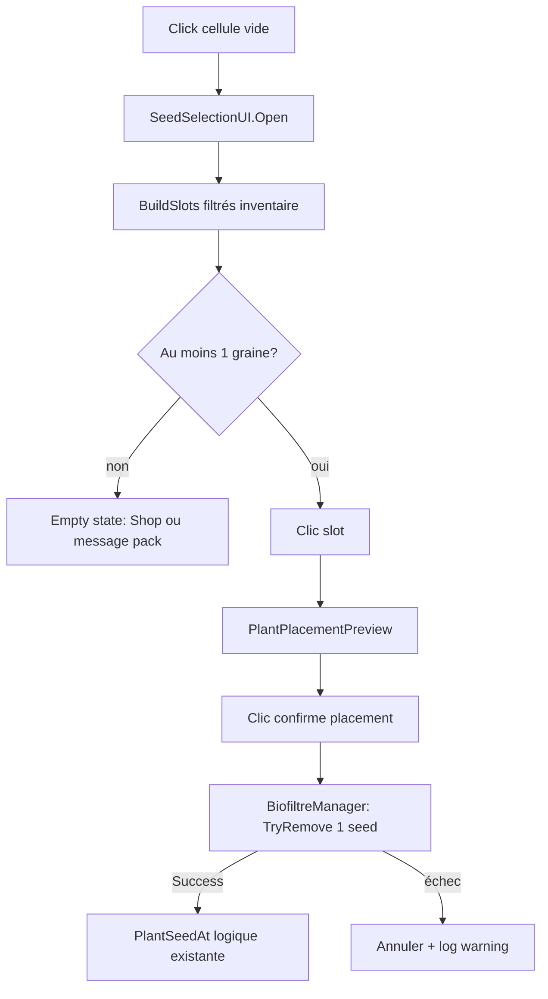

# Refactor — graines plantation ↔ inventaire

**ID tâche :** [P0-FARM-SEED-INV-001]  
**Branche Git :** `rework/selectionGraine` (depuis `main`)  
**Statut :** mergé sur **`main`** (`5125d7c`, 2026-05-19) — reste playtest [P0-FARM-PLAY-001] + prefab EmptyState [P0-FARM-UI-001]  
**Dernière mise à jour :** 2026-05-19

---

## 1. Problème actuel (bug produit)

Aujourd’hui, le flux plantation **ignore l’inventaire** :

| Zone | Comportement actuel | Attendu |
|------|---------------------|---------|
| `SeedSelectionUI.BuildSlots()` | Affiche **toutes** les entrées `availableSeeds` (Inspector) | N’afficher que les graines **possédées** (`Count > 0`) |
| `SeedSlotUI` | Nom + icône `PlantDefinition.spriteGraine` uniquement | Afficher **quantité** en stock (ex. `×12`) |
| `PlantPlacementPreview.ConfirmPlacement()` → `BiofiltreManager.PlantSeedAt()` | Pose la plante **sans** `TryRemove` | **Consommer 1×** l’item graine **à la confirmation** (placement réussi) |
| Cellule vide, sac vide | Le joueur peut encore choisir une graine et planter | **Bloquer** la plantation ; proposer une **sortie** (shop ou pack départ) |

**Conséquence :** plantation « gratuite » même sans `laitue_seed` (ou autre) dans `PlayerInventory` — incohérent avec le shop et la récolte (qui, elle, crédite l’inventaire).

---

## 2. Cartographie données (état projet)

| Concept | Asset / script | Identifiant |
|---------|----------------|-------------|
| Plante en grille | `PlantDefinition` (`Assets/Data/Ferme/Laitue.asset`) | `plantId` |
| Item sac (graine) | `ItemDefinition` `LaitueSeedling.asset` | `itemId` = **`laitue_seed`** |
| Récolte fin de cycle | `harvestStages` (stade Seedling) | `harvestItemId` = **`laitue_seed`** |
| Catalogue UI plantation | `SeedEntry` dans `SeedSelectionUI` | `plantDefinition` + `plantPrefab` — **pas encore** d’item lié |
| Achat shop | `ShopItem_LaitueSeedling.asset` | vend `laitue_seed` |

**Règle à formaliser :** une entrée plantable = triplet **`PlantDefinition` + prefab monde + `ItemDefinition` graine** (même `itemId` que celui consommé à la pose et, en général, celui récolté au stade graines si le design le prévoit).

Référence générale : `Docs/PLANTES_ET_INVENTAIRE.md` (`harvestItemId` ↔ `itemId`).  
**Protocole complet (nouvelle plante)** : `Notes/Farm/WORKFLOW_ajouter_nouvelle_plante.md`.

---

## 3. Décisions design à trancher (session)

Deux pistes **non exclusives** pour le joueur **sans graines** :

### Option A — Redirection shop (runtime)
- Si `Count(seedItem) == 0` pour **toutes** les graines plantables : fermer le popup graines et ouvrir le **shop HUD** (`UIManager.TryShowScreen(ScreenId.Shop)` via `NavigationHUD`, scène shell déjà chargée en additive).
- Variante UI : bandeau dans `SeedSelectionUI` (« Plus de graines » + bouton **Acheter**).
- **Prérequis :** filtrer le catalogue shop / surligner l’item `laitue_seed` (nice-to-have, pas bloquant MVP).

### Option B — Pack de départ (persistance)
- Même pattern que `PlayerInventory.ApplyStartingCurrencyOnce()` : flag `startingSeedsApplied` dans `inventory.json` + crédit **N** graines (ex. 3× `laitue_seed`) au premier lancement.
- **Avantage :** onboarding ferme sans bloquer ; le shop reste la source de réapprovisionnement ensuite.

**Recommandation MVP (à valider auteur) :** **B minimal** (3 graines une fois) **+** **A** en empty state (« racheter au shop ») pour les sessions suivantes. Éviter la plantation sans stock dans tous les cas.

---

## 4. Architecture cible (minimal, pas de sur-ingénierie)



### 4.1 Données — étendre `SeedEntry`

```csharp
// SeedSelectionUI.cs — SeedEntry
public ItemDefinition seedItem;  // ex. LaitueSeedling (itemId laitue_seed)
```

- Inspector : assigner l’`ItemDefinition` pour chaque ligne (en plus de `plantDefinition` / `plantPrefab`).
- Validation éditeur (optionnel) : `seedItem.itemId` cohérent avec une entrée `harvestStages` si présente.

**Alternative écartée pour l’instant :** champ `seedItemId` sur `PlantDefinition` — possible plus tard pour une seule source, mais duplication avec récolte déjà sur `harvestStages`.

### 4.2 Lecture inventaire — `SeedSelectionUI`

- Référence `PlayerInventory` : injectée par `BiofiltreManager.ConfigureSeedSelectionInstance` (même `itemDatabase` / inventaire que `PlantHarvestInteractor`).
- `BuildSlots()` :
  - ignorer entrées sans `seedItem` ou sans stock ;
  - `slot.Bind(entry, inventory.Count(entry.seedItem))` ;
  - `SetInteractable(fits && count > 0)`.
- S’abonner à `PlayerInventory.OnInventoryChanged` pour rafraîchir si le popup est ouvert (achat shop en parallèle — cas rare, utile).

### 4.3 Consommation — point unique `BiofiltreManager`

**Ne pas** consommer dans `SeedSelectionUI` (trop tôt — preview annulable).

Ajouter une surcharge ou paramètre :

```csharp
public bool TryPlantSeedAt(
    Vector2Int anchor,
    PlantDefinition plantDefinition,
    GameObject plantPrefab,
    ItemDefinition seedItem,
    int quantity = 1)
```

Ordre :
1. Vérifier `CanPlace` / cellules libres (existant).
2. `inventory.TryRemove(seedItem, quantity) == Success` — sinon **return false** (pas de plante).
3. Appeler la logique `PlantSeedAt` actuelle.
4. En cas d’échec rare après remove (à éviter) : **re-créditer** l’item (rollback) — seulement si un chemin peut échouer après débit.

`PlantPlacementPreview` doit transporter `ItemDefinition seedItem` (début de preview depuis `SeedEntry`).

**Restauration sauvegarde ferme :** `PlantSeedAt` depuis `TryLoadFarmState` **sans** consommation (déjà le cas — pas de graines déduites au load).

### 4.4 Empty state + shop

- Nouveau bloc UI léger dans `SeedSelectionUI.prefab` : `EmptyStatePanel` (texte + bouton).
- Handler : `NavigationHUD` ou callback injecté `Action onOpenShop` → `UIManager.TryShowScreen(ScreenId.Shop)` + fermer popup graines.
- Ne pas utiliser `SceneManager.LoadScene` direct (règle `SceneNavigator` / shell HUD).

### 4.5 Pack de départ (si option B)

- `PlayerInventory` : `[SerializeField] ItemDefinition startingSeedItem`, `[Min(0)] int startingSeedAmount`, `bool startingSeedsApplied`.
- Persistance : étendre `InventorySaveService.SaveData` (même fichier `inventory.json`).
- Menu contextuel reset inventaire : remettre le flag à false (comme monnaie).

---

## 5. Plan d’implémentation (branche `rework/selectionGraine`)

| Phase | Contenu | Fichiers principaux | Critère done |
|-------|---------|---------------------|--------------|
| **1** | `seedItem` sur `SeedEntry` + câblage Inspector laitue | `SeedSelectionUI.cs`, prefab popup | Laitue liée à `LaitueSeedling` |
| **2** | Filtre slots + quantité affichée | `SeedSelectionUI`, `SeedSlotUI`, prefab slot | 0 stock → slot absent ou désactivé |
| **3** | Consommation au plant confirmé | `BiofiltreManager`, `PlantPlacementPreview` | Planter sans stock **impossible** |
| **4** | Empty state + ouverture shop | `SeedSelectionUI`, prefab, wiring HUD | Sac vide → CTA shop, pas de plant |
| **5** | (Optionnel) Pack graines départ | `PlayerInventory`, save | Nouveau profil peut planter N fois |
| **6** | Tests + doc | `PROJECT_LOG.md`, cocher [P0-FARM-SEED-INV-001] | Playtest FirstLvl |

**Tests manuels minimaux :**
1. Reset inventaire → clic cellule → **aucune** plantation possible ; CTA shop OK.
2. Ajouter 2× `laitue_seed` → planter 2 fois → stock 0 → 3e tentative bloquée.
3. Preview démarré → Échap / clic droit → **pas** de débit.
4. Achat shop depuis HUD → retour ferme → graines visibles dans le popup.
5. Reload scène / save ferme : plantes restaurées, inventaire cohérent.

---

## 6. Hors scope (cette refactor)

- Nouveau `PopupId` dédié « inventaire vide graines » (utiliser empty state dans `FarmSeedSelection` suffit).
- Market / `market_catalog.json` (autre flux que `ScreenId.Shop`).
- Multi-graines avancées (filtre par biofiltre / unlock joueur) — voir `Notes/GDD/SPEC_progression_xp_joueur_et_biofiltre.md`.

---

## 7. Références code

| Fichier | Rôle |
|---------|------|
| `Assets/Scripts/UI/SeedSelectionUI.cs` | Liste `SeedEntry`, `Open` / `BuildSlots` |
| `Assets/Scripts/UI/SeedSlotUI.cs` | Ligne UI |
| `Assets/Scripts/Farm/PlantPlacementPreview.cs` | `ConfirmPlacement` → `PlantSeedAt` |
| `Assets/Scripts/Farm/BiofiltreManager.cs` | `TryOpenFarmSeedSelection`, `PlantSeedAt` |
| `Assets/Scripts/Inventory/PlayerInventory.cs` | `Count`, `TryRemove`, events |
| `Assets/Scripts/UI/NavigationHUD.cs` | `OnTabShopClicked` |
| `Assets/Scripts/UI/Popups/PopupId.cs` | `FarmSeedSelection` |

**Popup pipeline :** inchangé (`ScreenPopupHost` + binding existant) — seul le **contenu** du popup devient dépendant de l’inventaire.

---

## 8. Suivi statut

Le statut `[ ]` / `[x]` de [P0-FARM-SEED-INV-001] reste dans **`Notes/Todo_project.md`** uniquement. Cocher après phases 1–4 validées en playtest (phase 5 si option B retenue).

---

## 9. Bugs connus (post-merge)

### [P0-FARM-BUG-001] Message empty + slot graines simultanés

**Repro (2026-05-22)** : pack départ consommé → message « Aucune graine… » → achat shop 1× → re-ouverture popup : **titre empty** + **slot `Laitue ×1`**.

**Cause probable** : `ShowEmptyState()` écrase le TMP titre (fallback sans `emptyStatePanel`) ; `HideEmptyState()` ne restaure pas le libellé d’origine.

**Fix cible** : `SeedSelectionUI.cs` + prefab EmptyState [P0-FARM-UI-001]. Journal : **`PROJECT_LOG.md` 2026-05-22**.
