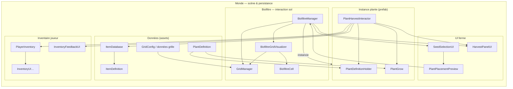
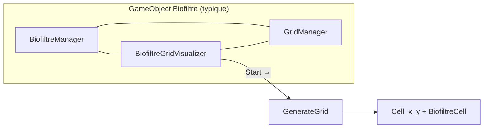
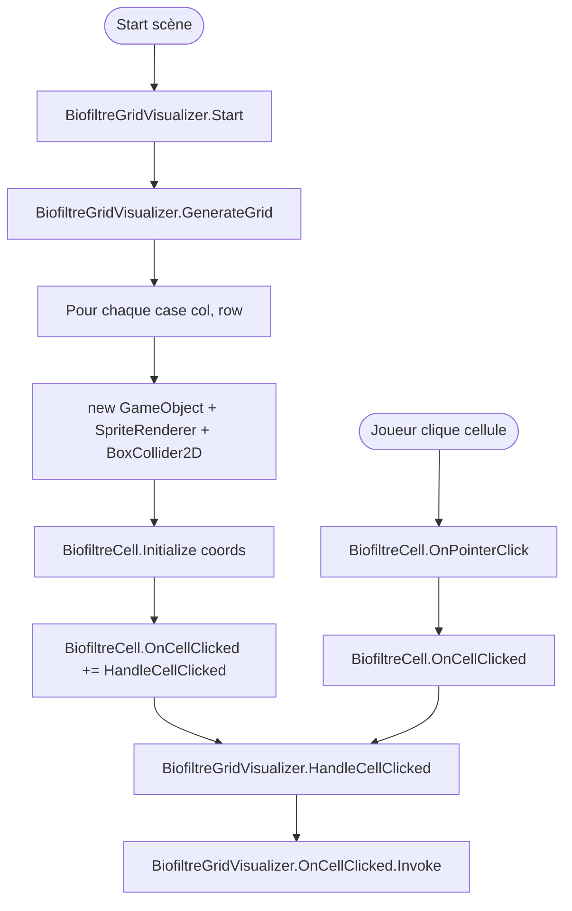
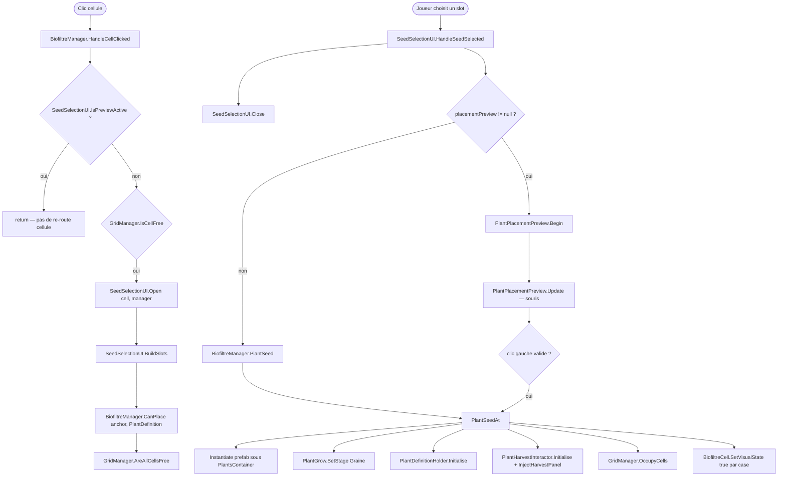
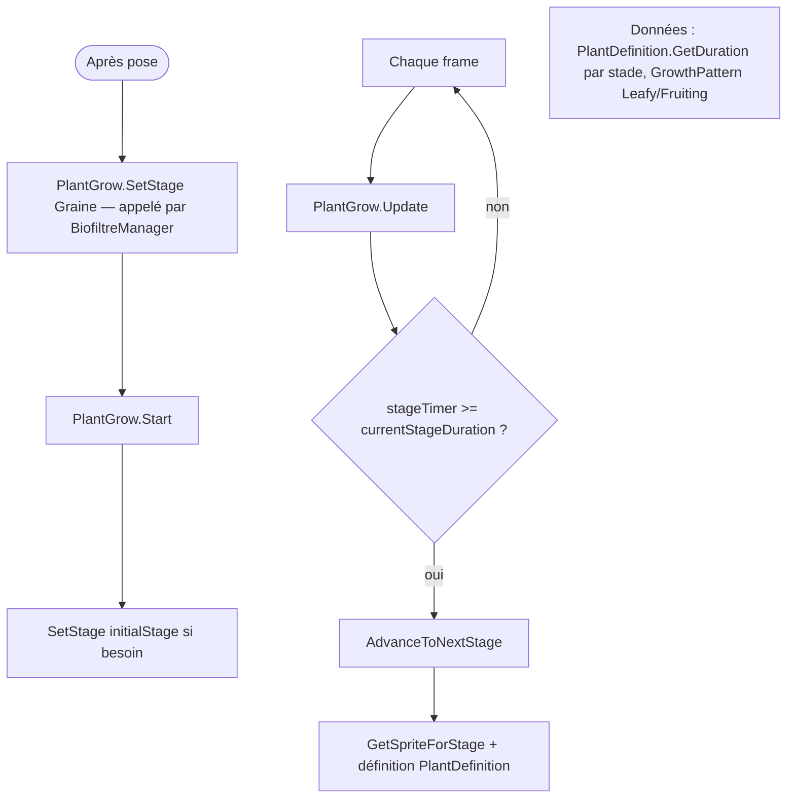
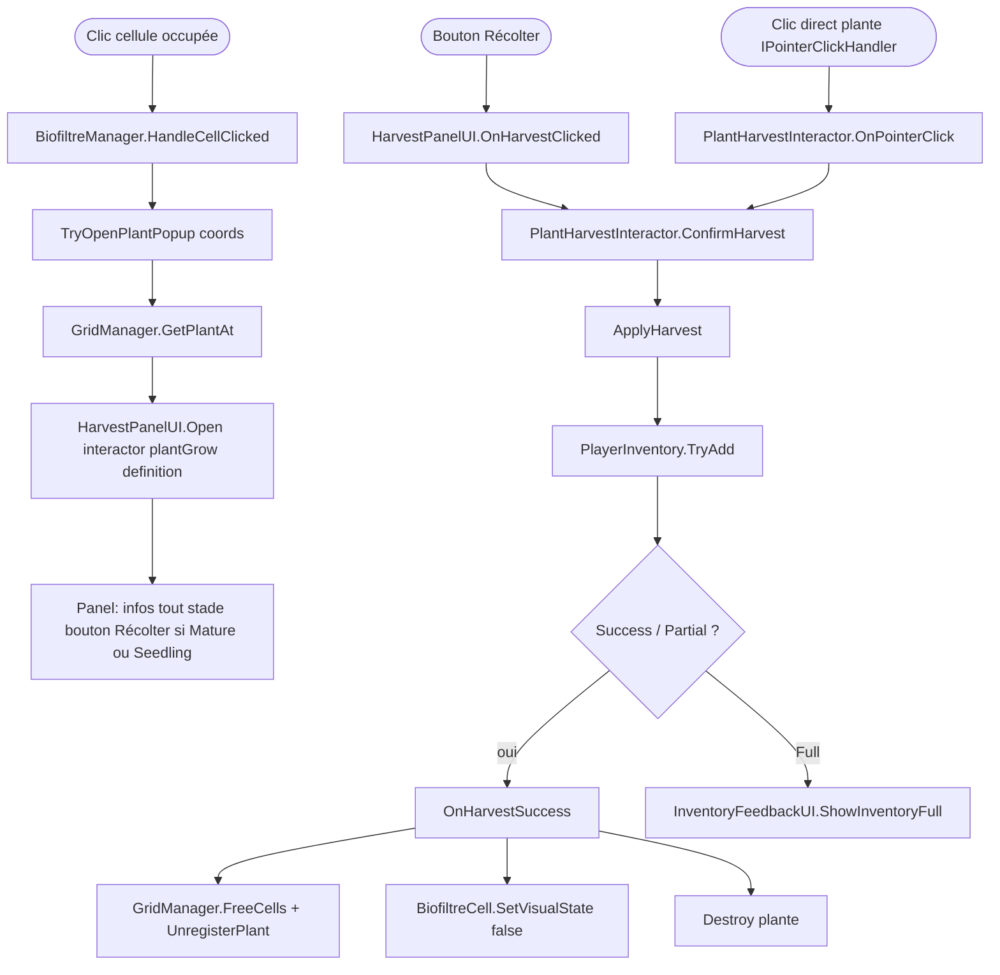
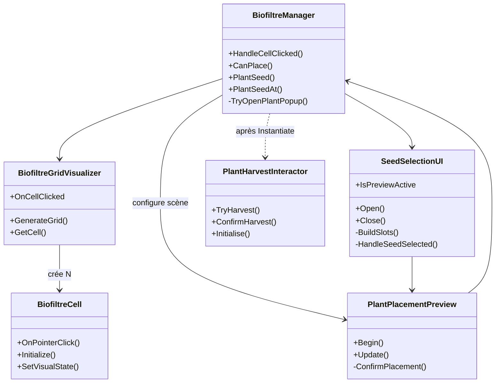
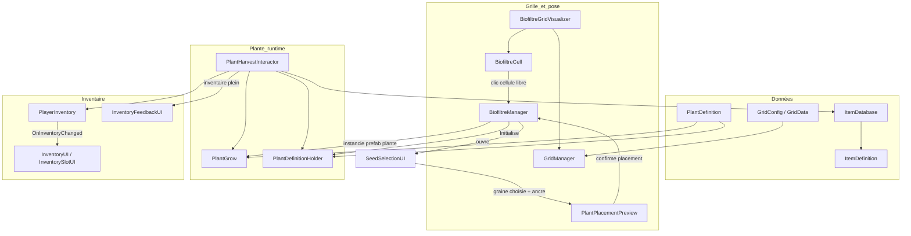

# Carte mentale — flux ferme ↔ inventaire

Document de **visualisation** des liaisons entre scripts existants (Unity 6). À mettre à jour quand de nouveaux orchestrateurs (ex. `GameManager`) apparaissent.

---

## Carte multi-niveaux (monde → cellule)

**Métaphore** : tu zoomes comme sur une carte — d’abord le **monde** (tous les domaines), puis l’**organisme** (le biofiltre et ses composants), puis un **organe** (un cycle : plantation, croissance, récolte), puis la **cellule** (les méthodes à ouvrir dans l’IDE). Chaque zoom est **un diagramme séparé** pour ne pas tout mélanger ; le schéma « Vue synthèse » plus bas reste la vue d’ensemble en un coup d’œil.

| Niveau | Tu te demandes… | Où aller |
|--------|-----------------|----------|
| **Monde** | Quels domaines et flux entre eux ? | Diagramme *Niveau 1* |
| **Organisme** | Qu’est-ce qui vit sur le même objet / la même zone ? | *Niveau 2 — Biofiltre* |
| **Organe** | Pour *cette* interaction joueur, qui appelle qui ? | Zoom A, B, C ou D |
| **Cellule** | Nom exact de la fonction | Étiquettes `()` dans les zooms |

Outils : [Mermaid Live](https://mermaid.live) pour exporter PNG/SVG ; ou copier un bloc dans Cursor avec extension Mermaid.

### Niveau 1 — Monde (domaines + ponts)

### Niveau 2 — Organisme « un biofiltre » (composants sur le même GameObject)

---

### Zoom A — Cycle « grille visible & cliquable »

### Zoom B — Cycle « plantation » (chaîne d’appels)

### Zoom C — Cycle « croissance » (autonome sur la plante)

### Zoom D — Cycle « récolte » (cellule occupée ou panel)

**Note (code 2026-04)** : `TryOpenHarvestPanel` / `FindInteractorAt` existent encore dans `BiofiltreManager` mais **ne sont pas** utilisés par `HandleCellClicked` ; le chemin grille passe par **`TryOpenPlantPopup`** + registre de plante. Voir `Notes/Codebase_etat_reference.md`.

### UML classes — vue simplifiée (référence)

---

## Vue synthèse (Mermaid)

---

## Plantation (grille → graine au sol)

| Étape | Rôle | Fichiers / remarques |
|--------|------|----------------------|
| Config cases | Taille, origine, `WorldToGrid` | `GridManager`, `GridConfig` |
| Cellules cliquables | Raycast / UI pointer | `BiofiltreCell` (généré par `BiofiltreGridVisualizer`) |
| Choix de la graine | Liste `SeedEntry` → `PlantDefinition` | `SeedSelectionUI`, `SeedSlotUI` |
| Validité footprint | Toutes les cellules libres | `BiofiltreManager.CanPlace` + `PlantDefinition.GetOccupiedCells` |
| Fantôme | Souris, vert/rouge | `PlantPlacementPreview` |
| Pose | Instanciation + occupation grille | `BiofiltreManager.PlantSeedAt` → `PlantGrow` stade `Graine`, `OccupyCells`, `PlantDefinitionHolder.Initialise` |

**Note** : il n’y a pas de classe nommée `BuildManager` ; le rôle est tenu par **`BiofiltreManager`** + **`PlantPlacementPreview`**.

---

## Croissance

| Élément | Détail |
|---------|--------|
| `PlantGrow` | Timers par stade (`PlantDefinition.GetDuration`), enchaînement **Leafy** vs **Fruiting** |
| Sprites | Lus sur `PlantDefinition` par stade (`spriteMature`, `spriteFlowering`, etc.) |
| Récoltable | Stade = `PlantDefinition.HarvestStage` (souvent `Mature`) |

---

## Récolte ↔ inventaire

| Élément | Détail |
|---------|--------|
| Déclencheur (grille) | Clic **cellule occupée** → `BiofiltreManager.TryOpenPlantPopup` → `GridManager.GetPlantAt` → **`HarvestPanelUI.Open`** (interactor + `PlantGrow` + `PlantDefinition`). |
| Déclencheur (plante) | **`PlantHarvestInteractor`** (`IPointerClickHandler`) : clic sur le collider 2D de la plante → **`ConfirmHarvest`** direct si récoltable (caméra avec **Physics2DRaycaster** + EventSystem). |
| Éligibilité (récolte) | **`IsHarvestable()`** : stade **Mature** ou **Seedling** (le panel n’active le bouton *Récolter* que dans ces cas). Le champ `PlantDefinition.HarvestStage` reste la référence data (souvent `Mature`). |
| Item | `harvestItemId` sur `PlantDefinition` ou override sur le composant ; résolution via **`ItemDatabase`**. |
| Ajout | **`PlayerInventory.TryAdd(ItemDefinition, int)`** → **`InventoryResult`** (inclut **Partial**). |
| Feedback | `InventoryFeedbackUI` si inventaire plein. |
| Après succès | **`OnHarvestSuccess`** : libère les cases, désenregistre la plante, **Destroy** — pas de seconde récolte sur la même instance. |
| **Pistes design** | **Mature** et **Seedling** partagent encore le **même** `harvestItemId` ; **`maxHarvestCount`** non utilisé pour des récoltes répétées sur pied ; comportement **`Partial`** + destruction de la plante à trancher (perte de la quantité non stockée). |

---

## Deux récoltes sur un cycle (intention design)

Profil **Leafy** (dans `PlantGrow`) : `… → Mature (récolte feuilles) → Flowering → Seedling`.

- Aujourd’hui : une seule paire **`harvestStage` + `harvestItemId`** dans `PlantDefinition`.
- Piste : second couple stade/item pour **graines**, ou structure de « phases de récolte » + compteurs (`maxHarvestCount` déjà présent sur l’asset mais non câblé dans `PlantHarvestInteractor`).

---

## Légende rapide

- **ScriptableObject** : `PlantDefinition`, `ItemDefinition`, `GridConfig`…
- **MonoBehaviour scène** : grille, UI, plantes instanciées, inventaire joueur
