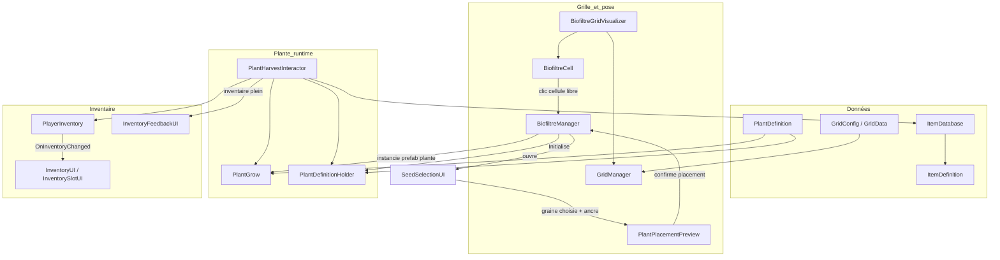

# Carte mentale — flux ferme ↔ inventaire

Document de **visualisation** des liaisons entre scripts existants (Unity 6). À mettre à jour quand de nouveaux orchestrateurs (ex. `GameManager`) apparaissent.

---

## Vue synthèse (Mermaid)

---

## Plantation (grille → graine au sol)

| Étape | Rôle | Fichiers / remarques |
|--------|------|----------------------|
| Config cases | Taille, origine, `WorldToGrid` | `GridManager`, `GridConfig` |
| Cellules cliquables | Raycast / UI pointer | `BiofiltreCell` (généré par `BiofiltreGridVisualizer`) |
| Choix de la graine | Liste `SeedEntry` → `PlantDefinition` | `SeedSelectionUI`, `SeedSlotUI` |
| Validité footprint | Toutes les cellules libres | `BiofiltreManager.CanPlace` + `PlantDefinition.GetOccupiedCells` |
| Fantôme | Souris, vert/rouge | `PlantPlacementPreview` |
| Pose | Instanciation + occupation grille | `BiofiltreManager.PlantSeedAt` → `PlantGrow` stade `Graine`, `OccupyCells`, `PlantDefinitionHolder.Initialise` |

**Note** : il n’y a pas de classe nommée `BuildManager` ; le rôle est tenu par **`BiofiltreManager`** + **`PlantPlacementPreview`**.

---

## Croissance

| Élément | Détail |
|---------|--------|
| `PlantGrow` | Timers par stade (`PlantDefinition.GetDuration`), enchaînement **Leafy** vs **Fruiting** |
| Sprites | Lus sur `PlantDefinition` par stade (`spriteMature`, `spriteFlowering`, etc.) |
| Récoltable | Stade = `PlantDefinition.HarvestStage` (souvent `Mature`) |

---

## Récolte ↔ inventaire

| Élément | Détail |
|---------|--------|
| Déclencheur | `PlantHarvestInteractor` — `OnMouseDown` (ancien Input Manager) ; requiert `Collider2D` |
| Éligibilité | `PlantGrow.CurrentStage == HarvestStage` (via `PlantDefinitionHolder`) |
| Item | `harvestItemId` sur `PlantDefinition` ou override sur le composant |
| Ajout | `PlayerInventory.TryAdd` → `InventoryResult` |
| Feedback | `InventoryFeedbackUI` si plein |
| **Manque actuel** | `OnHarvestSuccess` ne change pas le stade / ne consomme pas `maxHarvestCount` → **double récolte** possible ; pas de second `itemId` dédié aux graines (`Seedling`) |

---

## Deux récoltes sur un cycle (intention design)

Profil **Leafy** (dans `PlantGrow`) : `… → Mature (récolte feuilles) → Flowering → Seedling`.

- Aujourd’hui : une seule paire **`harvestStage` + `harvestItemId`** dans `PlantDefinition`.
- Piste : second couple stade/item pour **graines**, ou structure de « phases de récolte » + compteurs (`maxHarvestCount` déjà présent sur l’asset mais non câblé dans `PlantHarvestInteractor`).

---

## Légende rapide

- **ScriptableObject** : `PlantDefinition`, `ItemDefinition`, `GridConfig`…
- **MonoBehaviour scène** : grille, UI, plantes instanciées, inventaire joueur
