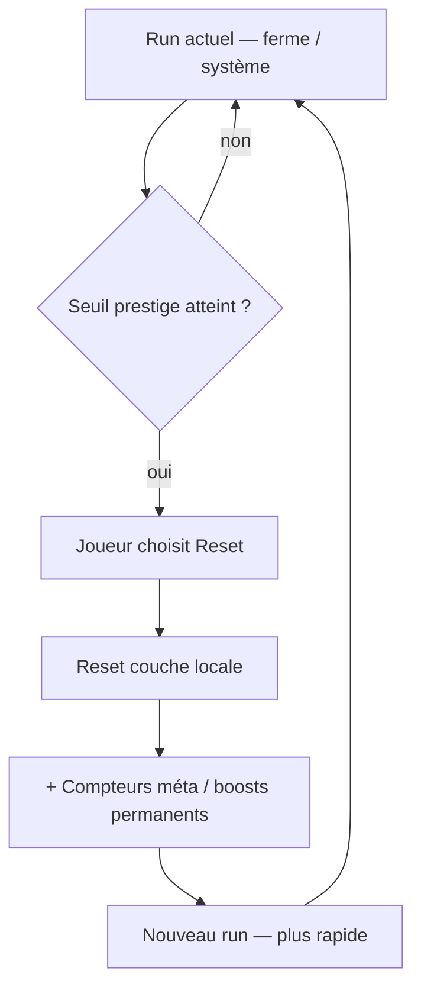

# Idée GDD — boucle ascension / méta-progression (jeu incrémental)

**Statut :** **backlog** — `[BL-GDD-006]` dans `Notes/Todo_project.md`. Pas de code, pas d’engagement prod avant prérequis.  
**Date :** 2026-06-08  
**Demande auteur :** mécanique type **Idle Miner** — recommencer à zéro avec des **bonus permanents** issus des runs précédents.

### Terminologie (validée auteur — EN / FR)

| Anglais (réf. industrie) | Français | Usage projet |
|--------------------------|----------|--------------|
| **Incremental game** | Jeu **incrémental** | Genre cible (idle / tycoon mobile) |
| **Ascension** | **Ascension** | Action joueur : soft reset → palier supérieur + bonus permanents |
| **Prestige** | Prestige | **Synonyme courant** (même mécanique ; Idle Farming Empire, etc.) |
| **Meta-progression** | Méta-progression | Ce qui **persiste entre** les ascensions (compteurs méta, multiplicateurs) |
| **Soft reset** | Reset doux | Remise à zéro de la couche locale, pas du save entier |

> Vocabulaire retenu côté design : **incrémental** + **ascension**. « Prestige » reste acceptable dans la veille jeux et la doc technique.

### Prérequis (décision auteur 2026-06-08)

> **Ne pas concevoir ni implémenter** tant que la **boucle principale** n’est pas validée :
> - **techniquement** (plantation → croissance → récolte → inventaire → shop/market, persistance, navigation) ;
> - **fon** (le core loop est satisfaisant en playtest, pas seulement « ça compile »).

Tant que ce seuil n’est pas atteint, ce document sert de **référence d’idée** uniquement.

---

## 1. Existe-t-il déjà dans le projet ?

| Où | Contenu | Suffisant ? |
|----|---------|-------------|
| `Notes/References/REFERENCES_jeux_inspiration.md` | Veille **Idle Farming Empire** — prestige, reset contre graines magiques | Référence externe seulement |
| `Notes/GDD/SPEC_progression_systeme_aquaponique_par_niveau.md` §9 | Question ouverte : *Respec / reset des nœuds (oui/non, coût) ?* | Portée **nœuds d’upgrade**, pas boucle méta globale |
| Code (`PlayerInventory.ResetAndDeleteSave`, `BiofiltreManager` reset runtime) | Reset **debug** ou **nouvelle partie** | Pas de boucle prestige joueur |

**Conclusion :** pas de note dédiée avant ce fichier.

---

## 2. Intention produit (ébauche)

Inspiré des **jeux incrémentaux** / idle mobile (Idle Miner, Idle Farming Empire, Melvor Idle) :

1. Le joueur fait progresser une **installation** ou une **carrière** (ferme, système aquaponique, comptes de production).
2. À un moment, il peut **volontairement tout remettre à zéro** (ou presque) sur cette couche.
3. En échange : déblocage de **méta-progression permanente** :
   - multiplicateurs globaux (vitesse, rendement, XP) ;
   - **nouveaux compteurs** ou ressources méta (ex. « graines magiques », « prestige points », « héritage bio ») ;
   - raccourcis au redémarrage (démarrage plus rapide qu’au premier run).
4. La boucle se répète : chaque « ascension » atteint plus loin, plus vite.

> **Comptables** (terme auteur) : à lire comme **nouveaux compteurs / paliers méta** débloqués après reset — pas une feature comptabilité réelle tant que non précisé.

---

## 3. Schéma de boucle (générique)

```
Run N (progression locale)
    → seuil atteint (niveau système, quota cycles, objectif quête…)
    → choix : continuer OU « Reset / Prestige »
    → reset couche locale (ferme, upgrades temporaires, stock partiel…)
    → gain permanent (méta-monnaie, talent global, multiplicateur)
Run N+1 (redémarrage accéléré grâce aux gains permanents)
```



---

## 4. Application possible au projet Rayman / aquaponie

À trancher — pistes **non exclusives** :

| Couche | Ce qui reset | Ce qui persiste | Payoff prestige |
|--------|--------------|-----------------|-----------------|
| **Système aquaponique** (par ferme / `FirstLvl`) | Niveau installation, upgrades onglets Biofiltre / Poisson / Techno | Méta global joueur | Multiplicateur cycles, anti-aléas, slots |
| **Joueur** (halo inventaire) | Rien — ou respec partiel payant | Arbres déjà achetés | Option B peu idle ; plutôt respec |
| **Monde / niveau** | Recommencer une scène ferme débloquée | Progression hub, inventaire global | Nouveaux « comptes » biome (ex. index biodiversité) |
| **Hybride** | Reset **instance** biofiltre après maturité max | Points prestige globaux + talents halo | Lie ferme locale et progression joueur |

### Liens avec les specs existantes

- **Maturité biofiltre** (`SPEC_progression_xp_joueur_et_biofiltre.md`) : compteur de cycles — pourrait devenir le **seuil** de prestige (« 10 cycles salade » = premier palier reset ?).
- **Panneau système par niveau** (`SPEC_progression_systeme_aquaponique_par_niveau.md`) : les points dépensés en upgrades pourraient être **convertis** en méta-monnaie au reset.
- **Halo 8 compétences** (`ProgressionTrackId`) : certains nœuds pourraient être **débloqués uniquement après X resets** (gating méta).

---

## 5. Questions ouvertes (à résoudre avant spec)

- [ ] **Scope du reset** : une ferme ? tout le save ? une branche (biofiltre seul) ?
- [ ] **Ce qui persiste** : inventaire, argent, talents halo, déblocages shop ?
- [ ] **Déclencheur** : choix joueur libre vs palier obligatoire vs les deux ?
- [ ] **Nom in-game** : Prestige, Ascension, Récolte méta, Cycle, autre ?
- [ ] **Nouveaux compteurs** : quelles ressources méta (liste fermée au départ) ?
- [ ] **Courbe** : chaque reset doit-il être **plus rapide** que le précédent (multiplicateur cumulatif) ?
- [ ] **Risque frustration** : le joueur casual accepte-t-il de « tout perdre » sur la ferme ?
- [ ] **Lien offline** : les gains hors-ligne comptent-ils vers le seuil de prestige ?
- [ ] **UI** : écran dédié avant reset (récap gains / pertes) — obligatoire type idle miner.

---

## 6. Références veille

- `Notes/References/REFERENCES_jeux_inspiration.md` — **A3 Idle Farming Empire** (prestige, graines magiques, gains hors-ligne).
- Jeux proches à étudier : Idle Miner Tycoon, Egg Inc. (prestige par couche), Melvor Idle (skills permanents).

---

## 7. Prochaine étape (quand boucle principale validée)

1. Confirmer que le **core loop** est stable et fun (playtests documentés).
2. Décider si la boucle prestige vit surtout sur **système aquaponique** (ferme) ou aussi sur **joueur global**.
3. Tableau *Reset / Garde / Débloque* pour un premier palier fictif.
4. Promouvoir en `SPEC_reset_prestige_systemes.md` + passage en `CT-*` si le design est tranché.

---

## Liens

- Hub idées tablette : `Notes/GDD/INBOX_notes_tablette_recherches.md`
- Progression joueur / maturité : `Notes/GDD/SPEC_progression_xp_joueur_et_biofiltre.md`
- Progression installation : `Notes/GDD/SPEC_progression_systeme_aquaponique_par_niveau.md`
- Arbres talents (gel design) : `INBOX_notes_tablette_recherches.md` § gel design
