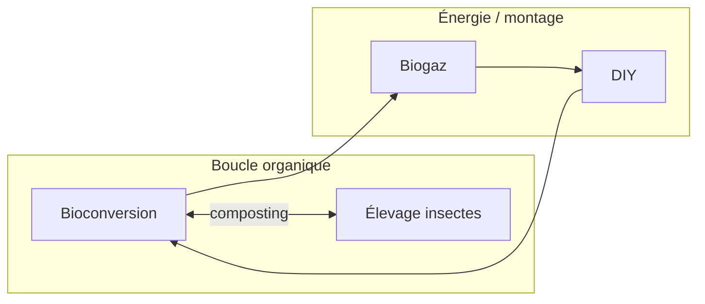

# Inbox — notes tablette (référence perso)

**« Tablette »** = support de **notes manuscrites** et **recherches perso** de l’auteur, **pas** un système ou une feature nommée dans le jeu.

Ce fichier est le **hub d’accueil** quand ces notes seront retranscrites ou importées dans le repo.

**Tâche projet liée :** **[P0-IDEA-001]** — `Notes/Todo_project.md` § *Prochaine session* (synthèse boucle gameplay + 3–5 tâches validées).

---

## Rôle

- Conserver le lien avec le rework inventaire : `Notes/Ui/SPEC_rework_inventaire_halo_progression.md`
- Accueillir progressivement le contenu des notes papier (pistes de recherche, boosts, arbres de talents, etc.)
- **Ne pas** inventer de règles ici tant que les notes originales ne sont pas apportées
- Croiser avec le **vrac déjà numérisé** (voir § *Contenu déjà dans le repo*) avant de dupliquer

---

## Cartographie — docs liés aux idées tablette

| Fichier | Contenu utile pour [P0-IDEA-001] | Statut |
|---------|----------------------------------|--------|
| **`Notes/GDD/Inbox_gdd.md`** | Brouillon GDD : états plantes (6 stades), salade vs tomate, Farm City, mini-Trello 15 min/jour, IA Google casual farm | **Partiellement transcrit** — à relire / compléter depuis tablette |
| **`Notes/Ui/SPEC_rework_inventaire_halo_progression.md`** | Vision UI halo (XP centre, talents acheteur / vendeur), §4 renvoie ici | Spec UI — règles métier **après** import notes |
| **`Notes/GDD/SPEC_progression_xp_joueur_et_biofiltre.md`** | XP joueur, maturité biofiltre (~10 cycles salade), gating cultures fruits | Spec partielle — à aligner avec notes tablette |
| **`Notes/References/REFERENCES_jeux_inspiration.md`** | Veille jeux idle / cozy farm — alimente idées, pas engagement prod | Référence externe |
| **`Notes/GDD/IDEA_boucle_reset_prestige_systemes.md`** | Jeu incrémental — **ascension** + méta-progression — backlog **[BL-GDD-006]** | Backlog |
| **`Notes/Inbox_features.md`** | Vrac features sans priorité (vide pour l’instant) | Destination possible post-session |
| **`Notes/Ui/Journal_ui.md`** § *Inbox (idées brutes)* | Idées UI en vrac (historique) | Secondaire |
| **`Notes/Todo_project.md`** § *Stock en attente* | [CT-INV-HALO-001], [CT-FARM-UI-001], etc. — **gelé** jusqu’à clôture [P0-IDEA-001] | Priorités à revalider |

---

## Contenu déjà dans le repo (extrait `Inbox_gdd.md`)

> À **vérifier / compléter** avec les notes manuscrites tablette lors de [P0-IDEA-001].

- **États plantes (piste 6 stades)** : graines → seedling → baby → mature/récoltable → … (brouillon incomplet dans `Inbox_gdd.md`)
- **Salade vs tomate** : chaînes d’états différentes (croissance, fleur, fruit mûr / graines)
- **Meta / workflow auteur** : mini-Trello tâches 15 min/jour ; à voir Farm City ; veille IA casual farm
- **Halo inventaire** : arbres talents commerce (acheteur / vendeur) — intention visuelle dans spec halo, détails talents **manquants** (tablette)

---

## Synthèse notes perso — halo & compétences (session 2026-06-05)

> Import structuré pour la tâche **lier slots halo → arbres**. Plan d’exécution : `Notes/Ui/SESSION_prochaine_halo_arbres_competences.md`.

### Règles de progression joueur (notes + spec halo — actées)

- Points dépensés pour débloquer des nœuds ; **ordre libre** entre pistes.
- Chaque piste = **avantages et inconvénients** ; équilibrage = chantier long (volume/vitesse vs marge/prix).
- UI : **pas** d’onglets par compétence dans l’overlay — le **slot halo** choisit la piste.

### Pistes halo — 8 compétences (import tablette 2026-06-08)

> **Code source de vérité :** `Assets/Scripts/UI/Inventory/Progression/ProgressionTrackId.cs`  
> Ordre halo : sens horaire depuis 12 h (slot 1 en haut).

| Slot | ID | Compétence | Périmètre indicatif (notes perso) |
|------|----|------------|-----------------------------------|
| 1 | `track.marketing` | **Marketing** | Vente, market, marges, volume — ex-branche « Vendeur » de l’ancien arbre Commerce |
| 2 | `track.insect.feed` | **Nourriture & élevage insectes** | Alimentation et élevage des insectes (source protéines / boucle ferme) |
| 3 | `track.bioconversion` | **Bioconversion** | Chaîne biofiltre / transformation matière organique |
| 4 | `track.fish.reproduction` | **Reproduction poisson** | Cycle reproductif, qualité eau, nutriments indirects sur plantes |
| 5 | `track.water` | **Eau** | Qualité, traitement, équilibre hydrique du système |
| 6 | `track.gardening` | **Jardinage plantes & graines** | 6 stades plantes (salade / tomate), germination, rendement, récolte |
| 7 | `track.diy` | **DIY** | Bricolage / craft / montage — relie souvent biogaz, bioconversion tech, installations maison |
| 8 | `track.shop` | **Magasin** | Achats shop, remises, offres — ex-branche « Acheteur » de l’ancien arbre Commerce |

### Arbres talents — **gel design** (2026-06-08)

> **Décision auteur :** la structure gameplay des arbres n'est **pas encore définie**. Pas d'implémentation data (SO, nœuds, effets) tant que le modèle d'architecture n'est pas tranché. La coque UI halo + overlay placeholder reste en place.

#### Liens transverses entre pistes (notes auteur)

Les compétences ne sont **pas toujours indépendantes** — exemples de couplages évoqués :

| Zone | Pistes liées | Idée |
|------|--------------|------|
| Boucle matière | **Bioconversion** ↔ **Élevage insectes** / composting | Déchets → insectes → nutriments / filière organique |
| Énergie / tech | **Biogaz** ↔ **Bioconversion** (tech) ↔ **DIY** | Montage, équipements, chaîne énergétique |
| Eau / vivant | **Eau** ↔ **Poisson** ↔ **Jardinage** | Déjà implicite dans l'aquaponie |



#### Options d'architecture (à trancher)

| Option | Description | Pour | Contre |
|--------|-------------|------|--------|
| **A — Arbre global unique** | Tous les nœuds dans un même graphe | Synergies visibles, pas de doublon conceptuel | UI lourde ; mélange joueur / installation |
| **B — Deux couches** | **Joueur** (halo, 8 slots) + **Système aquaponique** (ferme par niveau, cf. `SPEC_progression_systeme_aquaponique_par_niveau.md`) | Séparation claire déjà amorcée en doc | Risque de redondance ou de liens obscurs entre les deux |
| **C — Hybride** | 8 arbres par slot + **nœuds pont** / prérequis croisés | Garde le halo actuel ; exprime les liens bioconversion ↔ insectes ↔ DIY | Complexité data + UX (comment montrer un prérequis hors arbre ouvert ?) |

#### Méthode de travail suggérée (auteur)

- Poser les **blocs** (pistes, technologies, installations) sur une **table** (physique ou tabletop) et les **déplacer** pour tester les dépendances avant de figer l'UI.
- Produit intermédiaire utile : **carte de liens** (pas encore un arbre figé) — feuille / Miro / cartes sur table.

#### Conséquence projet

- **[P0-INV-HALO-007]** (SO + arbre mock) : **en attente** architecture.
- Ébauches Marketing / Magasin ci-dessous = **hypothèses**, pas engagement.

<details>
<summary>Ébauches provisoires commerce (non validées)</summary>

**Marketing** :
```
Racine Marketing → vendeur : prix vente, volume market
```

**Magasin** :
```
Racine Magasin → acheteur : remises, offres shop
```

> L'ancien arbre unique « Commerce » (Acheteur / Vendeur) est **scindé** en deux pistes (slots 1 et 8).

</details>

### Distinction explicite (note session 2026-06-04)

- **Halo inventaire** = progression **joueur** globale (cette tâche).
- **Panneau ferme `FirstLvl`** = progression **système aquaponique** par niveau (onglets Biofiltre / Poisson / Techno) → `Notes/GDD/SPEC_progression_systeme_aquaponique_par_niveau.md` — **autre chantier**.

### Encore manquant (tablette / design)

- **Architecture** : arbre global vs joueur + système aquaponique vs hybride (cf. § gel design).
- Carte des **liens** entre pistes (tabletop / Miro) avant nœuds chiffrés.
- Coûts en points par nœud (toutes pistes).
- Effets % Marketing / Magasin et autres branches.
- Source XP / points joueur (niveau seul vs récoltes vs quêtes).
- Détail nœuds par piste (insectes, bioconversion, eau, jardinage…).

---

## À importer (quand disponible — session [P0-IDEA-001])

- [ ] Transcription ou scan des notes manuscrites tablette
- [ ] Liste des pistes / recherches envisagées (agronomie, commerce, logistique…)
- [ ] Détail arbres (ex. commerce : acheteur / vendeur)
- [ ] Vision **boucle gameplay** explicite : ferme ↔ shop ↔ inventaire ↔ runner (si présente sur tablette)
- [ ] Toute recherche externe (références jeux, articles) — croiser avec `REFERENCES_jeux_inspiration.md`
- [ ] Synthèse 1 page + 3–5 tâches ordonnées → `Notes/Todo_project.md` + `PROJECT_LOG.md`

---

## Liens utiles côté projet

- Tâche session : **`Notes/Todo_project.md`** → **[P0-IDEA-001]**
- Vision UI halo + talents : `Notes/Ui/SPEC_rework_inventaire_halo_progression.md`
- XP joueur + biofiltre : `Notes/GDD/SPEC_progression_xp_joueur_et_biofiltre.md`
- Vrac GDD déjà saisi : `Notes/GDD/Inbox_gdd.md`
- Veille jeux : `Notes/References/REFERENCES_jeux_inspiration.md`
- Index doc : `INDEX.md` (entrées GDD / tablette)
