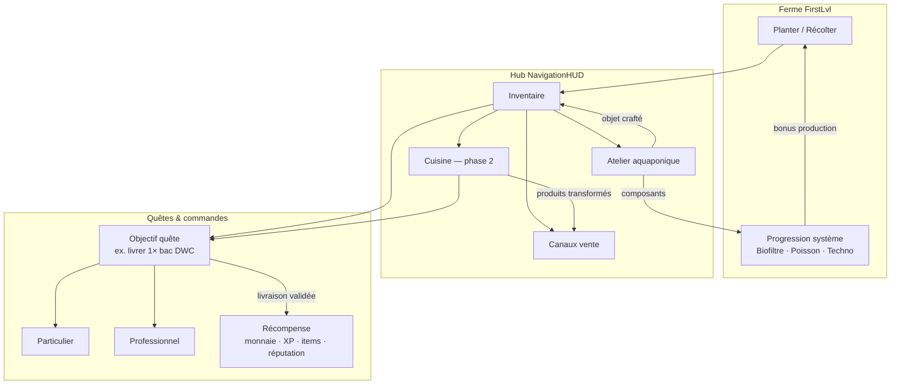
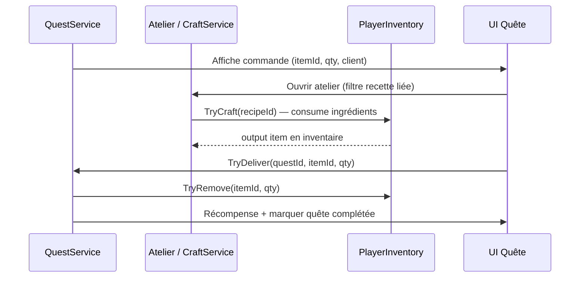

# SPEC — Atelier craft aquaponique, quêtes & cuisine (vision)

**Création :** 2026-08-31  
**Statut :** brouillon actif — intention auteur session 2026-08-31  
**Priorité produit :** axe **indispensable** pour éclairer le développement du **système aquaponique** et ouvrir la boucle **commandes / quêtes**.

> Ce document synthétise la vision **atelier** (craft technique aquaponie), son lien avec les **quêtes** (commandes particuliers & professionnels) et la **cuisine** (transformation produits — phase ultérieure).  
> Complète : `Notes/GDD/SPEC_inventaire_multiverse_hub.md` §6, `Notes/GDD/SPEC_progression_systeme_aquaponique_par_niveau.md`, `Notes/GDD/SPEC_vente_production_boucle_jeu.md`.  
> Backlog tâches : `Notes/Todo_project.md` — `[BL-GDD-008]`.

---

## 1) Vision produit

L’**atelier** est l’écran hub où le joueur **fabrique des objets** à partir de ressources d’inventaire. Ces objets servent à :

| Utilité | Description |
|---------|-------------|
| **Quêtes / commandes** | Des **particuliers** ou **professionnels** demandent des pièces ou installations aquaponiques (ex. bac DWC, kit tuyauterie, système complet) ; le joueur les **craft** puis **livre** contre une **récompense de quête**. |
| **Progression aquaponique** | Composants consommables ou équipables pour améliorer l’installation locale (media, capteurs, modules) — synergie future avec le panneau système `[BL-GDD-005]`. |
| **Économie** | Alternative ou complément à la **vente brute** des récoltes : transformer matières premières en **produits à plus forte valeur** (commandes > prix marché voisinage). |

**Phase ultérieure — Cuisine :** écran ou onglet séparé pour la **transformation alimentaire** (laitue → salade, poisson → préparation, confiture…). Même moteur craft, **station différente** — ne pas mélanger avec l’atelier technique.

---

## 2) Trois systèmes à ne pas confondre

| Système | Rôle | UI | Statut |
|---------|------|-----|--------|
| **Progression système aquaponique** | Améliorer l’installation **sur place** (nœuds Biofiltre / Poisson / Techno, points système, anti-aléas) | Panneau **in-scène** `FirstLvl` (overlay, pas `SceneNavigator`) | Spec `[BL-GDD-005]` — pas de code métier |
| **Atelier craft (hub)** | **Fabriquer** objets / kits / bacs à partir de l’inventaire ; **livrer** aux commanditaires de quêtes | Écran hub `ScreenId.Craft` (comme Shop / Inventaire) | **Chantier en cours** — cette spec |
| **Cuisine** | **Transformer** produits agricoles en denrées | Onglet Cuisine ou écran dédié (phase 2) | Backlog — après atelier V0 |

**Règle :** l’atelier **éclaire** le développement aquaponique ; le panneau in-scène **dépense des points système** sur des upgrades permanents ; la cuisine **valorise les récoltes** pour la boucle alimentaire / vente.

---

## 3) Boucle de jeu cible



**Session type (cible) :** récolter → ouvrir l’atelier → crafter le **bac DWC** demandé par un client → livrer la quête → récompense → réinvestir (graines, upgrades, nouvelles recettes).

---

## 4) Atelier & quêtes — utilité détaillée

### 4.1 Types de commanditaires

| Type | Exemples de demandes | Ton / récompense typique |
|------|----------------------|---------------------------|
| **Particulier** | Petit bac DWC balcon, kit débutant, media filtrant | Monnaie modérée, XP, déblocage recette simple |
| **Professionnel** | Installation DWC multi-bacs, système pour restaurant / maraîcher, formation + matériel | Gros paiement, items rares, réputation pro, déblocage tier craft |

### 4.2 Exemples d’objets craftables (atelier)

| Objet | Description gameplay | Lien quête |
|-------|---------------------|------------|
| **Bac DWC particulier** | Deep Water Culture — unité compacte | Quête « Mon voisin veut un bac sur son balcon » |
| **Bac DWC pro** | Version capacité / robustesse supérieure | Quête maraîcher, restaurant, école |
| **Kit tuyauterie** | Composant intermédiaire ou livrable seul | Prérequis ou sous-objectif |
| **Media filtrant** | Support racinaire / filtration | Lien prestige G2 (`SPEC_prestige_generation_systemes.md`) |
| **Pompe / capteur pH** (placeholder) | Techno aquaponie | Branche Techno `[BL-GDD-005]` |
| **Système aquaponique complet** (tardif) | Assemblage multi-composants | Quête ★5 vente — « formations / conseils » (`SPEC_vente_production_boucle_jeu.md` §2.9) |

Les noms exacts et chiffres sont **TBD** ; l’important est la **chaîne** : quête définit un **itemId cible** → joueur craft → inventaire contient l’item → action **Livrer** valide la quête.

### 4.3 Flux quête ↔ atelier (contrat technique)



**Règles proposées :**

- Une quête de **livraison** référence un ou plusieurs **`QuestDeliveryTarget`** (`itemId`, `quantity`, optionnel `minQuality`).
- Le craft **ne complète pas** la quête automatiquement : le joueur doit **confirmer la livraison** (évite les crafts accidentels).
- Les objets craftés pour quêtes sont des **`ItemDefinition`** normaux (`ItemCategory.Material` ou `Equipment`) — pas de type spécial « quest-only » en V0.
- Recettes débloquées par : niveau joueur, quête active, techno système, ou achat shop — **TBD** par recette.

### 4.4 Lien avec le backlog quêtes

Réf. `[BL-QUEST-DAILY-001]` (quêtes quotidiennes) : l’atelier fournit le **contenu** (objectifs « craft + livrer ») ; le service quête gère reset, suivi UI, persistance. Les **commandes particuliers / pros** peuvent être :

- des quêtes **ponctuelles** (histoire, PNJ voisinage),
- des quêtes **récurrentes** (daily / hebdo),
- des **contrats pro** à paliers (déblocage après X ventes voisinage).

---

## 5) Cuisine (phase 2 — rappel)

| Atelier | Cuisine |
|---------|---------|
| Objets **techniques** aquaponie | **Denrées** transformées |
| Bacs DWC, tuyaux, capteurs | Salades, plats poisson, conserves |
| Quêtes **installation / matériel** | Quêtes **catering**, marché, événements |
| `CraftStationType.AquaponicWorkshop` | `CraftStationType.Kitchen` |

Même **`CraftService`** et pipeline inventaire ; **filtre UI** et recettes séparés.

---

## 6) Architecture technique (alignement codebase)

### 6.1 Couches

| Couche | Fichiers cibles | Rôle |
|--------|-----------------|------|
| Data | `RecipeDefinition`, `RecipeCatalogDefinition`, `Assets/Data/Craft/` | Recette : output, ingrédients, station, prérequis |
| Service | `CraftService` | `CanCraft`, `TryCraft` atomique (mirror `InventoryCurrencyAccount.TryPurchase`) |
| Quêtes | `QuestDefinition`, `QuestService` (futur) | Objectifs livraison, récompenses, état persisté |
| UI atelier | `RuntimeCraftScreen`, popup confirmation | Liste recettes, filtre Atelier |
| UI quêtes | TBD — panneau ou intégration canaux vente / PNJ | Suivi commandes actives |
| Système | `ScreenId.Craft`, `PopupId` craft | Enregistrement `UIManager` + `ScreenPopupHost` |

### 6.2 Modèle recette (proposition)

```csharp
public enum CraftStationType
{
    AquaponicWorkshop = 0,  // V0
    Kitchen = 1               // Phase 2
}

// RecipeDefinition (ScriptableObject) — champs clés :
// - recipeId, displayName, stationType
// - outputItem (ItemDefinition), outputQuantity
// - ingredients[] (itemId + quantity)
// - preferredGameScope (filtre UI Farm / Global)
// - unlockRule (optionnel : questId, systemLevel, talentId)
// - linkedQuestIds[] (optionnel : quêtes qui demandent cet output)
```

### 6.3 Items

Étendre le catalogue au-delà du proto actuel (graine / laitue / euro) :

| Catégorie | Exemples atelier |
|-----------|------------------|
| `Material` | Scrap, fibre, compost, connecteur |
| `Equipment` | Bac DWC, pompe, capteur |
| `Harvest` | ingrédients récoltes (inchangé) |

Métadonnée future sur `ItemDefinition` : `craftRecipeIds[]` (popup inventaire → bouton **Craft**) — cf. `SPEC_inventaire_multiverse_hub.md`.

### 6.4 Règles projet

- Navigation hub : `UIManager` / `ScreenPopupHost` — pas de `SceneManager.LoadScene` depuis l’UI atelier.
- Prefabs UI : **Bezy** (`CraftScreen.prefab`, popup) — scripts + prompts **Cursor**.
- Craft atomique : retirer ingrédients puis ajouter output ; **rollback** si échec d’ajout.
- Logique quête / craft dans **services**, pas dans les vues.

---

## 7) Phases d’implémentation

### Phase A — Fondations atelier (V0)

- [ ] Branche `feature/craft-aquaponic-workshop`
- [ ] `RecipeDefinition` + `CraftStationType` + `CraftService.TryCraft`
- [ ] 3–5 `ItemDefinition` matériaux + 2–3 outputs (ex. bac DWC particulier, kit tuyauterie)
- [ ] 2–3 recettes `AquaponicWorkshop` en `Assets/Data/Craft/`
- [ ] Test sans UI (debug / editor)

### Phase B — UI atelier

- [ ] Bezy : `CraftScreen.prefab` (phases shell → composants → wiring)
- [ ] `ScreenId.Craft` + popup confirmation (pattern `ShopItemPopup`)
- [ ] Entrée NavigationHUD
- [ ] Playtest : récolter → crafter → item en inventaire

### Phase C — Quêtes livraison

- [ ] `QuestDefinition` avec objectif `DeliverItem`
- [ ] 1 quête particulier (bac DWC) + 1 quête pro (placeholder)
- [ ] UI suivi commande + bouton Livrer
- [ ] Récompenses : monnaie + XP (points compétences si halo prêt)

### Phase D — Lien progression aquaponique

- [ ] Consommation composant crafté → flag techno / upgrade instance
- [ ] Prérequis recette liés au niveau système `[BL-GDD-005]`

### Phase E — Cuisine

- [ ] `CraftStationType.Kitchen` + recettes transformation
- [ ] Onglet ou écran Cuisine
- [ ] Quêtes catering / marché

---

## 8) V0 — périmètre explicite

**In scope :**

- Atelier hub, station `AquaponicWorkshop` uniquement
- Craft → inventaire → livraison quête (1–2 quêtes test)
- Farm only (pas cross-jeu)

**Hors scope V0 :**

- Cuisine complète
- Panneau progression 3 onglets in-scène
- Gameplay poisson / bassin
- Quêtes quotidiennes avec reset UTC (`[BL-QUEST-DAILY-001]` complet)
- Market global

---

## 9) Questions ouvertes (à trancher en session)

| # | Question |
|---|----------|
| Q1 | Premier objet craft V0 : **bac DWC particulier** seul, ou aussi kit intermédiaire ? |
| Q2 | Ingrédients V0 : récoltes farm seules, ou récoltes + **monnaie** + achats shop ? |
| Q3 | Où afficher les **commandes** : écran dédié Quêtes, bandeau sur atelier, ou PNJ voisinage existant ? |
| Q4 | Livraison : l’item crafté est-il **consommé** à la livraison (oui en V0) ou peut-on livrer depuis l’inventaire général ? |
| Q5 | Recettes : déblocage par **quête active** uniquement, ou catalogue visible avec recettes grisées ? |

---

## 10) Références croisées

| Document | Lien |
|----------|------|
| `SPEC_inventaire_multiverse_hub.md` §6 | Atelier craft commun, cross-jeu (ultérieur) |
| `SPEC_progression_systeme_aquaponique_par_niveau.md` | Panneau in-scène — upgrades système, pas craft hub |
| `SPEC_vente_production_boucle_jeu.md` | Boucle ferme → économie ; ★5 systèmes / formations |
| `SPEC_prestige_generation_systemes.md` | Media G2, qualité eau future |
| `REFERENCES_jeux_inspiration.md` | Tiny Harvest — chaîne transformation ; Doraemon — requêtes villageois |
| `Notes/Todo_project.md` | `[BL-GDD-008]`, `[BL-QUEST-DAILY-001]` |

---

## 11) Décisions actées (session 2026-08-31)

| # | Décision |
|---|----------|
| D1 | L’atelier sert d’abord à **éclairer le système aquaponique** (composants, bacs, kits). |
| D2 | La **cuisine** arrive **après** — transformation produits, station séparée. |
| D3 | L’atelier permet de **répondre aux quêtes** : craft d’objets demandés par **particuliers** ou **professionnels**, livraison contre **récompense**. |
| D4 | Exemples produits : **bacs DWC** (particulier / pro), kits et composants aquaponiques. |
| D5 | Un seul moteur `CraftService` ; distinction par `CraftStationType`. |
