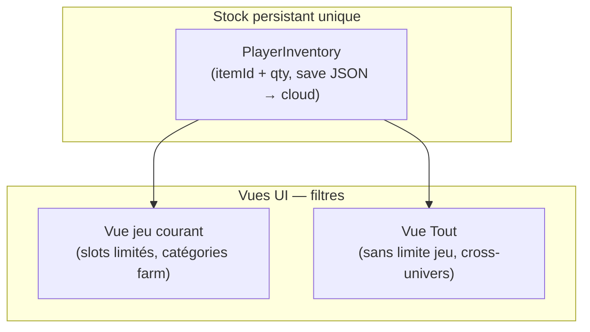
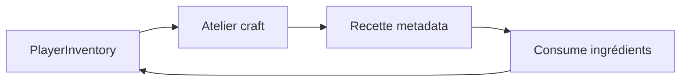

# SPEC — Inventaire multiverse & hub cross-jeu

**Création :** 2026-08-18  
**Statut :** brouillon actif — décisions auteur session 2026-08-18  
**Priorité produit :** fondation économie multiverse (farm → runner → shooter → market global).

> Ce document décrit le **modèle inventaire partagé**, les **onglets / vues**, l’**atelier craft commun** et les liens avec le **market global**.  
> Il complète : `Notes/Ui/SPEC_rework_inventaire_halo_progression.md`, `Notes/Ui/SPEC_services_inventory_market_cloud.md`, `Notes/GDD/SPEC_vente_production_boucle_jeu.md`.  
> Suivi tâches : `Notes/Todo_project.md` — `[P0-INV-TABS-001]`.

---

## 1) Vision produit

Le projet vise un **multiverse** : plusieurs modes de jeu (farm, infinite runner, shoot’em up…) partagent une **économie joueur** commune.

| Flux | Intention |
|------|-----------|
| Farm → récolte | Ressources entrent dans le stock joueur |
| Runner / Shooter | Consommables farm **droppables** ; buffs **adaptés par jeu** (metadata) |
| Hub (depuis n’importe quel jeu) | Gérer **toutes** les ressources : vendre, craft, organiser |
| Market global | Vente / achat multijeu avec filtres riches (TBD) |

Le joueur ne doit **pas** être obligé de lancer un autre jeu pour **vendre une arme** ou **lancer un craft shooter** depuis la farm.

---

## 2) Modèle de stock — une vérité, deux vues

### 2.1 Principe (décision auteur 2026-08-18)

**Par défaut : lunette, pas tiroir.**  
Une **liste inventaire unique** persiste côté save / cloud. Les onglets ne créent **pas** plusieurs sacs silencieux.

**Exception volontaire (non défaut) :** un transfert **manuel** entre « stock lié au jeu » et « stock global » pourra exister plus tard — **hors scope V0**, pas le flux principal.

### 2.2 Deux modes d’affichage

| Vue | Rôle | Limite slots |
|-----|------|--------------|
| **Vue jeu (défaut)** | Items **pertinents au jeu courant** (farm : graines, consommables farm, récoltes…) | **Oui** — capacité inventaire **par jeu** (chiffre TBD, ex. 20 slots farm) |
| **Vue Tout / Global** | **Tous** les items de **tous** les jeux ; gestion / vente / craft cross-jeu | **Non** — pas de plafond d’affichage lié au jeu courant |



### 2.3 Limite par jeu vs vue global

- La **limite de slots** s’applique à la **vue jeu** : ce que le joueur considère comme « mon sac farm » en session farm.
- La **vue Tout** montre l’intégralité du stock (armes shooter, nourriture poisson, graines…) pour **gérer / vendre / craft** sans changer de jeu.
- **Overflow / dépassement** (item au-delà du cap jeu) : comportement exact **TBD** — candidats :
  - A) item reste dans le vault global, invisible en vue jeu tant que non « transféré » (transfert manuel = exception) ;
  - B) vue jeu montre les N premiers slots filtrés, le reste accessible uniquement via **Tout** ;
  - C) collecte farm refusée si vue jeu pleine, message « ouvrir Tout / vendre / craft ».

→ **Décision V0 recommandée : B** (simple, pas de double sac) — à valider auteur.

### 2.4 Équipement équipé

- L’**équipement porté** (arme active shooter, etc.) reste **propre au jeu** où il est équipé.
- **Hors** de la grille inventaire classique : état **`EquippedLoadout`** par `GameId` (farm / runner / shooter).
- Depuis la farm, onglet **Équipement** ou **Tout** : voir l’arme, **vendre** ou **déséquiper** (retour vault) — **pas** « utiliser en farm » sauf metadata explicite.

---

## 3) Onglets inventaire

### 3.1 Structure cible (farm V0 → multiverse)

**Vue jeu (farm) — onglets par défaut à l’ouverture :**

| Onglet | Filtre | Exemples |
|--------|--------|----------|
| **Graines** | `Category = Seed` + scope Farm | `laitue_seed` |
| **Consommables** | `Category = Consumable` + scope Farm | anti-fourmi, test eau |
| **Récoltes** | `Category = Harvest` + scope Farm | laitue, futurs crops |
| *(plus tard)* **Équipement** | armes / modules hors farm | visible si items possédés |

**Onglet transversal :**

| Onglet | Filtre |
|--------|--------|
| **Tout** | Aucun filtre catégorie ; **tous** jeux ; **sans** limite slots jeu |

### 3.2 Profils d’onglets par jeu (V1+)

`InventoryTabProfile` (ScriptableObject, Cursor) : liste ordonnée d’onglets + règles filtre.

| Profil | Onglets jeu | Onglet Tout |
|--------|-------------|-------------|
| Farm | Graines, Consommables, Récoltes | Toujours présent |
| Runner | Buffs, Consommables, Modules | Toujours présent |
| Shooter | Armes, Munitions, Modules | Toujours présent |
| Hub / Market prep | Ressources, Consommables, Équipement | Toujours présent |

Réf. UI existante : `FilterBarPlaceholder` dans `InventoryScreen.prefab` → remplacer par barre onglets Bezy (`Notes/Ui/PROMPTS_Bezi_inventory_tabs.md`).

### 3.3 Interactions depuis la vue Tout

Depuis **n’importe quel jeu**, onglet **Tout** :

- Voir item cross-jeu
- Popup détail : **Vendre** (market), **Craft** (atelier), **Jeter** / compost (farm)
- **Utiliser** : **situationnel** — voir §5

---

## 4) Métadonnées item (`ItemDefinition` — évolution)

État actuel code : `ItemInventoryBehavior` = `Standard | Currency` seulement.  
Cible multiverse (champs à ajouter progressivement) :

| Champ | Type | Rôle |
|-------|------|------|
| `itemCategory` | enum | Seed, Harvest, Consumable, Material, Weapon, Ammo, FishCare, Currency, … |
| `gameScope` | flags | Farm, Runner, Shooter, Global |
| `tradeable` | bool | Listable market global |
| `craftRecipeIds` | refs | Recettes atelier |
| `useEffectsByGame` | map GameId → effect | Buff / action situationnelle (§5) |

**V0 farm (`[P0-INV-TABS-001]`)** : introduire au minimum **`itemCategory`** + **`gameScope`** sur les assets existants.

---

## 5) Utiliser un item — situationnel (TBD, risque élevé)

### 5.1 Intention auteur

- **Utiliser** un consommable peut produire un **effet différent selon le jeu** (ex. laitue = heal runner, buff vitesse shooter, compost farm…).
- Objectif design : pousser la **vente** / l’**échange** plutôt que l’usage direct quand l’effet est faible hors contexte.
- **Charge de maintenance élevée** — modéliser via **metadata** (`useEffectsByGame`), pas du code hardcodé par item.

### 5.2 Piste technique (brouillon)

```text
ItemUseEffectEntry:
  - gameId: Farm | Runner | Shooter
  - actionId: Heal | BuffSpeed | ApplySoil | None
  - magnitude, duration, VFX id
  - fallbackLabel: "Mieux vaut vendre au market"
```

- **Hors contexte** : bouton **Utiliser** grisé ou remplacé par **Vendre** / **Craft**.
- **Service** : `ItemUseService.TryUse(itemId, activeGameId)` lit metadata, applique effet ou refuse.

### 5.3 Questions ouvertes (non bloquantes V0 onglets)

1. Un item **sans** entrée pour le jeu courant : refus sec ou effet « générique » ?
2. Même item, **3 effets** différents : équilibrage par playtest — backlog `[BL-GDD-INV-USE-001]`.
3. Priorité V0 : **pas** d’implémenter multi-buff — seulement popup détail + vente / drop.

---

## 6) Atelier craft commun

### 6.1 Principes (décision auteur)

- **Un écran atelier hub** (comme inventaire / market), accessible depuis **tous** les jeux.
- **Craft cross-jeu toujours autorisé** si ingrédients présents dans le vault global.
- **Filtres** : par jeu (Farm / Runner / Shooter), par catégorie, par ingrédient manquant.
- **Filtre par défaut** = jeu courant ; bouton **Voir tout** pour recettes cross-jeu.

### 6.2 Flux



- Recette : `RecipeDefinition` (SO) — output item, ingrédients, `preferredGameScope` (filtre UI, **pas** blocage).
- **V0** : atelier **non implémenté** — spec posée pour aligner onglets + catégories items.
- **Vision détaillée** (atelier aquaponique, quêtes livraison, cuisine phase 2) : `Notes/GDD/SPEC_craft_atelier_aquaponique.md`.

---

## 7) Market global — filtres (TBD)

Le market partage le **même snapshot inventaire** que la vue **Tout**.

Filtres envisagés (liste non exhaustive, à prioriser en session dédiée) :

| Filtre | Exemple |
|--------|---------|
| Catégorie | Graines, Récoltes, Armes… |
| Jeu d’origine | Farm, Runner, Shooter |
| Rareté / tier | TBD |
| Prix | min / max |
| Vendable par moi | stock > 0 |
| Mes annonces actives | orders du joueur |
| Recherche texte | nom item |

**Hors scope V0 onglets** — documenter ici pour cohérence data (`tradeable`, `itemCategory`, `gameScope`).

Réf. vente farm actuelle : `SPEC_vente_production_boucle_jeu.md` (canaux voisinage V0 ≠ market global final).

---

## 8) Architecture technique (alignement codebase)

| Couche | Actuel | Cible |
|--------|--------|-------|
| Stock | `PlayerInventory` singleton, `List<InventorySlot>`, save JSON | Inchangé V0 ; puis `IInventoryService` (cloud) |
| Catalogue | `ItemDatabase` + `ItemDefinition` | + category, scope, tradeable, use effects |
| UI grille | `InventoryUI` — tous slots, pas de filtre | + filtre onglet + mode vue jeu / Tout |
| Barre onglets | `filterBarPlaceholder` inactif | Bezy `[BZ-INV-TABS-001]` + Cursor `InventoryFilterTabBar` |
| Équipement | — | `EquippedLoadoutService` par GameId (backlog) |
| Craft | — | `CraftService` + écran hub (backlog) |
| Market | `SaleChannelService` (farm local V0) | `IMarketService` global (backlog) |

**Règles projet :** navigation via `UIManager` / `ScreenPopupHost` ; pas de logique réseau dans les vues UI.

---

## 9) Phases d’implémentation

### Phase A — V0 farm (en cours)

- [ ] GDD spec (ce document)
- [ ] Bezy : barre onglets UI (`PROMPTS_Bezi_inventory_tabs.md`)
- [ ] Cursor : `ItemCategory` + filtre `InventoryUI` + onglet **Tout**
- [ ] Playtest `[P0-INV-TABS-PLAY-001]`

### Phase B — Multiverse metadata

- [ ] `gameScope`, `tradeable` sur items
- [ ] Vue **Tout** : items shooter visibles depuis farm
- [ ] `InventoryTabProfile` par jeu

### Phase C — Équipement par jeu

- [ ] Loadout équipé séparé de la grille
- [ ] Vente / déséquipement depuis hub

### Phase D — Craft + market global

- [ ] Atelier craft filtrable, cross-jeu
- [ ] Market filtres + sync cloud

### Phase E — Utiliser situationnel

- [ ] `useEffectsByGame` + `ItemUseService`
- [ ] Équilibrage + QA (fort risque régression)

---

## 10) Décisions actées vs ouvertes

### Acté (2026-08-18)

| # | Décision |
|---|----------|
| D1 | Stock persistant **unique** ; onglets = vues filtrées **par défaut** |
| D2 | **Vue jeu** = défaut, **slots limités** par jeu |
| D3 | **Vue Tout** = cross-jeu, **sans limite** slots jeu ; gestion / vente / craft |
| D4 | Transfert physique entre sacs : **possible plus tard**, **pas** le flux défaut |
| D5 | **Craft cross-jeu toujours autorisé** (si ingrédients OK) |
| D6 | **Équipement équipé** = état **unique au jeu** où il est porté |
| D7 | **Utiliser** item = situationnel / metadata — **à affiner**, pas V0 |

### Ouvert (à trancher)

| ID | Question |
|----|----------|
| Q1 | Cap slots **farm V0** (20 actuel ?) s’applique-t-il à la vue jeu ou au vault entier ? |
| Q2 | Overflow au-delà du cap : modèle **A / B / C** (§2.3) ? |
| Q3 | Onglet **Récoltes** séparé en V0 ou fusion avec **Consommables** ? |
| Q4 | Libellé onglet global : **Tout** vs **Global** vs **Multiverse** ? |
| Q5 | Liste exacte filtres market (§7) — session GDD dédiée |
| Q6 | Effets **Utiliser** par jeu — priorité vs vente (§5) |

---

## 11) Références

- UI inventaire : `Notes/Ui/ARBRE_inventory_halo_ui.md`
- Rework halo : `Notes/Ui/SPEC_rework_inventaire_halo_progression.md`
- Cloud : `Notes/Ui/SPEC_services_inventory_market_cloud.md`
- Vente V0 : `Notes/GDD/SPEC_vente_production_boucle_jeu.md`
- Prompts Bezy onglets : `Notes/Ui/PROMPTS_Bezi_inventory_tabs.md`
- Code : `PlayerInventory.cs`, `InventoryUI.cs`, `ItemDefinition.cs`, `InventoryScreenController.cs`
