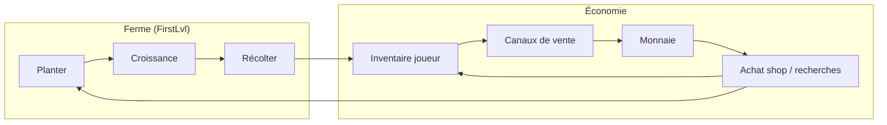
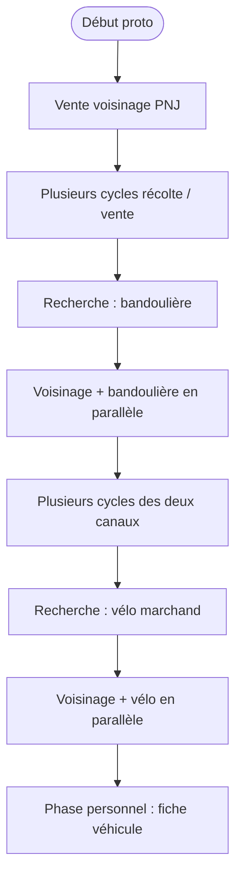
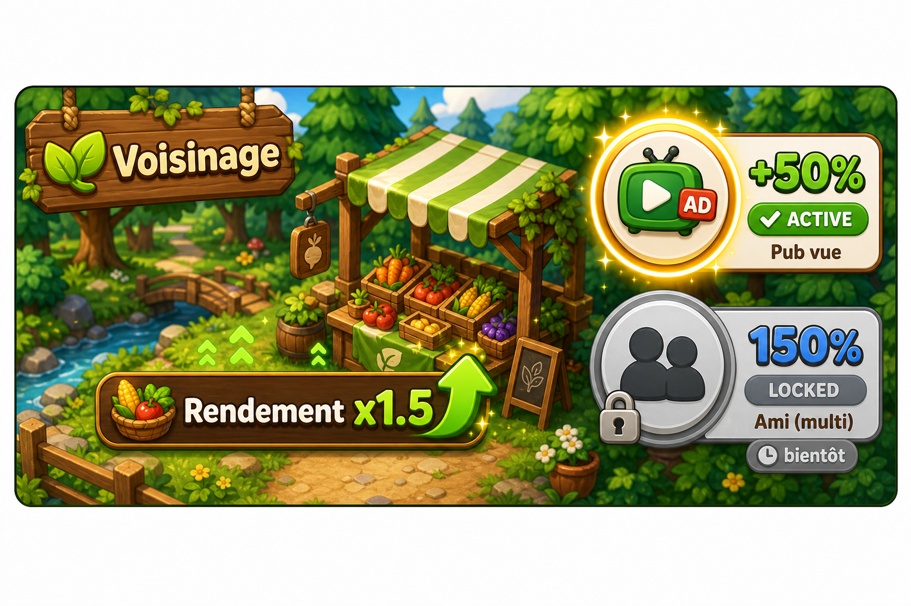

# SPEC — Vente de la production (boucle de jeu)

**Création :** 2026-06-10  
**Statut :** brouillon actif — vision auteur intégrée (2026-06-10)  
**Priorité produit :** axe **indispensable** pour fermer la boucle ferme → économie → réinvestissement.

> Ce document décrit **la vente des produits récoltés** (laitue, graines, futurs crops…).  
> Il ne remplace pas la doc **achat** (`Notes/Ui/popup_generique.md`) ni le suivi des tâches (`Notes/Todo_project.md`).

---

## 1) Rôle dans la boucle de jeu

La production sans débouché économique bloque la progression. La vente est le **convertisseur** entre :

| Entrée | Sortie | Permet ensuite |
|--------|--------|----------------|
| Items récoltés (`PlayerInventory`) | Monnaie (`PrimaryCurrency`) | Acheter graines / recherches / upgrades commerce |

**Objectif session typique (cible)** : récolter → écouler via un **canal de vente** → accumuler monnaie sur plusieurs cycles → débloquer le canal suivant → réinvestir (graines, upgrades).  
Le **runner**, le **biofiltre** et les **talents commerce** modulent ou consomment cette boucle — détail à croiser avec [P0-IDEA-001] (`Notes/GDD/INBOX_notes_tablette_recherches.md`).

---

## 2) Vision design — canaux de vente (brouillon auteur)

> Import structuré session 2026-06-10. Chiffres et UX détaillée **TBD** ; la logique de progression est actée en intention.

### 2.1 Principe général

La vente n’est **pas** un écran shop générique au départ : ce sont des **canaux d’écoulement** débloqués progressivement. Chaque canal a son propre **prix**, **capacité / volume** et **coût d’accès** (recherche ou upgrade).

### 2.2 Référence interface UI — écran d’écoulement

> **Affichage :** les images s’affichent correctement **sur GitHub** (après push). L’aperçu Markdown **Cursor / VS Code** peut ne pas les rendre en local — ouvrir le PNG dans le même dossier que cette note, ou consulter le fichier sur github.com.

Référence visuelle pour la **conception UI** des canaux de vente / zones d’écoulement : liste verticale de **bandeaux thématiques** (scroll), chaque panneau = un univers ou un canal distinct.

**Fichier :** `Notes/GDD/ref_ui_ecoulement_production_panneaux.png`

**Ce qu’on retient pour l’implémentation :**

| Élément référence | Traduction gameplay |
|-------------------|---------------------|
| Bandeaux horizontaux empilés | Liste scrollable des **canaux de vente** (voisinage, bandoulière, vélo, …) ou des **zones d’écoulement** débloquées |
| Pancarte + icône en haut à gauche | Identifiant visuel du canal (icône + libellé court) |
| Illustration isométrique par panneau | Ambiance / thème du canal — pas un bouton plat générique |
| Style cartoon saturé, lisible mobile | Cohérent avec le ton cozy farm du projet |
| Scroll vertical | Plusieurs canaux ou zones sans écran surchargé |
| **Slots d’upgrade** (coin du bandeau) | Options **rendement** par canal — cf. §2.8 |

*Proto V0 (voisinage seul) : un seul panneau actif au départ ; les autres apparaissent **verrouillés** ou absents jusqu’au déblocage recherche (cf. §2.5). Les upgrades rendement (§2.8) sont **hors scope V0** — north star UI.*

### 2.3 Échelle des canaux

| Tier | Canal | Rôle | Déblocage (intention) | Proto |
|------|-------|------|------------------------|-------|
| **0** | **Voisinage** (PNJ) | Écoulement local, prix **correct**, volumes **très faibles** | Disponible dès le début | **V1 proto** — seule option au lancement |
| **1** | **Bandoulière** — étal portatif légumes & poissons | Vente mobile légère, capacité ~15 kg, circuit court | Recherche / upgrade financée après **plusieurs cycles** récolte → vente voisinage | Post-proto |
| **2** | **Vélo marchand** — légumes & poissons | Capacité supérieure, plusieurs concepts (remorque, triporteur, bi-porteur…) | Upgrade après cycles **voisinage + bandoulière** | Post-proto |
| **3+** | Personnel + véhicule assigné | Le joueur **remplit l’inventaire** d’un véhicule ; visualisation **CA − coût vendeur** | Quand du **personnel** est disponible | Phase ultérieure |

**Références visuelles (concept art)** :

> **Affichage :** les images s’affichent correctement **sur GitHub** (après push). L’aperçu Markdown **Cursor / VS Code** peut ne pas les rendre en local — ouvrir les PNG dans le même dossier que cette note, ou consulter le fichier sur github.com.

#### Tier 1 — Bandoulière (étal portatif)

Étal portatif « Aquaponie locale » : casiers légumes + bac isotherme poissons, bandoulière, ~15 kg charge utile, circuit court.

#### Tier 2 — Vélo marchand

Quatre variantes : remorque étal, camionnette revisitée, triporteur magasin, bi-porteur modulable — palette bois / vert éco, circuit court.

### 2.4 Règle de parallélisme (actée en intention)

Le joueur **ne peut pas** exploiter tous les canaux mobiles en même temps lui-même.

| Combinaison | Autorisée ? |
|-------------|-------------|
| Voisinage **+** bandoulière (joueur) | Oui — voisinage reste le socle |
| Voisinage **+** vélo marchand (joueur) | Oui — **un seul** canal mobile actif à la fois |
| Bandoulière **+** vélo en parallèle (joueur) | **Non** |
| Voisinage **+** N véhicules avec **personnel** | Oui — phase personnel (§2.6) : le joueur gère l’approvisionnement, le vendeur écoule |

En résumé : **voisinage toujours possible** ; le joueur n’active qu’**un** des systèmes mobiles (bandoulière **ou** vélo) jusqu’à l’arrivée du personnel.

### 2.5 Prototype en cours — périmètre V0

Focus **tier 0 — voisinage** uniquement :

- Implémenter **quelques PNJ voisins** comme points de vente.
- Produit cible initial : **salades** (laitue récoltée).
- **Prix** : très correct pour le joueur (bonne marge relative au coût des graines).
- **Quantité** : **très réduite** par PNJ / par cycle — goulot volontaire pour forcer la progression et plusieurs boucles récolte → vente avant la bandoulière.
- Pas de bandoulière ni vélo dans le proto immédiat ; ils servent de **north star** pour les recherches.

### 2.6 Phase personnel (horizon — non proto)

Quand du **personnel vendeur** est disponible :

- **Fiche véhicule** (UI dédiée) : le joueur **remplit l’inventaire** du véhicule (légumes, poissons, glace… selon le type d’étal).
- **Visualisation** : chiffre d’affaire prévisionnel ou réalisé **moins le coût du vendeur** (salaire / commission — à chiffrer).
- Permet de **déléguer** un canal mobile tout en gardant le voisinage (et éventuellement un second véhicule avec un autre employé).
- Lien possible avec piste **Logistique** / **Commerce** des talents halo — détail TBD tablette.

### 2.7 Axes économiques par canal (à chiffrer)

| Paramètre | Voisinage | Bandoulière | Vélo marchand |
|-----------|-----------|-------------|---------------|
| Prix unitaire (ex. salade) | Élevé (correct) | Moyen | Plus bas ou volume plus haut ? **TBD** |
| Volume max / cycle | Très faible | Faible–moyen (~15 kg ref. art) | Élevé |
| Coût d’exploitation | Négligeable | Amortissement upgrade | Amortissement + entretien ? |
| Interaction joueur | Dialogue PNJ / livraison | Session mobile (TBD gameplay) | Session mobile ou assignation staff |

### 2.8 Upgrades rendement — par bandeau

Chaque **bandeau** (canal d’écoulement débloqué) expose des **options d’upgrade** pour augmenter le rendement des ventes sur ce canal. Le joueur voit immédiatement l’état **actif / inactif / verrouillé** via des **icônes PNG** sur le bandeau (pas de texte long).

#### Options actées (intention auteur)

| Option | Déclencheur | Effet rendement | Proto | Feedback UI |
|--------|-------------|-----------------|-------|-------------|
| **Boost pub** | Vision d’une **publicité** récompensée | **+50 %** sur les ventes du bandeau (multiplicateur **×1,5**) | Post-V0 (monétisation) | Icône **lecteur / AD** — état **actif** (halo doré + badge « Pub vue ») ou **inactif** (grisé, CTA « Regarder ») |
| **Ami coop** | Ajout d’un **ami** sur le canal | **150 %** du rendement de base (multiplicateur **×1,5** — même ordre de grandeur que la pub, à valider si cumul) | **Multi** — seulement si le jeu est **rentable** | Icône **deux silhouettes** — **verrouillé** en solo (« Ami · bientôt ») ; actif en multi |

**Règles provisoires :**

- Les upgrades sont **par bandeau** : chaque canal a ses propres slots (voisinage, bandoulière, vélo…).
- Le **rendement courant** du bandeau doit être lisible en un coup d’œil (ex. jauge ou libellé « Rendement ×1,5 » sur le bandeau actif).
- **Cumul pub + ami** : **TBD** — ne pas supposer ×2,25 sans équilibrage ; documenter le choix avant implémentation multi.
- Durée du boost pub : **TBD** (session, X heures, jusqu’au prochain cycle de vente…).

#### Référence visuelle — feedback joueur

**Fichier :** `Notes/GDD/ref_ui_bandeau_upgrades_rendement.png`

**États UI à prévoir (Bezy / prefab bandeau) :**

| État | Rendu |
|------|-------|
| Inactif | Icône grisée, pas de halo |
| Actif (pub vue) | Icône couleur + anneau doré + indicateur rendement |
| Verrouillé (ami / multi) | Cadenas + libellé court « bientôt » |
| Rendement global bandeau | Badge ou barre « ×1,0 » / « ×1,5 » visible sur le bandeau sélectionné |

*Maquette conceptuelle — les assets finaux (sprites PNG des icônes AD / Ami) seront produits en phase polish ou via Bezy.*

---

## 3) Distinction achat vs vente (vocabulaire projet)

| Terme | Sens actuel / cible | Écran / flux |
|-------|---------------------|--------------|
| **Shop — achat** | Le joueur **dépense** de la monnaie pour recevoir des items (ex. graines) | `ScreenId.Shop`, `RuntimeShopScreen` — **livré (achat)** |
| **Vente production** | Le joueur **cède** des items récoltés contre de la monnaie via un **canal** (§2) | **Non implémenté** |
| **Market (global)** | Place de marché interconnectée (cloud) — hors scope proto local | `ScreenId.Market` commenté ; spec cloud : `Notes/Ui/SPEC_services_inventory_market_cloud.md` |

**Règle de rédaction :** « vente voisinage / bandoulière / vélo » pour les canaux locaux ; réserver « market » au marché global cloud.

---

## 4) État actuel du code (2026-06-10)

### Ce qui existe

| Élément | Détail |
|---------|--------|
| Récolte → inventaire | `PlantHarvestInteractor` → `PlayerInventory.TryAdd` — voir `Notes/Farm/SYSTEMES_carte_mentale.md` |
| Monnaie + achat | `InventoryCurrencyAccount.TryPurchase`, wallet UI — voir `Notes/Ui/popup_generique.md` |
| Catalogue prototype | `MarketCatalogPrototype` + `market_catalog.json` — offres **achat** shop uniquement |
| Talents vendeur (mock) | Branche « Vendeur » — mock `talent.commerce.seller.price1` ; à relier aux canaux plus tard |

### Ce qui manque (gap principal)

- Aucun canal de vente (PNJ voisinage, bandoulière, vélo).
- Pas de prix de **revente** par item / par canal.
- Pas de système **recherche / upgrade** lié aux canaux commerce.
- Pas de **boost rendement** par bandeau (pub / ami — §2.8).
- Pas de règle **parallélisme** canaux côté code.

---

## 5) Questions ouvertes (reste à trancher)

### 5.1 Proto voisinage (priorité immédiate)

- [ ] Nombre de PNJ voisins (2–3 ?) et emplacement scène (Hub, FirstLvl, quartier dédié ?).
- [ ] UX : dialogue, popup livraison, ou interaction « donner X salades » ?
- [ ] Plafond quantité par PNJ : fixe, reset journalier, ou par cycle de récolte ?
- [ ] Prix exact salade vs prix graine (ratio cible pour N cycles avant bandoulière).

### 5.2 Recherches & upgrades

- [ ] Arbre techno : branche **Commerce / Logistique** ou upgrade dans panneau FirstLvl ?
- [ ] Coût monnaie + prérequis (XP, maturité biofiltre ?) pour bandoulière puis vélo.
- [ ] Les recherches consomment-elles aussi des matériaux inventaire (bois, sangles…) ou monnaie seule en V1 ?

### 5.3 Gameplay mobile (bandoulière / vélo)

- [ ] Mini-jeu / déplacement sur carte, ou écran de gestion abstrait (timer + stock) ?
- [ ] Légumes **et** poissons dès la bandoulière, ou légumes seuls jusqu’au vélo ?

### 5.4 Items vendables

- [ ] Proto : salades uniquement ; extension poisson quand piste `track.fish` active ?
- [ ] Flag `canSell` + canal autorisé par item ?

### 5.6 Upgrades rendement par bandeau (§2.8)

- [ ] Durée du boost **pub** après vision (session, timer, cycle vente ?).
- [ ] Cumul **pub + ami** : additionnel ou le plus fort des deux ?
- [ ] SDK pub (Unity Ads, AdMob…) — choix technique post-rentabilité.
- [ ] Scope **multi ami** : coop async, invitation, ou salon — horizon uniquement.

---

## 6) Pistes d’architecture (cible technique, non engagée)

1. **`ISaleChannelService`** (ou équivalent) — un contrat par canal :
   - `CanSell(itemId, quantity)` / `TrySell(channelId, itemId, quantity)`
   - retourne prix, quantité acceptée, monnaie créditée.
2. **`SaleChannelDefinition` (SO)** — id, tier, prix multiplier, volume cap, unlock research id.
3. **PNJ voisinage V0** — composant `NeighborBuyerNPC` + data table demandes (item, qty max, prix).
4. **Parallélisme** — `SaleChannelManager` : vérifie qu’un seul canal mobile joueur est actif ; voisinage toujours OK.
5. **Phase staff** — `VehicleSaleAssignment` : inventaire dédié véhicule, simulation CA / coût vendeur (offline tick ou à la collecte).
6. **UI** — popup livraison PNJ (proto) ; fiche véhicule (plus tard) ; prefabs **Bezy** pour étal / vélo quand gameplay visuel requis ; **slots upgrade rendement** sur chaque bandeau (§2.8).
7. **`SaleChannelYieldModifier`** — multiplicateur rendement par canal (pub, ami, talents) ; appliqué au calcul monnaie créditée.

### Fichiers code probablement touchés (V0 voisinage)

| Zone | Fichiers / concepts |
|------|---------------------|
| Données | `NeighborSaleOfferDefinition`, prix salade, caps quantité |
| Logique | Service vente, `TryRemove` inventaire + crédit monnaie |
| Scène | PNJ + collider / interaction |
| UI | Popup quantité + confirmation (réutiliser patterns shop) |

---

## 7) Veille références — observations (à compléter)

Utiliser `Notes/References/REFERENCES_jeux_inspiration.md`.  
Noter surtout : **écoulement local limité**, **déblocage capacité de vente**, **délégation / automate**.

### Observations

*(Aucune observation saisie pour l’instant.)*

---

## 8) Hypothèses provisoires (alignées vision §2)

1. **Proto** = tier 0 voisinage seul ; salades ; prix correct ; volume très bas.
2. **Progression** = monnaie accumulée sur **plusieurs cycles** avant chaque recherche (bandoulière → vélo).
3. **Parallélisme** = voisinage + **un** canal mobile joueur max ; pas bandoulière + vélo simultanés sans staff.
4. **Spread économique** : le voisinage reste rentable en marge unitaire ; les canaux supérieurs compensent par **volume** (à valider au chiffrage).
5. Le **shop actuel** reste l’**achat** ; la **vente** passe par les canaux §2, pas par un onglet « vendre » générique du shop (sauf raccourci UI plus tard).

---

## 9) Liens croisés

| Document | Lien |
|----------|------|
| Achats shop (livré) | `Notes/Ui/popup_generique.md` |
| Boucle ferme / récolte | `Notes/Farm/SYSTEMES_carte_mentale.md` |
| Talents commerce | `Notes/GDD/INBOX_notes_tablette_recherches.md` |
| Progression système aquaponique | `Notes/GDD/SPEC_progression_systeme_aquaponique_par_niveau.md` |
| Market cloud (horizon) | `Notes/Ui/SPEC_services_inventory_market_cloud.md` |
| Veille jeux | `Notes/References/REFERENCES_jeux_inspiration.md` |

---

## 10) Prochaines étapes suggérées

1. Chiffrer §5.1 (2–3 PNJ, cap salades, ratio prix) pour implémenter V0.
2. Esquisser l’arbre de recherche bandoulière → vélo (coûts, prérequis cycles).
3. Valider §5.3 : gestion abstraite vs déplacement pour bandoulière/vélo.
4. Créer les tâches dans `Notes/Todo_project.md` **sur demande**.

---

*Dernière mise à jour : 2026-06-13 — upgrades rendement par bandeau (§2.8 : pub +50 %, ami 150 % multi) + maquette feedback UI.*
