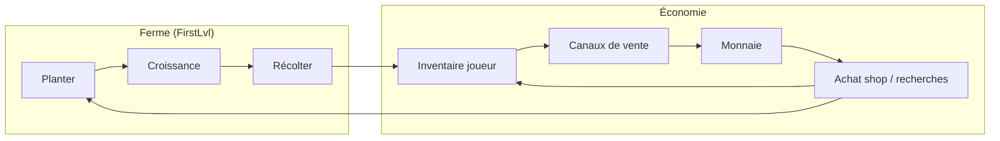
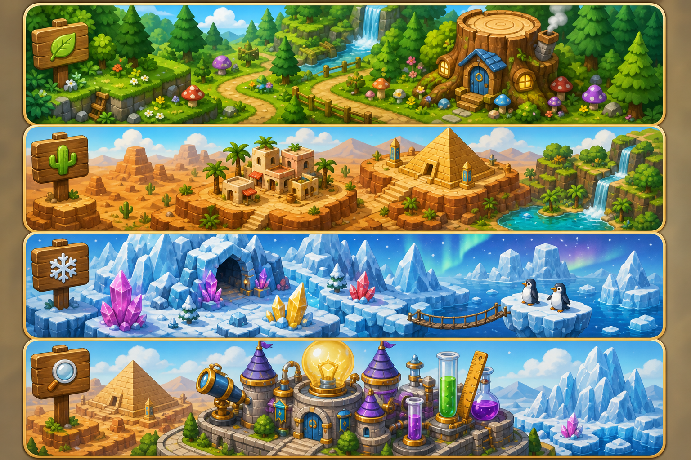
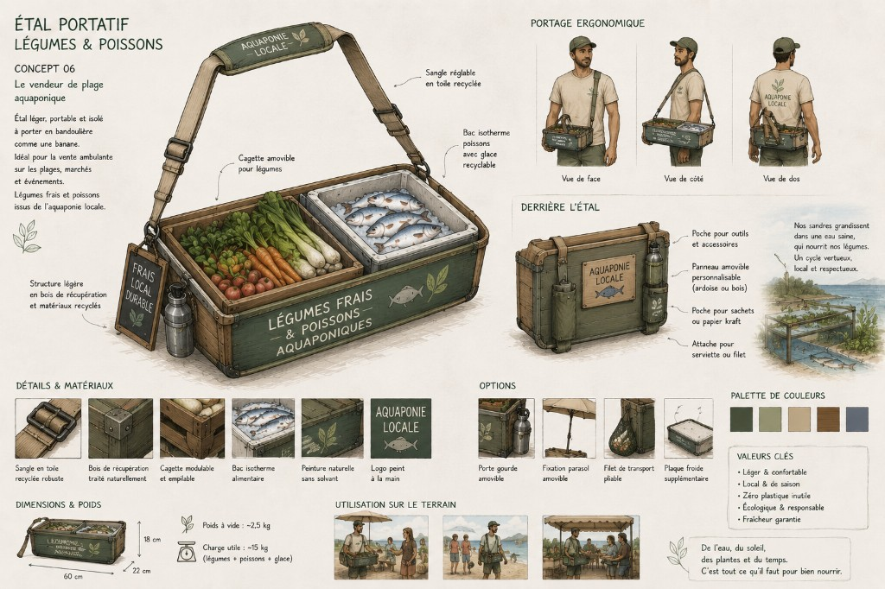
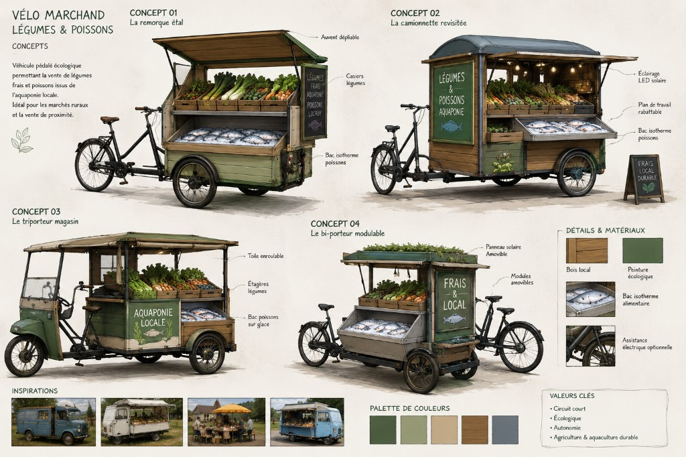
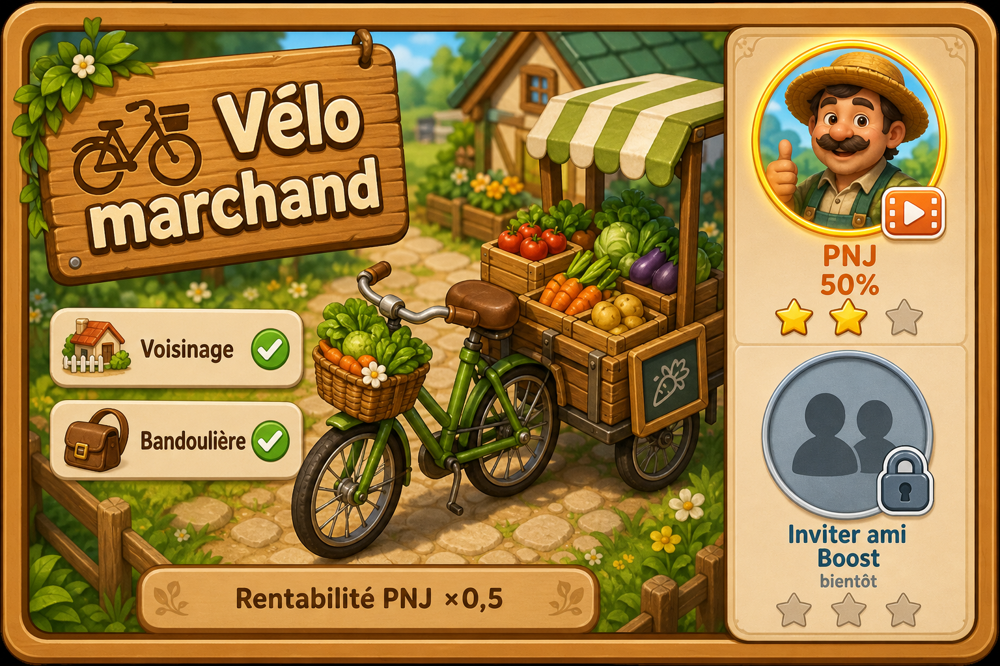

# SPEC — Vente de la production (boucle de jeu)

**Création :** 2026-06-10  
**Statut :** brouillon actif — vision auteur intégrée (2026-06-10)  
**Priorité produit :** axe **indispensable** pour fermer la boucle ferme → économie → réinvestissement.

> Ce document décrit **la vente des produits récoltés** (laitue, graines, futurs crops…).  
> Il ne remplace pas la doc **achat** (`Notes/Ui/popup_generique.md`) ni le suivi des tâches (`Notes/Todo_project.md`).

---

## 1) Rôle dans la boucle de jeu

La production sans débouché économique bloque la progression. La vente est le **convertisseur** entre :

| Entrée | Sortie | Permet ensuite |
|--------|--------|----------------|
| Items récoltés (`PlayerInventory`) | Monnaie (`PrimaryCurrency`) | Acheter graines / recherches / upgrades commerce |



**Objectif session typique (cible)** : récolter → écouler via un **canal de vente** → accumuler monnaie sur plusieurs cycles → débloquer le canal suivant → réinvestir (graines, upgrades).  
Le **runner**, le **biofiltre** et les **talents commerce** modulent ou consomment cette boucle — détail à croiser avec [P0-IDEA-001] (`Notes/GDD/INBOX_notes_tablette_recherches.md`).

---

## 2) Vision design — canaux de vente (brouillon auteur)

> Import structuré session 2026-06-10. Chiffres et UX détaillée **TBD** ; la logique de progression est actée en intention.

### 2.1 Principe général

La vente n’est **pas** un écran shop générique au départ : ce sont des **canaux d’écoulement** débloqués progressivement. Chaque canal a son propre **prix**, **capacité / volume** et **coût d’accès** (recherche ou upgrade).

### 2.2 Référence interface UI — écran d’écoulement

> **Affichage :** les images s’affichent correctement **sur GitHub** (après push). L’aperçu Markdown **Cursor / VS Code** peut ne pas les rendre en local — ouvrir le PNG dans le même dossier que cette note, ou consulter le fichier sur github.com.

Référence visuelle pour la **conception UI** des canaux de vente / zones d’écoulement : liste verticale de **bandeaux thématiques** (scroll), chaque panneau = un univers ou un canal distinct.



**Fichier :** `Notes/GDD/ref_ui_ecoulement_production_panneaux.png`

**Ce qu’on retient pour l’implémentation :**

| Élément référence | Traduction gameplay |
|-------------------|---------------------|
| Bandeaux horizontaux empilés | Liste scrollable des **canaux de vente** (voisinage, bandoulière, vélo, …) ou des **zones d’écoulement** débloquées |
| Pancarte + icône en haut à gauche | Identifiant visuel du canal (icône + libellé court) |
| Illustration isométrique par panneau | Ambiance / thème du canal — pas un bouton plat générique |
| Style cartoon saturé, lisible mobile | Cohérent avec le ton cozy farm du projet |
| Scroll vertical | Plusieurs canaux ou zones sans écran surchargé |
| **Étoiles roses** (en-tête bandeau) | Niveau d’**upgrade du canal** — cf. §2.9 |
| **2 portraits** (coin du bandeau) | Actions PNJ délégué + inviter ami — cf. §2.8 |

*Proto V0 (voisinage seul) : un seul panneau actif au départ ; délégation PNJ / ami (§2.8) **hors scope V0**.*

### 2.3 Échelle des canaux

| Tier | Canal | Rôle | Déblocage (intention) | Proto |
|------|-------|------|------------------------|-------|
| **0** | **Voisinage** (PNJ) | Écoulement local, prix **correct**, volumes **très faibles** | Disponible dès le début | **V1 proto** — seule option au lancement |
| **1** | **Bandoulière** — étal portatif légumes & poissons | Vente mobile légère, capacité ~15 kg, circuit court | Recherche / upgrade financée après **plusieurs cycles** récolte → vente voisinage | Post-proto |
| **2** | **Vélo marchand** — légumes & poissons | Capacité supérieure, plusieurs concepts (remorque, triporteur, bi-porteur…) | Upgrade après cycles **voisinage + bandoulière** | Post-proto |
| **3+** | Personnel + véhicule assigné | Le joueur **remplit l’inventaire** d’un véhicule ; visualisation **CA − coût vendeur** | Quand du **personnel** est disponible | Phase ultérieure |

**Références visuelles (concept art)** :

> **Affichage :** les images s’affichent correctement **sur GitHub** (après push). L’aperçu Markdown **Cursor / VS Code** peut ne pas les rendre en local — ouvrir les PNG dans le même dossier que cette note, ou consulter le fichier sur github.com.

#### Tier 1 — Bandoulière (étal portatif)



Étal portatif « Aquaponie locale » : casiers légumes + bac isotherme poissons, bandoulière, ~15 kg charge utile, circuit court.

#### Tier 2 — Vélo marchand



Quatre variantes : remorque étal, camionnette revisitée, triporteur magasin, bi-porteur modulable — palette bois / vert éco, circuit court.

### 2.4 Règle de parallélisme (actée en intention)

Le joueur **ne peut pas** exploiter tous les canaux mobiles en même temps lui-même.

| Combinaison | Autorisée ? |
|-------------|-------------|
| Voisinage **+** bandoulière (joueur) | Oui — voisinage reste le socle |
| Voisinage **+** vélo marchand (joueur) | Oui — **un seul** canal mobile actif à la fois côté joueur |
| Bandoulière **+** vélo en parallèle (**joueur** sur les deux) | **Non** |
| Voisinage **+** bandoulière (joueur) **+** vélo (PNJ délégué) | **Oui** — exemple cible : le joueur gère voisinage et bandoulière pendant qu’un **PNG vendeur** écoule le vélo à **50 %** de rentabilité (§2.8) |
| Voisinage **+** N véhicules avec **personnel** | Oui — extension §2.6 / §2.8 : plusieurs PNJ possibles si le jeu le permet |

En résumé : le joueur n’exploite qu’**un** canal mobile lui-même (bandoulière **ou** vélo). En revanche, un **canal supplémentaire** peut tourner via un **PNJ assigné** (portrait PNG sur le bandeau), avec une **rentabilité réduite**.

### 2.5 Prototype en cours — périmètre V0

Focus **tier 0 — voisinage** uniquement :

- Implémenter **quelques PNJ voisins** comme points de vente.
- Produit cible initial : **salades** (laitue récoltée).
- **★1 voisinage** (vision §2.9) : **1 voisin**, plafond **2 salades** — point de départ même en proto.
- **Prix** : très correct pour le joueur (bonne marge relative au coût des graines).
- **Quantité** : **très réduite** par PNJ / par cycle — goulot volontaire pour forcer la progression.
- Pas de bandoulière ni vélo dans le proto immédiat ; système **étoiles ★2+** en north star post-V0.


### 2.6 Délégation & slots bandeau (horizon — non proto)

Chaque bandeau débloqué expose **deux actions** (cf. §2.8) pendant que le joueur gère d’autres canaux.

- **Slot 1 — PNJ** : vente déléguée à **50 %** ; déblocage via **pub** puis acquisition **PNJ/robot** si rentable.
- **Slot 2 — Ami** : boost production / bénéfice **win/win** (horizon lointain, multi).
- **Étoiles roses** : progression du **bandeau / canal** entier (§2.9), pas des portraits.
- Le joueur **remplit le stock** ; exemple : joueur **voisinage + bandoulière**, PNJ sur **vélo** (§2.4).

### 2.7 Axes économiques par canal (à chiffrer)

| Paramètre | Voisinage | Bandoulière | Vélo marchand |
|-----------|-----------|-------------|---------------|
| Prix unitaire (ex. salade) | Élevé (correct) | Moyen | Plus bas ou volume plus haut ? **TBD** |
| Volume max / cycle | Très faible | Faible–moyen (~15 kg ref. art) | Élevé |
| Coût d’exploitation | Négligeable | Amortissement upgrade | Amortissement + entretien ? |
| Interaction joueur | Dialogue PNJ / livraison | Session mobile (TBD gameplay) | Session mobile ou assignation staff |

### 2.8 Slots bandeau — PNJ délégué & ami (2 portraits)

Sur chaque **bandeau** (canal débloqué), la UI expose **deux emplacements portrait** empilés sur le côté. Les **étoiles d’upgrade** du canal sont sur l’**en-tête du bandeau** (§2.9), pas sous les portraits.

```
┌─────────────────────────────────────────────┐
│  Voisinage          ★ ☆ ☆ ☆ ☆  (étoiles)    │  ← upgrade bandeau §2.9
│  [illustration canal]        ┌──────────┐   │
│                              │ Portrait │   │  ← Slot 1 : action PNJ
│                              │   PNJ    │   │
│                              ├──────────┤   │
│                              │ Inviter  │   │  ← Slot 2 : action ami
│                              │   ami    │   │
│                              └──────────┘   │
└─────────────────────────────────────────────┘
```

#### Slot 1 — Action PNJ (vendeur délégué)

| Élément | Règle |
|---------|--------|
| **Rôle** | Un **personnage non joueur** vend à ta place sur ce canal |
| **Rentabilité** | **50 %** vs joueur sur le même canal (×0,5 marge / monnaie) |
| **Déblocage** | Le slot PNJ **n’est pas disponible** tant qu’il n’est pas débloqué (cf. paliers ci-dessous) |
| **Action** | Lancer cycle de vente déléguée (stock à remplir par le joueur) |

**Paliers de déblocage PNJ (ordre d’intention) :**

| Palier | Condition | Effet |
|--------|-----------|-------|
| **A — Pub** | Vision d’une **publicité récompensée** | Débloque l’**usage** du slot PNJ (session ou durée **TBD**) — rentabilité **50 %** |
| **B — Acquisition** | Achat / déblocage d’un **PNJ ou robot** vendeur | Accès **permanent** au slot — feature si le jeu est **rentable** |

#### Slot 2 — Action « Inviter un ami » (horizon lointain)

| Élément | Règle |
|---------|--------|
| **Rôle** | Assigner un **ami** pour booster **production / bénéfice** sur ce bandeau |
| **Win / win** | L’ami reçoit un **petit bonus passif** sans jouer (cosmétique, monnaie soft, cadeau — **TBD**) |
| **Déblocage** | **Multi** — seulement si le jeu est **rentable** ; plus tard que le PNJ |
| **Effet joueur** | **Booster** rendement ou volume (**% exact TBD**) — complète le PNJ, ne le remplace pas forcément |

*Le slot ami reste **verrouillé** en solo : portrait grisé + cadenas + libellé « Inviter ami · bientôt ».*

#### Comparaison rendement (même canal)

| Mode | Rentabilité / effet | Slot actif |
|------|---------------------|------------|
| Joueur gère le canal | **100 %** (référence) | Aucun slot délégué |
| PNJ délégué (action lancée) | **50 %** | Portrait PNJ + badge « 50 % » |
| PNJ + ami (horizon) | **50 %** base PNJ **+ boost ami** (**TBD**) | Les deux portraits actifs |

#### Référence visuelle — feedback joueur



**Fichiers :**
- `Notes/GDD/ref_ui_bandeau_slots_pnj_ami_upgrades.png` — maquette **2 portraits** (étoiles à repositionner sur en-tête bandeau en polish)
- `Notes/GDD/ref_ui_bandeau_pnj_delegue_rendement.png` — variante focus PNJ seul (conservée)

**États UI à prévoir (Bezy / prefab bandeau) :**

| État | Slot PNJ | Slot ami |
|------|----------|----------|
| Verrouillé | Cadenas + icône **pub** ou boutique PNJ | Cadenas « bientôt » |
| Débloqué, inactif | Portrait PNG visible | Portrait silhouettes grisées |
| En action | Portrait + badge **50 %** | Boost actif (**horizon**) |

*Assets finaux : sprite portrait **PNJ/robot** ; icône **ami**.*

### 2.9 Étoiles d’upgrade — progression du bandeau (canal)

Les **étoiles roses** (★) sont l’**upgrade du bandeau / canal dans son ensemble** — pas des portraits PNJ ou ami. Chaque canal (voisinage, bandoulière, vélo…) possède sa propre courbe **1 à 5 étoiles**.

**Principe :**

- **★1** = état de départ du canal une fois débloqué (capacités minimales).
- Monter d’une étoile exige des **conditions cumulatives** : ventes répétées **par ce canal**, volumes d’items écoulés, **monnaie** investie (montants **TBD** par canal).
- Chaque palier débloque **un choix ou une extension** : plus de clients, plus de volume, nouveaux produits, nouveaux services.
- **★5** = capacité maximale du canal (vision long terme).

#### Exemple acté — bandeau **Voisinage**

| Étoile | État du canal | Conditions pour monter (*exemple ★1 → ★2*) | Récompense du palier |
|--------|---------------|---------------------------------------------|----------------------|
| **★1** | **1 voisin** acheteur ; plafond **2 salades** par cycle / livraison | — (départ) | Premier écoulement local |
| **★2** | Extension capacité / offre | **5 ventes** passées par ce canal **+** **50 salades** écoulées au total **+** **2 000** gold *(monnaie à définir)* | **Au choix** (ou cumul partiel **TBD**) : **+1 voisin** **ou** **3 salades** / voisin *(6 salades max pour 2 voisins)* **ou** vente d’**autres légumes** plus rentables |
| **★3** | *TBD* | *TBD* (ventes + volume + monnaie) | *TBD* — élargissement entourage / produits |
| **★4** | *TBD* | *TBD* | *TBD* — préparation poisson / système |
| **★5** | **Entourage élargi** — vision **~7 personnes** | *TBD* | Vente de **poissons**, de **systèmes aquaponiques**, **formations** (ateliers / conseils) |

**Notes de design (voisinage) :**

- Les compteurs (**5 ventes**, **50 salades**, **2 000 gold**) sont des **valeurs de travail** pour ★2 — à équilibrer en playtest.
- La montée d’étoile est **spécifique au canal** : progresser le voisinage ne débloque pas automatiquement le vélo.
- L’UI affiche la **prochaine étoile** grisée + barre de progression (ventes / salades / gold) sur le bandeau concerné.
- Les **5 étoiles roses** au sommet du bandeau = lecture immédiate du niveau du canal.

#### Autres bandeaux (bandoulière, vélo…)

Même logique **1–5 étoiles**, récompenses adaptées au tier (capacité kg, zones desservies, types de produits). Détail **TBD** quand chaque canal sera priorisé en prod.

---

## 3) Distinction achat vs vente (vocabulaire projet)

| Terme | Sens actuel / cible | Écran / flux |
|-------|---------------------|--------------|
| **Shop — achat** | Le joueur **dépense** de la monnaie pour recevoir des items (ex. graines) | `ScreenId.Shop`, `RuntimeShopScreen` — **livré (achat)** |
| **Vente production** | Le joueur **cède** des items récoltés contre de la monnaie via un **canal** (§2) | **Shell HUD** livré (2026-06-17) — bandeaux + vente métier **en cours** ; voir `Notes/Ui/SPEC_sale_channels_ui_bandeaux.md` |
| **Market (global)** | Place de marché interconnectée (cloud) — hors scope proto local | `ScreenId.Market` commenté ; spec cloud : `Notes/Ui/SPEC_services_inventory_market_cloud.md` |

**Règle de rédaction :** « vente voisinage / bandoulière / vélo » pour les canaux locaux ; réserver « market » au marché global cloud.

---

## 4) État actuel du code (2026-06-17)

### Ce qui existe

| Élément | Détail |
|---------|--------|
| Récolte → inventaire | `PlantHarvestInteractor` → `PlayerInventory.TryAdd` — voir `Notes/Farm/SYSTEMES_carte_mentale.md` |
| Monnaie + achat | `InventoryCurrencyAccount.TryPurchase`, wallet UI — voir `Notes/Ui/popup_generique.md` |
| Catalogue prototype | `MarketCatalogPrototype` + `market_catalog.json` — offres **achat** shop uniquement |
| Talents vendeur (mock) | Branche « Vendeur » — mock `talent.commerce.seller.price1` ; à relier aux canaux plus tard |
| **Écran HUD Vente (shell)** | `ScreenId.SaleChannels`, onglet **Vente** `NavigationHUD`, prefab `SaleChannelsScreen.prefab`, `RuntimeSaleChannelsScreen` — doc `Notes/Ui/SPEC_sale_channels_ui_bandeaux.md` |

### Ce qui manque (gap principal)

- Pas de **bandeaux scroll** ni prefab `SaleChannelBandeauView` (prochaine session **Bezy**).
- Pas de transaction **TrySell** (inventaire → monnaie) ni popup confirmation vente.
- Pas de prix de **revente** par item / par canal.
- Pas de système **recherche / upgrade** lié aux canaux commerce.
- Pas de **étoiles d’upgrade bandeau** (§2.9) ni **slots** PNJ / ami (§2.8) côté UI.
- Pas de règle **parallélisme** canaux côté code.

---

## 5) Questions ouvertes (reste à trancher)

### 5.1 Proto voisinage (priorité immédiate)

- [x] UX : **bandeau cliquable** sur écran HUD `SaleChannels` (pas de PNJ 3D / scène dédiée) — 2026-06-17.
- [x] Bandeau Voisinage ★1 + scroll (prefab Bezy) — livré 2026-06-20.
- [x] Plafond quantité (2 salades) + popup confirmation vente — livré 2026-06-20 (`SaleChannelService`, 15 gold/unité).
- [ ] **Timer canal** — cooldown **24 h** après vente (persistance + UI bandeau) — code Cursor OK ; Bezy Ph.4–5 en cours.
- [ ] Prix exact salade vs prix graine (ratio cible pour N cycles avant bandoulière).

### 5.2 Recherches & upgrades

- [ ] Arbre techno : branche **Commerce / Logistique** ou upgrade dans panneau FirstLvl ?
- [ ] Coût monnaie + prérequis (XP, maturité biofiltre ?) pour bandoulière puis vélo.
- [ ] Les recherches consomment-elles aussi des matériaux inventaire (bois, sangles…) ou monnaie seule en V1 ?

### 5.3 Gameplay mobile (bandoulière / vélo)

- [ ] Mini-jeu / déplacement sur carte, ou écran de gestion abstrait (timer + stock) ?
- [ ] Légumes **et** poissons dès la bandoulière, ou légumes seuls jusqu’au vélo ?

### 5.4 Items vendables

- [ ] Proto : salades uniquement ; extension poisson quand piste `track.fish` active ?
- [ ] Flag `canSell` + canal autorisé par item ?

### 5.6 Étoiles bandeau & slots PNJ / ami (§2.8–§2.9)

- [ ] Courbes ★3 et ★4 voisinage (seuils ventes / volume / gold).
- [ ] ★2 voisinage : le joueur **choisit** +1 voisin, +volume, ou nouveaux légumes — ou les trois en paliers séparés ?
- [ ] Monnaie upgrade : **gold** = `PrimaryCurrency` ou ressource dédiée ?
- [ ] ★5 : détail des **7 personnes** entourage (PNJ nommés, slots, types d’offres).
- [ ] Étoiles **bandoulière / vélo** : calquer le modèle voisinage.
- [ ] Durée accès PNJ après **pub** ; boost **ami** win/win (% et récompense passive).

### 5.7 Talents halo Commerce

- [ ] Modificateurs par canal (ex. vendeur → bonus vélo, acheteur inchangé) — après import notes tablette.

---

1. **`ISaleChannelService`** (ou équivalent) — un contrat par canal :
   - `CanSell(itemId, quantity)` / `TrySell(channelId, itemId, quantity)`
   - retourne prix, quantité acceptée, monnaie créditée.
2. **`SaleChannelDefinition` (SO)** — id, tier, prix multiplier, volume cap, unlock research id.
3. **PNJ voisinage V0** — composant `NeighborBuyerNPC` + data table demandes (item, qty max, prix).
4. **Parallélisme** — `SaleChannelManager` : un seul canal mobile **joueur** ; voisinage OK ; canal supplémentaire possible via **PNJ délégué** (§2.8).
5. **Slots bandeau** — `SaleChannelBandeauSlots` : portrait PNJ + portrait ami (§2.8).
6. **`SaleChannelStarProgression`** — étoiles 1–5 par canal ; compteurs ventes / volume / gold ; récompenses palier (§2.9).
7. **Délégation PNJ** — `NpcSaleAssignment` : déblocage pub ou acquisition ; cycle **×0,5**.
8. **Boost ami** — `FriendSaleBooster` (horizon) : win/win passif.
9. **UI** — prefabs **Bezy** : bandeau + **5 étoiles roses** en-tête + 2 portraits + barre progression upgrade.
10. **`SaleChannelYieldModifier`** — 1,0 joueur, 0,5 PNJ, + boost ami ; modificateurs étoiles canal en sus.

### Fichiers code probablement touchés (V0 voisinage)

| Zone | Fichiers / concepts |
|------|---------------------|
| Données | `NeighborSaleOfferDefinition`, prix salade, caps quantité |
| Logique | Service vente, `TryRemove` inventaire + crédit monnaie |
| Scène | PNJ + collider / interaction |
| UI | Popup quantité + confirmation (réutiliser patterns shop) |

---

## 7) Veille références — observations (à compléter)

Utiliser `Notes/References/REFERENCES_jeux_inspiration.md`.  
Noter surtout : **écoulement local limité**, **déblocage capacité de vente**, **délégation / automate**.

### Observations

*(Aucune observation saisie pour l’instant.)*

---

## 8) Hypothèses provisoires (alignées vision §2)

1. **Proto** = tier 0 voisinage seul ; salades ; prix correct ; volume très bas.
2. **Progression** = monnaie accumulée sur **plusieurs cycles** avant chaque recherche (bandoulière → vélo).
3. **Parallélisme** = voisinage + **un** canal mobile joueur max ; **vélo (ou autre) en PNJ délégué** possible en parallèle à **50 %** rentabilité (§2.8).
4. **Spread économique** : le voisinage reste rentable en marge unitaire ; les canaux supérieurs compensent par **volume** (à valider au chiffrage).
5. Le **shop actuel** reste l’**achat** ; la **vente** passe par les canaux §2, pas par un onglet « vendre » générique du shop (sauf raccourci UI plus tard).

---

## 9) Liens croisés

| Document | Lien |
|----------|------|
| Achats shop (livré) | `Notes/Ui/popup_generique.md` |
| Boucle ferme / récolte | `Notes/Farm/SYSTEMES_carte_mentale.md` |
| Talents commerce | `Notes/GDD/INBOX_notes_tablette_recherches.md` |
| Progression système aquaponique | `Notes/GDD/SPEC_progression_systeme_aquaponique_par_niveau.md` |
| Market cloud (horizon) | `Notes/Ui/SPEC_services_inventory_market_cloud.md` |
| Veille jeux | `Notes/References/REFERENCES_jeux_inspiration.md` |

---

## 10) Prochaines étapes suggérées

1. Chiffrer §5.1 (2–3 PNJ, cap salades, ratio prix) pour implémenter V0.
2. Esquisser l’arbre de recherche bandoulière → vélo (coûts, prérequis cycles).
3. Valider §5.3 : gestion abstraite vs déplacement pour bandoulière/vélo.
4. Créer les tâches dans `Notes/Todo_project.md` **sur demande**.

---

*Dernière mise à jour : 2026-06-20 — V0 voisinage livré (bandeaux + vente laitue) ; prochaine session timer canal (1 vente/jour).*
