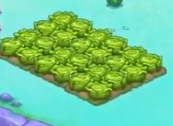
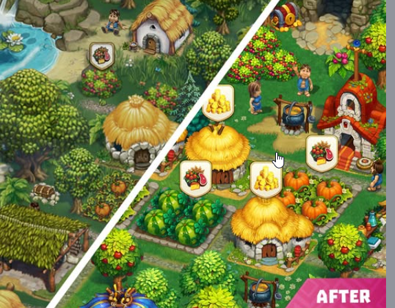

# Jeux de référence — inspiration & veille features

Catalogue des jeux à **jouer** ou **regarder en stream** pour étudier leurs mécaniques et features, et alimenter les idées du projet (farming idle mobile : plantation, inventaire, shop, automatisation/biofiltre, progression).

Règles d'usage :
- Une entrée ici sert d'**inspiration / veille**, pas d'engagement de production.
- Pour transformer une feature observée en idée concrète : la déplacer vers `Notes/Inbox_features.md` (vrac) ou vers une spec dédiée, **sur demande explicite**.
- Statut d'étude par jeu : `[ ]` à voir · `[~]` en cours d'étude · `[x]` étudié.
- Garder pour chaque jeu : liens, ce qui est intéressant pour **notre** projet, et les observations de session.

Convention d'ajout : recopier le **gabarit** en bas du fichier pour chaque nouveau jeu.

Sommaire :
- [Ordre d'étude recommandé](#ordre-détude-recommandé)
- [A. Mobile — idle farming (le plus proche du projet)](#a-mobile--idle-farming)
- [B. Mobile — cozy / pixel art](#b-mobile--cozy--pixel-art)
- [C. PC / cross-platform — idle & automatisation](#c-pc--cross-platform--idle--automatisation)
- [D. Mobile — références mécaniques voisines](#d-mobile--références-mécaniques-voisines)
- [E. PC cozy farm — polish critters / VFX (qualité cible)](#e-pc-cozy-farm--polish-critters--vfx-qualité-cible)
- [F. Vue iso 2:1 + cartoon (direction art 2026-09-08)](#f-vue-iso-21--cartoon-direction-art-2026-09-08)

---

## Ordre d'étude recommandé

> Synthèse veille 2026-06-10 — ordre pour **notre** projet (plantation → inventaire → shop → biofiltre, mobile casual).

| Priorité | Jeu | Pourquoi en premier |
|---|---|---|
| **1** | **A1 Tiny Harvest** | Le plus proche : chaîne plante → transformation, cozy, progression non punitive. *Limite : surtout iOS.* |
| **2** | **A3 Idle Farming Empire** | Référence mobile idle : offline earnings, prestige, timing upgrades. Idéal si pas d'accès Tiny Harvest (Android). |
| **3** | **A4 Idle Farm (Luma)** | Managers / machines / scale — proche de l'automatisation biofiltre. |
| **4** | **A2 Cube Farm** | Session courte (30–45 min) pour disséquer l'essentiel d'un idle (timers, déblocage terrain). |
| **5** | **B1 Mini Mini Farm** | Ensuite si besoin pixel art + quêtes + feedback outils (moins idle pur). |
| **6** | **B2/B3** Window Garden / Viladia | Plus tard : ambiance cozy ou social/market, pas la boucle farming de base. |

---

## A. Mobile — idle farming

### A1) Tiny Harvest: Cozy Farm RPG

- **Statut étude** : [ ] à voir
- **Dev / éditeur** : Simon Grimm
- **Plateformes** : iOS / Mac / Vision (Simulation)
- **Genre** : Idle farming RPG + crafting
- **Liens** : https://apps.apple.com/us/app/tiny-harvest-cozy-farm-rpg/id6755226300

**Pitch** — Idle farming cozy : planter/récolter (timers simples), **transformer** les matières (farine, corde, conserves), upgrader les bâtiments pour débloquer recettes + prod plus rapide, et envoyer des explorateurs (forêt, désert, montagne) ramener des matériaux rares. *No forced ads*, progression sans punition (pas de pourrissement si on s'absente).

**Intéressant pour nous** :
- Chaîne **plante → inventaire → transformation** (proche de notre pipeline + biofiltre).
- Upgrades de bâtiments qui débloquent recettes/vitesse → courbe de progression douce.
- « Orders without pressure » : requêtes quotidiennes optionnelles (coins/XP).
- Companion/esprit de ferme qui level up (bonus) → idée de meta-progression.

**À observer** : rythme des timers, feedback « prêt à récolter », monétisation non-intrusive.

---

### A2) Cube Farm

- **Statut étude** : [ ] à voir
- **Plateformes** : Android / iOS (gratuit, quasi sans pub)
- **Genre** : Incrémental / idle minimaliste
- **Liens** : recherche store « cube farm » (incremental idle)

**Pitch** — Planter des graines sur une parcelle (≈7 s de pousse) → débloquer plus de terrain et de crops → optimiser la production. Surcouche : collecter des **pets**, les nourrir avec les crops, les renforcer via combats.

**Intéressant pour nous** :
- Boucle d'**optimisation pure** très lisible (bon pour disséquer l'essentiel d'un idle).
- Déblocage progressif terrain/crops = montée en complexité maîtrisée.
- Greffe d'un système secondaire (pets) sur la boucle de farming.

**À observer** : ce qui pousse à débloquer la parcelle suivante, sensation de « numbers go up ».

---

### A3) Idle Farming Empire

- **Statut étude** : [ ] à voir
- **Dev / éditeur** : Futureplay (Helsinki)
- **Plateformes** : Android / iOS (online/offline)
- **Genre** : Idle tycoon farming
- **Liens** : https://play.google.com/store/apps/details?id=com.futureplay.boots

**Pitch** — Automatiser une ferme de crops/animaux, gagner en continu (gains **hors-ligne**), **prestige** (crops au marché → graines magiques), contrôle météo (soleil/pluie) pour booster la prod.

**Intéressant pour nous** :
- **Offline earnings** : récompenser le retour du joueur (clé en mobile).
- **Prestige loop** : reset contre boost permanent → rejouabilité.
- Décisions d'investissement (quand upgrader / récolter / idle).

**À observer** : calcul/affichage des gains hors-ligne, courbe de prestige, clarté des upgrades.

---

### A4) Idle Farm: Farming Simulator

- **Statut étude** : [ ] à voir
- **Dev / éditeur** : Luma
- **Plateformes** : Android / iOS
- **Genre** : Idle tycoon (style Klondike/township)
- **Liens** : https://play.google.com/store/apps/details?id=com.luma.IdleFarm

**Pitch** — 60+ crops (cycles/profitabilité distincts), **200+ managers** (chacun une compétence), 7 machines agricoles, 5 environnements (Grassland, Savane, tropical, Japon, Mars). Upgrade des champs + planification de la prod.

**Intéressant pour nous** :
- **Managers** : pattern d'automatisation par recrutement/affectation (vs nos robots).
- Variété de crops avec cycles/profit différents → équilibrage économique.
- Environnements/thèmes comme paliers de progression cosmétique + gameplay.

**À observer** : UI de gestion des managers/champs à grande échelle, lisibilité quand ça scale.

---

### A5) Idle Farm Tycoon – Merge Crops

- **Statut étude** : [ ] à voir
- **Dev / éditeur** : Fancy Elephant
- **Plateformes** : Android / iOS
- **Genre** : Idle tycoon + merge
- **Liens** : https://play.google.com/store/apps/details?id=com.fancyelephant.idlemergetycoon

**Pitch** — Ferme idle où l'on **merge** des cultures/objets pour monter en niveau, automatiser la production et faire croître l'empire agricole. Boucle typique merge-tycoon appliquée au farming.

**Intéressant pour nous** :
- Comment le **merge** se greffe sur une boucle récolte/vente (alternative ou complément à notre grille).
- Progression par fusion vs déblocage direct de slots/crops.
- Patterns de monétisation et rythme idle sur ce sous-genre.

**À observer** : clarté merge vs idle passif, moment où le joueur revient pour fusionner.

---

### A6) Farm Thru Empire

- **Statut étude** : [ ] à voir
- **Dev / éditeur** : Migmig Dijital
- **Plateformes** : iOS (Android à vérifier)
- **Genre** : Idle farm-to-market tycoon
- **Liens** : https://apps.apple.com/us/app/farm-thru-empire/id6754455667

**Pitch** — Chaîne **ferme → transformation → marché** (volailles, lait, fromage…), gains **offline**, festivals saisonniers, montée en richesse progressive.

**Intéressant pour nous** :
- Pipeline **récolte → produit transformé → vente** (très proche shop + inventaire + biofiltre).
- Offline earnings et événements saisonniers comme rétention.
- Courbe « farm story » sans pression extrême.

**À observer** : lisibilité de la chaîne de transformation, feedback vente au marché.

---

### A7) Hay Day

- **Statut étude** : [ ] à voir
- **Dev / éditeur** : Supercell
- **Plateformes** : Android / iOS
- **Genre** : Farming casual (référence industrie — plus actif qu'idle pur)
- **Liens** : https://play.google.com/store/apps/details?id=com.supercell.hayday

**Pitch** — Ferme sociale de référence : semer, élever, produire, **commandes** (camion, bateau), marché entre joueurs, progression douce par déblocage de bâtiments/cultures.

**Intéressant pour nous** :
- **Shop / commandes** et structure économique farming mobile mature.
- Feedback plantation/récolte et file d'attente de production.
- Modèle de rétention long terme (pas à copier tel quel — plus « actif » que notre cible idle).

**À observer** : UX commandes, équilibrage temps d'attente vs satisfaction, clarté inventaire, **pose plants iso 3/4 sur losange**.

---

### A8) Pocket Harvest

- **Statut étude** : [ ] à voir
- **Dev / éditeur** : Kairosoft
- **Plateformes** : Android / iOS
- **Genre** : Farming sim pixel (gestion / tycoon léger)
- **Liens** : https://play.google.com/store/apps/details?id=net.kairosoft.android.harvest_en

**Pitch** — Gérer une ferme pixel : cultures à cycles variés, animaux, shop, upgrades d'installations, objectifs à court terme. Boucle lisible et équilibrage crop/profit très transparent.

**Intéressant pour nous** :
- **Cycles de cultures** et rentabilité par crop (référence équilibrage).
- Structure shop + upgrades sans surcharge UI.
- Format « session courte » compatible mobile.

**À observer** : courbes de profit par culture, déblocages progressifs, lisibilité des timers.

---

### A9) Big Farm: Mobile Harvest

- **Statut étude** : [ ] à voir — **à playtester : multiplayer / social** (cité auteur 2026-09-08)
- **Dev / éditeur** : Goodgame Studios
- **Plateformes** : Android / iOS
- **Genre** : Farming casual / gestion de ferme **en ligne**
- **Liens** : https://play.google.com/store/apps/details?id=com.goodgamestudios.bigfarmmobileharvest

**Pitch** — Ferme à grande échelle : cultures, animaux, bâtiments, quêtes. Jouable **avec amis / famille / farmers** : village partagé, chat, quêtes jointes, marché/échanges, communauté.

**Intéressant pour nous** :
- **Multiplayer / social** : ce qu’on observe (voisinage, trade, co-op, pression sociale) — **pas** à copier tel quel sur l’aquaponie solo.
- Gestion de ferme qui **scale** (plusieurs productions simultanées).
- Quêtes/objectifs qui rythment la progression.

**À observer** : comment le multi se greffe sur la boucle farm (aide, trade, visites), UI quand ça scale, ce qu’on **évite** (grind social, FOMO).

---

### A10) Plantera

- **Statut étude** : [ ] à voir
- **Dev / éditeur** : Varagtun
- **Plateformes** : Android / iOS / PC
- **Genre** : Idle « jardin / plantes »
- **Liens** : https://play.google.com/store/apps/details?id=com.varagtun.plantera

**Pitch** — Faire pousser des plantes en idle, débloquer espèces, améliorer le jardin, récolter en continu. Focus **timers et croissance** plus que économie complexe.

**Intéressant pour nous** :
- Feedback **croissance / prêt à récolter** très lisible.
- Déblocage d'espèces comme palier de progression.
- Idle léger — bon pour calibrer les timers de nos plantes.

**À observer** : sensation de progression avec peu de systèmes, animations de croissance.

---

### A11) Pocket Plants

- **Statut étude** : [ ] à voir
- **Dev / éditeur** : Thumbspark
- **Plateformes** : Android / iOS
- **Genre** : Idle collection / croissance de plantes
- **Liens** : https://play.google.com/store/apps/details?id=com.thumbspark.pocketplants

**Pitch** — Collectionner et faire évoluer des plantes, les combiner pour découvrir de nouvelles espèces, progression idle avec objectifs de collection.

**Intéressant pour nous** :
- **Collection** comme moteur d'engagement (complément à l'économie pure).
- Combinaisons / découvertes = meta-progression douce.
- Timers courts adaptés au mobile casual.

**À observer** : équilibre collection vs boucle économique, rétention sans pression.

---

### A12) Harvest Land

- **Statut étude** : [ ] à voir — **à playtester : farm + graphique** (cité auteur 2026-09-08)
- **Dev / éditeur** : MTAG / Evo Games (`com.evogames.slavsforvk`)
- **Plateformes** : Android / iOS
- **Genre** : Farming / village iso cartoon (un peu de magie / combats île)
- **Liens** : https://play.google.com/store/apps/details?id=com.evogames.slavsforvk

**Pitch** — Village-ferme : cultures (blé, raisin…), animaux, bâtiments (scierie, poulailler, mines), expansion d’îles, trade, guildes. Combat/monstres = **hors scope** pour nous.

**Intéressant pour nous** :
- **Boucle farm** : planter / élevage / bâtiments de prod / expansion.
- **Graphique** iso cartoon village (complément Tribez / Hay Day).
- Trade / crew = secondaire (le multi se playteste surtout sur **Big Farm** A9).

**À observer** : lisibilité parcelles et plants, densité village, timers, ce qu’on ignore (combat, gamble diamants).

---

### A13) Family Farm Seaside

- **Statut étude** : [ ] à voir — **à playtester** (cité auteur 2026-09-08)
- **Dev / éditeur** : Century Games (ex-FunPlus)
- **Plateformes** : Android / iOS
- **Genre** : Farming casual iso (ferme + mer)
- **Liens** : https://play.google.com/store/apps/details?id=com.funplus.familyfarm

**Pitch** — Ferme bord de mer : planter / récolter, animaux, cuisine (plats), déco, visites voisins, trade, commandes. Iso cartoon « casual farm » classique (famille Hay Day / FarmVille).

**Intéressant pour nous** :
- Pose objets / parcelles sur **losanges**, lecture mobile.
- Chaîne **récolte → cuisine → commandes** (écho inventaire + vente).
- Voisinage / trade = secondaire (le multi se playteste surtout sur **Big Farm** A9).

**À observer** : densité ferme vs lisibilité, timers, cuisine vs vente brute, ce qu’on évite (FOMO social).

---

## B. Mobile — cozy / pixel art

### B1) Mini Mini Farm

- **Statut étude** : [ ] à voir
- **Plateformes** : iOS / Android (gratuit, jouable offline, sans IAP obligatoires)
- **Genre** : Farming sim pixel rétro
- **Liens** : https://apps.apple.com/us/app/mini-mini-farm/id1534460779

**Pitch** — Pionnier sur une île déserte : semer/élever/récolter, **requêtes de villageois** (rush = double récompense), déblocage de terrain, upgrade d'outils (labour/coupe plus snappy), pêche, donjon (matériaux rares), animaux. Objectif 100% d'exploration.

**Intéressant pour nous** :
- Pixel art rétro « easy to learn, surprisingly addictive » + **offline**.
- Requêtes/objectifs clairs qui rythment la progression.
- Upgrade d'outils = feedback de confort (« farm work extra satisfying »).

**À observer** : feel des feedbacks d'outils, structure des requêtes/objectifs.

---

### B2) Window Garden — Lofi Idle Game

- **Statut étude** : [ ] à voir
- **Dev / éditeur** : CLOVER-FI Games
- **Plateformes** : iOS / Android / Mac (Best Indie Google Play 2024 SEA)
- **Genre** : Idle cozy / cottagecore + lofi
- **Liens** : https://play.google.com/store/apps/details?id=com.cloverfi.windowgarden

**Pitch** — Jardin d'intérieur virtuel à faire pousser et **décorer**, collection (critters/oiseaux/papillons), missions, minijeux, musique lofi, sleep timer. Ambiance détente avant tout.

**Intéressant pour nous** :
- **Feel cozy** + ambiance sonore comme rétention émotionnelle.
- Collection + déco comme moteur d'engagement (au-delà des chiffres).
- Monétisation **pub opt-in** (modèle non-intrusif à étudier).

**À observer** : direction artistique/ambiance, équilibre détente vs progression.

---

### B3) Viladia: Cozy Pixel Farm

- **Statut étude** : [ ] à voir
- **Dev / éditeur** : Selvas AI
- **Plateformes** : Android / iOS (online)
- **Genre** : Farming sim pixel **social**
- **Liens** : https://play.google.com/store/apps/details?id=com.selvasai.ttrebirth

**Pitch** — Ferme pixel : crops + craft (pain, confiture, laiterie), élevage (dont créatures magiques), **déco de village**, **marché global / troc** entre joueurs, visites de villages, quêtes & events saisonniers.

**Intéressant pour nous** :
- Dimension **social/market** (troc, marché global) si on l'envisage un jour.
- Déco/personnalisation comme moteur de rétention long terme.
- Events saisonniers = contenu live récurrent.

**À observer** : design du marché entre joueurs, boucle d'events saisonniers.

---

### B4) Goodville: Farm Game Adventure

- **Statut étude** : [ ] à voir
- **Dev / éditeur** : Goodville AG
- **Plateformes** : Android / iOS
- **Genre** : Farm casual + quêtes narrative
- **Liens** : https://play.google.com/store/apps/details?id=com.goodville.goodville

**Pitch** — Ferme avec **quêtes** et fil narrative léger, production agricole, personnages, événements. Moins idle pur, plus « aventure ferme » cozy.

**Intéressant pour nous** :
- Quêtes comme structure de progression (alternative aux commandes shop).
- Ton cozy + personnages pour la rétention émotionnelle.
- Équilibre narration vs boucle économique farming.

**À observer** : rythme des quêtes, ne pas noyer la boucle plantation/récolte.

---

### B5) My Dear Farm

- **Statut étude** : [ ] à voir — **à playtester** (features + visuel, cité auteur 2026-09-08)
- **Dev / éditeur** : HyperBeard
- **Plateformes** : Android / iOS (Steam PC annoncé, pas encore live)
- **Genre** : Farming sim cozy / déco, vue **iso** cartoon kawaii
- **Liens** : [Play](https://play.google.com/store/apps/details?id=com.HyperBeardGames.MyDearFarm) · [App Store](https://apps.apple.com/us/app/my-dear-farm/id1590446639) · [Steam (coming)](https://store.steampowered.com/app/3937950/My_Dear_Farm/)

**Pitch** — Ferme kawaii : cultiver, récolter, **vendre au marché**, custom perso/pet, **déco** (meubles, sets). Croissance aussi hors session (Steam : crops/arbres/fleurs continuent). Grille de pose libre (snap optionnel côté PC).

**Intéressant pour nous** :
- Boucle **plante → récolte → marché** (écho inventaire + canaux vente).
- Déco / placement comme rétention (sans en faire le core aquaponie).
- Croissance **offline** + session courte mobile.
- Visuel iso cartoon cozy — complément Zombie Castaways / Tribez (sans copier le kawaii pastel).

**À observer** (playtest) : timers, UX marché, densité déco vs lisibilité, pose sur grille, feedback récolte.

---

## C. PC / cross-platform — idle & automatisation

### C1) Rusty's Retirement

- **Statut étude** : [ ] à voir
- **Dev / éditeur** : Mister Morris Games
- **Sortie** : 16 août 2024 (PC/Mac, Steam Deck)
- **Genre** : Idle-farming sim en **overlay de bureau**
- **Liens** : [Steam](https://store.steampowered.com/app/2666510/Rustys_Retirement/) · [Wikipedia](https://en.wikipedia.org/wiki/Rusty%27s_Retirement)


**Pitch** — Sim de ferme **idle** en bande horizontale en bas de l'écran (ou **mode vertical** sur le côté), pour jouer en fond pendant qu'on fait autre chose. Le robot Rusty + ouvriers automatisent arrosage/entretien/récolte ; le joueur donne des ordres et gère les upgrades.

**Intéressant pour nous** :
- Boucle planter → arroser → récolter → vendre → réinvestir (proche de notre pipeline).
- **Biofuel** : crops → biocarburant → pièces → bâtiments/déco (chaîne multi-étages = écho au biofiltre).
- Automatisation par robots upgradables ; **Focus Mode** (ralentit la prod) ; terrains débloquables (marais/désert/forêt) ; intégration **Twitch** (`!plant`/`!water`/`!harvest`).

**À observer** : rythme idle, feedback « prêt »/robot bloqué, courbe d'upgrades, UX placement (vs `SeedSelectionUI`).

---

### C2) The Farmer Was Replaced

- **Statut étude** : [ ] à voir
- **Dev / éditeur** : Timon Herzog / Metaroot
- **Sortie** : 10 oct. 2025 (EA depuis fév. 2023) — *Overwhelmingly Positive*
- **Genre** : Idle + **puzzle de programmation**
- **Liens** : [Steam](https://store.steampowered.com/app/2060160/The_Farmer_Was_Replaced/)


**Pitch** — On **programme** un drone (langage type Python) pour automatiser totalement les tâches de ferme (planter, arroser, récolter). Progression **continue** (pas de niveaux discrets) : farmer → ressources → débloquer techno → scripts plus complexes.

**Intéressant pour nous** :
- Vision extrême de l'**automatisation** : penser nos « robots/ouvriers » comme règles configurables.
- Progression continue sans paliers artificiels.
- À regarder surtout en **stream/vidéo** (concept plus que pour copier le gameplay mobile).

**À observer** : comment l'automatisation reste « idle » tout en demandant du setup, satisfaction du « execute ».

---

### C3) Melvor Idle

- **Statut étude** : [ ] à voir
- **Dev / éditeur** : Games by Malcs
- **Sortie** : 2020 (PC, Android, iOS, browser — cross + cloud save)
- **Genre** : Idle / incrémental RPG (inspiré RuneScape)
- **Liens** : [Steam](https://store.steampowered.com/app/1267910/Melvor_Idle/) · [Google Play](https://play.google.com/store/apps/details?id=com.malcs.melvoridle)


**Pitch** — 20+ skills à monter (dont **Farming**) qui interagissent entre eux, combat, donjons, **banque/inventaire** (1100+ items), progression **offline**, cloud save cross-platform.

**Intéressant pour nous** :
- **Profondeur de progression** et interconnexion des systèmes (un skill nourrit les autres).
- Système **inventaire/banque** robuste à grande échelle (réf. pour notre inventaire).
- Offline progression + cloud save (patterns mobiles).

**À observer** : structure de l'inventaire/banque, interdépendance des systèmes, gestion du end-game.

---

### C4) Forager

- **Statut étude** : [ ] à voir
- **Dev / éditeur** : HopFrog
- **Sortie** : 18 avr. 2019 (PC + consoles)
- **Genre** : Action-aventure 2D open-world (« idle qu'on veut jouer activement »)
- **Liens** : [Steam](https://store.steampowered.com/app/751780/Forager/)


**Pitch** — Inspiré de Stardew/Terraria/Zelda : explorer, **gather/craft**, construire une base à partir de rien, **acheter des terrains** pour s'étendre, level up (skills/blueprints), secrets/donjons. Forte composante **automatisation** des ressources.

**Intéressant pour nous** :
- **Achat de terrain / expansion** comme moteur de progression (écho à l'agrandissement de la ferme).
- Automatisation de la collecte de ressources.
- Liberté d'objectifs (gatherer / farmer / merchant).

**À observer** : sensation d'expansion (acheter une case = dopamine), équilibrage craft/automatisation.

---

### C5) Mr. Farmboy

- **Statut étude** : [ ] à voir
- **Plateformes** : PC (Steam) — vu dans Humble « Awesome Automation Bundle »
- **Genre** : Farming **hands-free** / automatisation
- **Liens** : recherche Steam « Mr. Farmboy » *(image à ajouter)*

**Pitch** — Des assistants se déplacent en continu sur la ferme (planter, soigner les animaux, maintenir les opérations) pendant que le joueur se concentre sur la **croissance et l'optimisation**.

**Intéressant pour nous** :
- Modèle **hands-free** : les ouvriers agissent en autonomie, le joueur pilote la stratégie.
- Comparable à notre direction « robots/ouvriers » sur le biofiltre.

**À observer** : autonomie des assistants vs ordres du joueur, lisibilité de l'activité simultanée.

---

## D. Mobile — références mécaniques voisines

> Jeux **hors farming pur** mais utiles pour des patterns idle mobile (offline, prestige, numbers go up).

### D1) Egg, Inc.

- **Statut étude** : [ ] à voir
- **Dev / éditeur** : Auxbrain
- **Plateformes** : Android / iOS / PC
- **Genre** : Idle incrémental (œufs / couveuses — pas du farming)
- **Liens** : https://play.google.com/store/apps/details?id=com.auxbrain.egginc

**Pitch** — Incrémental iconique : produire des œufs, upgrader couveuses et transports, **prestige** (soul eggs), gains **offline**, sensation « numbers go up » très maîtrisée.

**Intéressant pour nous** :
- Référence **offline earnings** et affichage des gains au retour.
- Boucle **prestige** et meta-progression permanente.
- Clarté des upgrades à grande échelle (inventaire économique abstrait).

**À observer** : pas le thème — étudier les **mécaniques** idle/prestige/offline, pas le skin œufs.

---

## E. PC cozy farm — polish critters / VFX (qualité cible)

> Ajout 2026-07-23 — références citées pour la **qualité d’ambiance** (insectes / critters / VFX ferme), pas pour copier la boucle idle mobile. Lié à `[CT-FARM-POLISH-002]` / `Notes/Farm/SPEC_insecte_flowering.md`.

### E1) Farm Together

- **Statut étude** : [ ] à voir
- **Dev / éditeur** : Milkstone Studios
- **Plateformes** : PC / consoles
- **Genre** : Farming coop cozy
- **Liens** : https://store.steampowered.com/app/673950/Farm_Together/

**Pitch** — Ferme coopérative sans stress : planter, élever, décorer ; sessions courtes ou longues ; forte présence d’**ambiance visuelle** (animaux, détails de parcelle).

**Intéressant pour nous** :
- Densité de **vie secondaire** sur la ferme (critters, polish) sans alourdir la boucle principale.
- Référence de « ferme qui vit » à côté des cultures.

**À observer** : lisibilité des petits éléments animés, densité sans clutter mobile.

---

### E2) Dinkum

- **Statut étude** : [ ] à voir
- **Dev / éditeur** : James Bendon / James Bendon Games
- **Plateformes** : PC / consoles
- **Genre** : Life-sim / exploration / farming léger
- **Liens** : https://store.steampowered.com/app/1062520/Dinkum/

**Pitch** — Coloniser une île : explorer, pêcher, miner, farmer, décorer ; bestiaire et **faune** très présents dans le paysage.

**Intéressant pour nous** :
- Faune / insectes comme **présence monde** (pas forcément système profond).
- Qualité de motion / personnalité des petites créatures.

**À observer** : comment les critters renforcent l’immersion sans devenir une corvée.

---

### E3) Coral Island

- **Statut étude** : [ ] à voir
- **Dev / éditeur** : Stairway Games
- **Plateformes** : PC / consoles
- **Genre** : Farming sim / life-sim (Stardew-like tropical)
- **Liens** : https://store.steampowered.com/app/1155970/Coral_Island/

**Pitch** — Île tropicale : ferme, village, plongée, festivals ; art direction soignée, **critters** et détails environnementaux riches.

**Intéressant pour nous** :
- Cible de **polish** (insectes, flore, VFX) pour une ferme aquaponie cozy.
- Cohérence style art ↔ petites animations secondaires.

**À observer** : densité visuelle acceptable vs lisibilité gameplay (surtout si on vise mobile plus tard).

---

## F. Vue iso 2:1 + cartoon (direction art 2026-09-08)

> Décision auteur : monde **iso 2:1 cartoon**. Modèles les plus proches = **Township + The Tribez**.  
> **Bémole :** eux = cultures **à plat** (terre plane). Nous = **volume** via biofiltres / hydro (plante sur le deck IBC, pas un champ).  
> Source : `Notes/Art/NOTE_graphique.md` · prompt : `Notes/Art/PROMPT_assets_monde_iso.md`.

### F0) Mix auteur (priorité visuel)

| # | Jeu | Plateforme | Pourquoi | Liens / capture |
|---|-----|------------|----------|-----------------|
| **F0a** | **Township** (déjà F2) | Mobile | **Modèle cible** avec Tribez : ville/ferme iso cartoon. **Sauf** cultures à plat. | [Play](https://play.google.com/store/apps/details?id=com.playrix.township) |
| **F0b** | **The Tribez: Build a Village** | Mobile / PC | **Modèle cible** avec Township. Village + props. Capture : `images/tribez_village_iso.png`. **Sauf** parcelles terre plane. | [Play](https://play.google.com/store/apps/details?id=com.gameinsight.tribez) |
| **F0c** | **Zombie Castaways** | Mobile | Polish graphique aimé. **On reste cartoon** : pas de zombies. | [Play](https://play.google.com/store/apps/details?id=com.vizorinteractive.zombiesettlersv2) |
| **F0i** | **SpongeBob Adventures: In A Jam** (*un truc du genre*) | Mobile | Pose têtes iso 3/4. Capture : `images/spongebob_farm_cabbage_iso.png`. **Poser sur deck IBC**, pas un champ. | [Play](https://play.google.com/store/apps/details?id=com.tiltingpoint.sbadventures) |
| **F0d** | **My Dear Farm** (déjà B5) | Mobile · Steam bientôt | Iso cartoon cozy : farm + marché + déco. **À playtester** features. | [Play](https://play.google.com/store/apps/details?id=com.HyperBeardGames.MyDearFarm) |
| **F0e** | **Harvest Land** (déjà A12) | Mobile | **Farm + graphique.** Village iso, parcelles, bâtiments. Combat = ignorer. | [Play](https://play.google.com/store/apps/details?id=com.evogames.slavsforvk) |
| **F0f** | **Hay Day** (déjà A7) | Mobile | **Déjà en doc.** Playtest visuel : plants 3/4 sur losange. | [Play](https://play.google.com/store/apps/details?id=com.supercell.hayday) |
| **F0g** | **Big Farm: Mobile Harvest** (déjà A9) | Mobile | **Multiplayer / social** (amis, village, trade, quêtes jointes). Pas le core solo. | [Play](https://play.google.com/store/apps/details?id=com.goodgamestudios.bigfarmmobileharvest) |
| **F0h** | **Family Farm Seaside** (déjà A13) | Mobile | Ferme iso + mer, parcelles losange, cuisine/commandes. **À playtester.** | [Play](https://play.google.com/store/apps/details?id=com.funplus.familyfarm) |



*Capture auteur — pose plantes 3/4. Copyright Nickelodeon / éditeur ; veille only.*



*Capture auteur — volume village/props. Copyright Game Insight ; veille only.*

**À observer :** **Township + Tribez** (modèles, sauf champ plat) → SpongeBob farm (têtes 3/4 sur deck) → Harvest Land / Family Farm Seaside / My Dear Farm → Hay Day (losange) → Big Farm (multi). Zombie Castaways = polish only.

**File playtest auteur** (noter ce qui est repris / évité → `Inbox_features.md` si ça devient une idée) :

- [ ] **Township** — modèle cible (sauf cultures à plat)
- [ ] **The Tribez** — modèle cible (sauf parcelles terre plane)
- [ ] Zombie Castaways — polish visuel seulement
- [ ] SpongeBob In A Jam — pose têtes (à greffer sur IBC)
- [ ] **Harvest Land** — farm + graphique
- [ ] **Family Farm Seaside** — ferme iso, parcelles, cuisine/commandes
- [ ] **My Dear Farm** — marché, déco, timers, grille
- [ ] Hay Day — plant sur losange (**déjà A7**)
- [ ] **Big Farm: Mobile Harvest** — multiplayer / social

### F1) Farming 2D iso — mobile / PC (priorité visuel)

| # | Jeu | Plateforme | Pourquoi pour **notre** iso | Liens |
|---|-----|------------|-----------------------------|-------|
| **F1** | **Hay Day** (déjà A7) | Mobile | Grille losange + plants 3/4, lecture mobile. | [Play](https://play.google.com/store/apps/details?id=com.supercell.hayday) |
| **F2** | **Township** | Mobile | Iso ville + fermes ; densité bâtiments vs lisibilité pouce. Playrix. | [Play](https://play.google.com/store/apps/details?id=com.playrix.township) |
| **F3** | **FarmVille 2: Country Escape** | Mobile | Grille iso casual Zynga ; héritage FarmVille Flash (losanges). | [Play](https://play.google.com/store/apps/details?id=com.zynga.FarmVille2CountryEscape) |
| **F4** | **Pocket Harvest** (déjà A8) | Mobile / PC / Switch | Pixel **iso/3/4** Kairosoft : parcelles, workers, scale ferme lisible. | [Play](https://play.google.com/store/apps/details?id=net.kairosoft.android.harvest_en) · [Steam](https://store.steampowered.com/app/2019380/Pocket_Harvest/) |
| **F5** | **Family Farm Seaside** (déjà A13) | Mobile | Iso farm + mer ; pose sur diamants. | [Play](https://play.google.com/store/apps/details?id=com.funplus.familyfarm) |
| **F6** | **Rusty's Retirement** (déjà C1) | PC | Idle **iso** overlay : plants + robots sur grille, proche de notre boucle. | [Steam](https://store.steampowered.com/app/2666510/Rustys_Retirement/) |
| **F7** | **Autonauts** | PC | Iso automation farming (ouvriers) ; lisibilité d’une ferme qui tourne seule. | [Steam](https://store.steampowered.com/app/979120/Autonauts/) |
| **F8** | **Graveyard Keeper** | PC / consoles | 2.5D iso : jardin / parcelles / craft ; profondeur + order de dessin. | [Steam](https://store.steampowered.com/app/599140/Graveyard_Keeper/) |
| **F9** | **Littlewood** | PC / Switch | Cozy town + farm, caméra iso douce, silhouettes simples (bon pour mobile). | [Steam](https://store.steampowered.com/app/848450/Littlewood/) |
| **F10** | **Farming Isles** | PC | Farming sim **annoncé iso** : îles / parcelles / structures. Plus rare, à checker en vidéo. | [Steam](https://store.steampowered.com/app/2987160/Farming_Isles/) |

**À observer en priorité (visuel, pas la boucle) :**
1. **Zombie Castaways** — polish cartoon iso (sans le thème).
2. **The Tribez** — village / props.
3. **SpongeBob farm** — pose têtes de cultures 3/4.
4. Hay Day — plant sur losange.
5. Pocket Harvest / Rusty's — densité et idle.

**Hors cible caméra** (3/4 ortho ou 3D, pas 2D iso) : Stardew Valley, Coral Island, Dinkum, Farming Simulator. Utile polish (section E), pas pour caler la grille.

Inbox GDD mentionnait **Farm City** : même famille iso casual que Township / Hay Day ; à revoir si l’entrée store est encore vivante.

---

### F2) Look carton / papercraft (secondaire)

Cartoon d’abord (décision auteur). Ces titres = grain papier **optionnel**, pas le look principal.

| # | Jeu | Plateforme | Pourquoi pour **notre** carton | Liens |
|---|-----|------------|--------------------------------|-------|
| **F11** | **Yoshi's Crafted World** | Switch | **Réf n°1 matière** : carton ondulé peint, scotch, objets ménagers, diorama. | [Nintendo](https://www.nintendo.com/us/store/products/yoshis-crafted-world-switch/) |
| **F12** | **Tearaway** (Unfolded) | Vita / PS4 | Monde **papercraft** pliable ; bords papier, trous, épaisseur. | [PS](https://store.playstation.com/en-us/product/UP9000-CUSA02534_00-TEARAWAYUNFOLD01) |
| **F13** | **Lumino City** | PC | Vraie maquette carton/papier filmée ; chaleur artisanale. | [Steam](https://store.steampowered.com/app/313010/Lumino_City/) |
| **F14** | **Townscaper** | PC / mobile | Blocs papier, ville diorama, lecture iso. Pas farm. | [Steam](https://store.steampowered.com/app/1291340/Townscaper/) |
| **F15** | **Islanders** | PC / mobile | Iso minimal, pièces « posées » comme un jeu de plateau. | [Steam](https://store.steampowered.com/app/1046030/Islanders/) |
| **F16** | **Cloud Gardens** | PC / Switch | Dioramas iso + **plantes** qui envahissent ; plus proche thème ferme. | [Steam](https://store.steampowered.com/app/1372320/Cloud_Gardens/) |
| **F17** | **Dorfromantik** | PC / Switch / mobile | Tuiles paysage **carton de jeu de société** ; campagne, pas parcelles idle. | [Steam](https://store.steampowered.com/app/1455840/Dorfromantik/) |

**Combo utile :** Zombie Castaways (polish cartoon) + The Tribez (village) + SpongeBob farm (pose plant) + Yoshi Crafted World (grain papier optionnel seulement).

---

## Gabarit — nouveau jeu (copier-coller)

```
### X) Titre du jeu

- **Statut étude** : [ ] à voir
- **Dev / éditeur** :
- **Plateformes / Sortie** :
- **Genre** :
- **Liens** :


**Pitch** — ...

**Intéressant pour nous** :
- ...

**À observer** : ...
```
