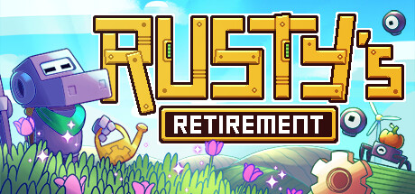
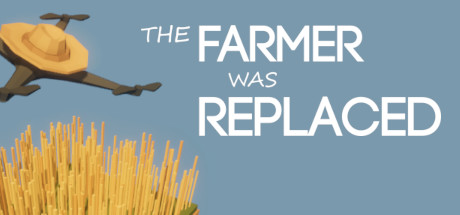
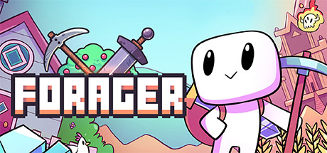

# Jeux de référence — inspiration & veille features

Catalogue des jeux à **jouer** ou **regarder en stream** pour étudier leurs mécaniques et features, et alimenter les idées du projet (farming idle mobile : plantation, inventaire, shop, automatisation/biofiltre, progression).

Règles d'usage :
- Une entrée ici sert d'**inspiration / veille**, pas d'engagement de production.
- Pour transformer une feature observée en idée concrète : la déplacer vers `Notes/Inbox_features.md` (vrac) ou vers une spec dédiée, **sur demande explicite**.
- Statut d'étude par jeu : `[ ]` à voir · `[~]` en cours d'étude · `[x]` étudié.
- Garder pour chaque jeu : liens, ce qui est intéressant pour **notre** projet, et les observations de session.

Convention d'ajout : recopier le **gabarit** en bas du fichier pour chaque nouveau jeu.

Sommaire :
- [A. Mobile — idle farming (le plus proche du projet)](#a-mobile--idle-farming)
- [B. Mobile — cozy / pixel art](#b-mobile--cozy--pixel-art)
- [C. PC / cross-platform — idle & automatisation](#c-pc--cross-platform--idle--automatisation)

---

## A. Mobile — idle farming

### A1) Tiny Harvest: Cozy Farm RPG

- **Statut étude** : [ ] à voir
- **Dev / éditeur** : Simon Grimm
- **Plateformes** : iOS / Mac / Vision (Simulation)
- **Genre** : Idle farming RPG + crafting
- **Liens** : https://apps.apple.com/us/app/tiny-harvest-cozy-farm-rpg/id6755226300

**Pitch** — Idle farming cozy : planter/récolter (timers simples), **transformer** les matières (farine, corde, conserves), upgrader les bâtiments pour débloquer recettes + prod plus rapide, et envoyer des explorateurs (forêt, désert, montagne) ramener des matériaux rares. *No forced ads*, progression sans punition (pas de pourrissement si on s'absente).

**Intéressant pour nous** :
- Chaîne **plante → inventaire → transformation** (proche de notre pipeline + biofiltre).
- Upgrades de bâtiments qui débloquent recettes/vitesse → courbe de progression douce.
- « Orders without pressure » : requêtes quotidiennes optionnelles (coins/XP).
- Companion/esprit de ferme qui level up (bonus) → idée de meta-progression.

**À observer** : rythme des timers, feedback « prêt à récolter », monétisation non-intrusive.

---

### A2) Cube Farm

- **Statut étude** : [ ] à voir
- **Plateformes** : Android / iOS (gratuit, quasi sans pub)
- **Genre** : Incrémental / idle minimaliste
- **Liens** : recherche store « cube farm » (incremental idle)

**Pitch** — Planter des graines sur une parcelle (≈7 s de pousse) → débloquer plus de terrain et de crops → optimiser la production. Surcouche : collecter des **pets**, les nourrir avec les crops, les renforcer via combats.

**Intéressant pour nous** :
- Boucle d'**optimisation pure** très lisible (bon pour disséquer l'essentiel d'un idle).
- Déblocage progressif terrain/crops = montée en complexité maîtrisée.
- Greffe d'un système secondaire (pets) sur la boucle de farming.

**À observer** : ce qui pousse à débloquer la parcelle suivante, sensation de « numbers go up ».

---

### A3) Idle Farming Empire

- **Statut étude** : [ ] à voir
- **Dev / éditeur** : Futureplay (Helsinki)
- **Plateformes** : Android / iOS (online/offline)
- **Genre** : Idle tycoon farming
- **Liens** : https://play.google.com/store/apps/details?id=com.futureplay.boots

**Pitch** — Automatiser une ferme de crops/animaux, gagner en continu (gains **hors-ligne**), **prestige** (crops au marché → graines magiques), contrôle météo (soleil/pluie) pour booster la prod.

**Intéressant pour nous** :
- **Offline earnings** : récompenser le retour du joueur (clé en mobile).
- **Prestige loop** : reset contre boost permanent → rejouabilité.
- Décisions d'investissement (quand upgrader / récolter / idle).

**À observer** : calcul/affichage des gains hors-ligne, courbe de prestige, clarté des upgrades.

**Lien projet** : idée prestige / reset système → `Notes/GDD/IDEA_boucle_reset_prestige_systemes.md`.

---

### A4) Idle Farm: Farming Simulator

- **Statut étude** : [ ] à voir
- **Dev / éditeur** : Luma
- **Plateformes** : Android / iOS
- **Genre** : Idle tycoon (style Klondike/township)
- **Liens** : https://play.google.com/store/apps/details?id=com.luma.IdleFarm

**Pitch** — 60+ crops (cycles/profitabilité distincts), **200+ managers** (chacun une compétence), 7 machines agricoles, 5 environnements (Grassland, Savane, tropical, Japon, Mars). Upgrade des champs + planification de la prod.

**Intéressant pour nous** :
- **Managers** : pattern d'automatisation par recrutement/affectation (vs nos robots).
- Variété de crops avec cycles/profit différents → équilibrage économique.
- Environnements/thèmes comme paliers de progression cosmétique + gameplay.

**À observer** : UI de gestion des managers/champs à grande échelle, lisibilité quand ça scale.

---

## B. Mobile — cozy / pixel art

### B1) Mini Mini Farm

- **Statut étude** : [ ] à voir
- **Plateformes** : iOS / Android (gratuit, jouable offline, sans IAP obligatoires)
- **Genre** : Farming sim pixel rétro
- **Liens** : https://apps.apple.com/us/app/mini-mini-farm/id1534460779

**Pitch** — Pionnier sur une île déserte : semer/élever/récolter, **requêtes de villageois** (rush = double récompense), déblocage de terrain, upgrade d'outils (labour/coupe plus snappy), pêche, donjon (matériaux rares), animaux. Objectif 100% d'exploration.

**Intéressant pour nous** :
- Pixel art rétro « easy to learn, surprisingly addictive » + **offline**.
- Requêtes/objectifs clairs qui rythment la progression.
- Upgrade d'outils = feedback de confort (« farm work extra satisfying »).

**À observer** : feel des feedbacks d'outils, structure des requêtes/objectifs.

---

### B2) Window Garden — Lofi Idle Game

- **Statut étude** : [ ] à voir
- **Dev / éditeur** : CLOVER-FI Games
- **Plateformes** : iOS / Android / Mac (Best Indie Google Play 2024 SEA)
- **Genre** : Idle cozy / cottagecore + lofi
- **Liens** : https://play.google.com/store/apps/details?id=com.cloverfi.windowgarden

**Pitch** — Jardin d'intérieur virtuel à faire pousser et **décorer**, collection (critters/oiseaux/papillons), missions, minijeux, musique lofi, sleep timer. Ambiance détente avant tout.

**Intéressant pour nous** :
- **Feel cozy** + ambiance sonore comme rétention émotionnelle.
- Collection + déco comme moteur d'engagement (au-delà des chiffres).
- Monétisation **pub opt-in** (modèle non-intrusif à étudier).

**À observer** : direction artistique/ambiance, équilibre détente vs progression.

---

### B3) Viladia: Cozy Pixel Farm

- **Statut étude** : [ ] à voir
- **Dev / éditeur** : Selvas AI
- **Plateformes** : Android / iOS (online)
- **Genre** : Farming sim pixel **social**
- **Liens** : https://play.google.com/store/apps/details?id=com.selvasai.ttrebirth

**Pitch** — Ferme pixel : crops + craft (pain, confiture, laiterie), élevage (dont créatures magiques), **déco de village**, **marché global / troc** entre joueurs, visites de villages, quêtes & events saisonniers.

**Intéressant pour nous** :
- Dimension **social/market** (troc, marché global) si on l'envisage un jour.
- Déco/personnalisation comme moteur de rétention long terme.
- Events saisonniers = contenu live récurrent.

**À observer** : design du marché entre joueurs, boucle d'events saisonniers.

---

## C. PC / cross-platform — idle & automatisation

### C1) Rusty's Retirement

- **Statut étude** : [ ] à voir
- **Dev / éditeur** : Mister Morris Games
- **Sortie** : 16 août 2024 (PC/Mac, Steam Deck)
- **Genre** : Idle-farming sim en **overlay de bureau**
- **Liens** : [Steam](https://store.steampowered.com/app/2666510/Rustys_Retirement/) · [Wikipedia](https://en.wikipedia.org/wiki/Rusty%27s_Retirement)



**Pitch** — Sim de ferme **idle** en bande horizontale en bas de l'écran (ou **mode vertical** sur le côté), pour jouer en fond pendant qu'on fait autre chose. Le robot Rusty + ouvriers automatisent arrosage/entretien/récolte ; le joueur donne des ordres et gère les upgrades.

**Intéressant pour nous** :
- Boucle planter → arroser → récolter → vendre → réinvestir (proche de notre pipeline).
- **Biofuel** : crops → biocarburant → pièces → bâtiments/déco (chaîne multi-étages = écho au biofiltre).
- Automatisation par robots upgradables ; **Focus Mode** (ralentit la prod) ; terrains débloquables (marais/désert/forêt) ; intégration **Twitch** (`!plant`/`!water`/`!harvest`).

**À observer** : rythme idle, feedback « prêt »/robot bloqué, courbe d'upgrades, UX placement (vs `SeedSelectionUI`).

---

### C2) The Farmer Was Replaced

- **Statut étude** : [ ] à voir
- **Dev / éditeur** : Timon Herzog / Metaroot
- **Sortie** : 10 oct. 2025 (EA depuis fév. 2023) — *Overwhelmingly Positive*
- **Genre** : Idle + **puzzle de programmation**
- **Liens** : [Steam](https://store.steampowered.com/app/2060160/The_Farmer_Was_Replaced/)



**Pitch** — On **programme** un drone (langage type Python) pour automatiser totalement les tâches de ferme (planter, arroser, récolter). Progression **continue** (pas de niveaux discrets) : farmer → ressources → débloquer techno → scripts plus complexes.

**Intéressant pour nous** :
- Vision extrême de l'**automatisation** : penser nos « robots/ouvriers » comme règles configurables.
- Progression continue sans paliers artificiels.
- À regarder surtout en **stream/vidéo** (concept plus que pour copier le gameplay mobile).

**À observer** : comment l'automatisation reste « idle » tout en demandant du setup, satisfaction du « execute ».

---

### C3) Melvor Idle

- **Statut étude** : [ ] à voir
- **Dev / éditeur** : Games by Malcs
- **Sortie** : 2020 (PC, Android, iOS, browser — cross + cloud save)
- **Genre** : Idle / incrémental RPG (inspiré RuneScape)
- **Liens** : [Steam](https://store.steampowered.com/app/1267910/Melvor_Idle/) · [Google Play](https://play.google.com/store/apps/details?id=com.malcs.melvoridle)


**Pitch** — 20+ skills à monter (dont **Farming**) qui interagissent entre eux, combat, donjons, **banque/inventaire** (1100+ items), progression **offline**, cloud save cross-platform.

**Intéressant pour nous** :
- **Profondeur de progression** et interconnexion des systèmes (un skill nourrit les autres).
- Système **inventaire/banque** robuste à grande échelle (réf. pour notre inventaire).
- Offline progression + cloud save (patterns mobiles).

**À observer** : structure de l'inventaire/banque, interdépendance des systèmes, gestion du end-game.

---

### C4) Forager

- **Statut étude** : [ ] à voir
- **Dev / éditeur** : HopFrog
- **Sortie** : 18 avr. 2019 (PC + consoles)
- **Genre** : Action-aventure 2D open-world (« idle qu'on veut jouer activement »)
- **Liens** : [Steam](https://store.steampowered.com/app/751780/Forager/)



**Pitch** — Inspiré de Stardew/Terraria/Zelda : explorer, **gather/craft**, construire une base à partir de rien, **acheter des terrains** pour s'étendre, level up (skills/blueprints), secrets/donjons. Forte composante **automatisation** des ressources.

**Intéressant pour nous** :
- **Achat de terrain / expansion** comme moteur de progression (écho à l'agrandissement de la ferme).
- Automatisation de la collecte de ressources.
- Liberté d'objectifs (gatherer / farmer / merchant).

**À observer** : sensation d'expansion (acheter une case = dopamine), équilibrage craft/automatisation.

---

### C5) Mr. Farmboy

- **Statut étude** : [ ] à voir
- **Plateformes** : PC (Steam) — vu dans Humble « Awesome Automation Bundle »
- **Genre** : Farming **hands-free** / automatisation
- **Liens** : recherche Steam « Mr. Farmboy » *(image à ajouter)*

**Pitch** — Des assistants se déplacent en continu sur la ferme (planter, soigner les animaux, maintenir les opérations) pendant que le joueur se concentre sur la **croissance et l'optimisation**.

**Intéressant pour nous** :
- Modèle **hands-free** : les ouvriers agissent en autonomie, le joueur pilote la stratégie.
- Comparable à notre direction « robots/ouvriers » sur le biofiltre.

**À observer** : autonomie des assistants vs ordres du joueur, lisibilité de l'activité simultanée.

---

## Gabarit — nouveau jeu (copier-coller)

```
### X) Titre du jeu

- **Statut étude** : [ ] à voir
- **Dev / éditeur** :
- **Plateformes / Sortie** :
- **Genre** :
- **Liens** :


**Pitch** — ...

**Intéressant pour nous** :
- ...

**À observer** : ...
```
