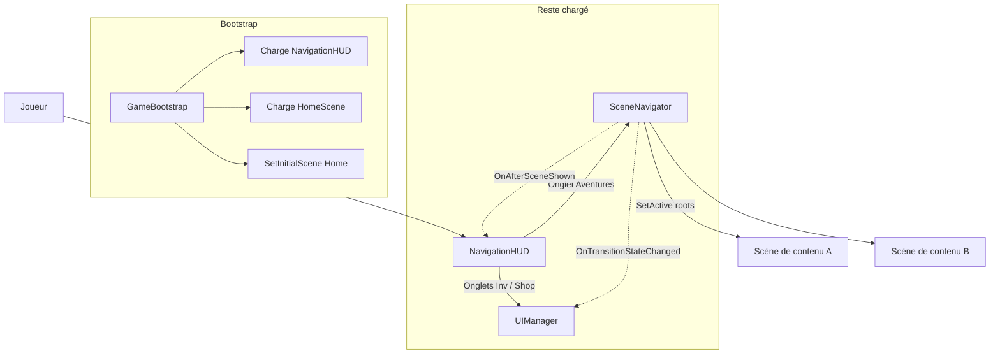

# SceneUiLoadManagement — Scènes Unity vs écrans UI (shell)

Note de référence : comment le projet gère l’**affichage des scènes de contenu** et les **panneaux UI globaux** (inventaire, shop). À jour par rapport au code sous `Assets/Scripts/`.

---

## Deux systèmes à ne pas confondre

| Couche | Rôle | Pilote principal |
|--------|------|------------------|
| **Scènes de contenu** (`HomeScene`, `FirstLvl`, …) | Lieu du gameplay (racines de scène activées/désactivées) | **`SceneNavigator`** |
| **Écrans HUD** (`Inventory`, `Shop`) | Prefabs instanciés sous le Canvas du shell | **`UIManager`** |

- **`SceneId`** (`ScreenId.cs`) : noms des fichiers `.unity` (Bootstrap, NavigationHUD, HomeScene, FirstLvl, …).
- **`ScreenId`** (`ScreenId.cs`) : identifiants d’écran pour **`UIManager`** — ce ne sont **pas** des scènes Unity.

---

## Démarrage (`GameBootstrap`)

Fichier : `Assets/Scripts/Core/GameBootstrap.cs`.

1. Charge **additivement** `NavigationHUD` (shell : Canvas, `SceneNavigator`, `UIManager`, `PlayerInventory`, …).
2. Charge **additivement** `HomeScene` (première scène de contenu).
3. Appelle `SceneNavigator.SetInitialScene(HomeScene)` pour déclarer la scène visible au navigateur.

Plusieurs scènes coexistent en mémoire ; on ne remplace pas tout le jeu par un seul `LoadScene` après le boot.

---

## `SceneNavigator` — « Afficher une scène »

Fichier : `Assets/Scripts/Systems/SceneNavigator.cs`.

- Ne **décharge** pas les scènes de contenu pour changer d’écran : il **`SetActive(true/false)` sur chaque `GameObject` racine** de la scène cible / précédente (`SetSceneRootsActive`).
- Scènes listées en **lazy** : chargées à la première demande (`LoadSceneAsync` en **additif**), puis réutilisées.
- La scène **NavigationHUD** n’est pas pilotée par ce mécanisme (shell séparé).

**Transition typique :**

1. `IsTransitioning = true` → événements (`OnTransitionStateChanged`, etc.).
2. S’assurer que la scène cible est chargée.
3. Désactiver les racines de `CurrentScene`.
4. Activer les racines de la nouvelle scène ; mettre à jour `CurrentScene`.
5. `OnAfterSceneShown` ; puis `IsTransitioning = false`.

**API principale :** `await SceneNavigator.Instance.ShowScene(SceneId.…)`  
(Règle projet : ne pas appeler `SceneManager.LoadScene` depuis l’UI gameplay sauf exception documentée côté bootstrap.)

---

## `NavigationHUD` — Barre selon la scène affichée

Fichier : `Assets/Scripts/UI/NavigationHUD.cs`.

S’abonne à `SceneNavigator` :

- **Pendant une transition** → mode **Hidden** (nav + exit masqués).
- **Après `OnAfterSceneShown`** :
  - **`HomeScene`** → mode **Navigation** (3 onglets) + `HideGlobalPanels()` (ferme inventaire/shop via `UIManager`).
  - **Autre scène** (ex. `FirstLvl`) → mode **ExitOnly** (croix) ; le retour se fait via `OnExitToHomeRequested` (géré par le contrôleur de la scène gameplay).

**Onglets :**

- **Aventures** → `SceneNavigator.ShowScene(HomeScene)` (+ masque les panneaux globaux avant transition).
- **Inventaire / Shop** → `UIManager.TryShowScreen(ScreenId.…)` — **ne changent pas** de scène Unity.

**Garde-fou transition :** les onglets inventaire/shop ne bloquent que si un `SceneNavigator` existe **et** `IsTransitioning` (pas besoin de navigateur pour ouvrir ces panneaux en test).

---

## `UIManager` — Panneaux globaux

Fichier : `Assets/Scripts/Systems/UIManager.cs`.

- Écrans = **prefabs** + `screenId`, instanciés sous `screenRoot`, lazy ou préchargés selon les listes Inspector.
- **Pendant une transition de scène** (`OnTransitionStateChanged` → `true`) : **`HideAllGlobalUI()`** pour ne pas laisser inventaire/shop au-dessus d’un chargement.

`CurrentScene` du navigateur décrit la **scène de contenu**, pas « l’inventaire est ouvert ».

---

## Schéma de flux

---

## Règles pratiques (checklist)

1. **Changer de lieu / niveau / hub** → `SceneNavigator.ShowScene(SceneId.…)`.
2. **Ouvrir inventaire ou shop** → `UIManager` + `ScreenId` ; prefab édité dans Unity (ex. `Assets/Prefabs/Ui/InventoryScreen.prefab`).
3. **Ne pas** mélanger les deux : un `screenId` n’est pas un nom de scène `.unity`.
4. Respecter **`IsTransitioning`** pour éviter double navigation ; le HUD et le `UIManager` réagissent déjà à cet état.

---

## Fichiers clés

| Fichier | Rôle |
|---------|------|
| `Assets/Scripts/Systems/SceneNavigator.cs` | Activation des racines, chargement additif, événements de transition |
| `Assets/Scripts/Systems/ScreenId.cs` | `SceneId` + `ScreenId` |
| `Assets/Scripts/Core/GameBootstrap.cs` | Ordre de chargement initial |
| `Assets/Scripts/UI/NavigationHUD.cs` | Modes HUD + onglets + lien navigateur |
| `Assets/Scripts/Systems/UIManager.cs` | Registre des écrans prefab + masquage à la transition |

---

*Document généré pour consultation ultérieure — titre demandé : SceneUiLoadManagement.*
